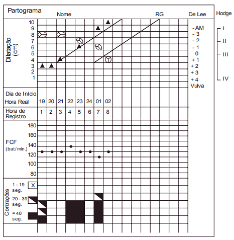
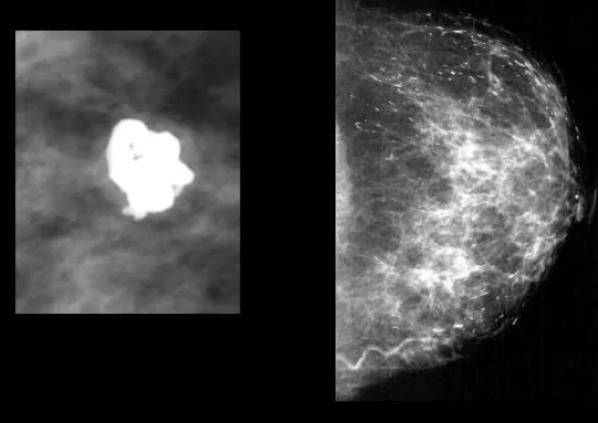
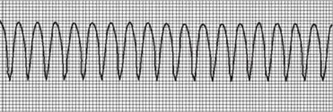

# ENARE 2021-2022 - Prova de Acesso Direto

## Questão 1

Em uma cirurgia colorretal, durante o procedimento, o cirurgião deve estar atento e fazer qual das seguintes recomendações ao colega anestesista?

**Descrição Técnica da Imagem:** Imagem relacionada à questão.

**Alternativas:**
- A) Administrar uma dose de vancomicina profilática logo após a incisão da pele.
- B) Administrar cefazolina + ampicilinasulbactam na indução anestésica e repetir a dose após 6 horas.
- C) Administrar vancomicina na indução anestésica e manter por 24 horas.
- D) Administrar cefazolina + metronidazol na indução anestésica e repetir após aproximadamente 3 - 4 horas.
- E) Administrar ampicilina-sulbactam na indução anestésica e manter por 48 horas.

**Tags:** #Pergunta #ENARE

---
## Questão 2

Um paciente negro de 28 anos necessita de avaliação quanto a uma cicatriz de crescimento exagerado em região de lóbulo da orelha, além dos limites de onde havia uma ferida prévia. Qual das seguintes orientações deve-se fornecer ao paciente?

**Descrição Técnica da Imagem:** Imagem relacionada à questão.

**Alternativas:**
- A) Trata-se, provavelmente, de cicatriz hipertrófica que deve regredir em breve.
- B) Trata-se, provavelmente, de um câncer de pele escamocelular, comum nessa região.
- C) Trata-se, provavelmente, de queloide, mais comum entre pacientes negros e que não possuem forma de prevenção clara.
- D) Trata-se, provavelmente, de queloide, mais comum entre pacientes caucasianos, que são prontamente resolvidos de maneira cirúrgica.
- E) Trata-se, provavelmente, de cicatriz hipertrófica, mais comum entre pacientes negros e que são facilmente resolvidas de maneira cirúrgica. PRM - ACESSO DIRETO INSTITUTO AOCP

**Tags:** #Pergunta #ENARE

---
## Questão 3

Um paciente que será submetido a uma cirurgia teve indicação de anestesia raquidiana pela equipe de anestesia. Assinale a alternativa que apresenta somente informações corretas sobre esse bloqueio anestésico e que podem ser fornecidas ao paciente.

**Descrição Técnica da Imagem:** Imagem relacionada à questão.

**Alternativas:**
- A) A raquianestesia representa uma alternativa à manipulação da via aérea e evita as complicações da intubação orotraqueal.
- B) Na raquianestesia, pode haver despertar prolongado ou sonolência pós-operatória com alguma frequência.
- C) A raquianestesia apresenta vantagens por evitar efeitos colaterais como bradicardia e cefaleia.
- D) A raquianestesia apresenta a vantagem de poder ser realizada também em pacientes com cardiopatias e coagulopatias.
- E) O risco de cefaleia pós-punção é baixo e ocorre com maior frequência em idosos do sexo masculino.

**Tags:** #Pergunta #ENARE

---
## Questão 4

Para uma boa avaliação da necessidade nutricional de um paciente, é necessário prever sua taxa metabólica basal, a qual pode ser calculada por meio da equação de HarrisBenedict, que leva em consideração:

**Descrição Técnica da Imagem:** Imagem relacionada à questão.

**Alternativas:**
- A) peso em kg, altura em cm e Vco2 (volume de gás carbônico expirado).
- B) altura em m, superfície corpórea em m2 e temperatura corporal em °C.
- C) peso em kg, altura em m e fator de estresse, que exige multiplicação por 1,2 a 1,5 em pacientes com sepse.
- D) peso em g, altura em cm e frequência cardíaca em bpm.
- E) altura em cm, peso em kg e fator de estresse, que exige multiplicação por 1,1 a 1,2 para pacientes submetidos à cirurgia eletiva. Tipo 01 – Página 2 Exame Nacional de Residência INSTITUTO AOCP 5

**Tags:** #Pergunta #ENARE

---
## Questão 5

Um paciente de 10 anos teve uma fratura do antebraço esquerdo. Quanto ao tipo de fratura que pode ter ocorrido nesse caso e suas características, assinale a alternativa correta. Uma paciente com um nódulo de tireoide biopsiado, compatível com neoplasia, possui indicação de tireoidectomia total. Para realizar tal cirurgia, o médico deve ter o conhecimento das estruturas anatômicas da região. Assinale a alternativa que apresenta apenas informações corretas sobre a anatomia locorregional necessária para esse procedimento.

**Descrição Técnica da Imagem:** Imagem relacionada à questão.

**Alternativas:**
- A) Fratura em galho verde – desvio da cortical óssea sem uma linha visível de fratura.
- B) Fratura metafisária – fratura através da placa cartilaginosa de crescimento.
- C) Fratura em galho verde – ruptura incompleta da cortical óssea.
- D) Fratura em fivela – fratura através da placa cartilaginosa de crescimento.
- E) Fratura em fivela – fratura de uma área enfraquecida devido a uma doença preexistente.

**Tags:** #Pergunta #ENARE

---
## Questão 6

Um paciente com IMC> 35kg/m2, hipertenso, diabético e etilista é atendido para avaliação de indicação de cirurgia bariátrica, já com pré-operatório pronto. Assinale a alternativa que apresenta a melhor atitude médica a ser tomada durante a consulta nesse caso.

**Descrição Técnica da Imagem:** Imagem relacionada à questão.

**Alternativas:**
- A) A tireoide está localizada sob os músculos platisma e escaleno, que devem ser seccionados ou afastados para acessá-la.
- B) É necessário ficar atento quanto ao trajeto do nervo glossofaríngeo, já que ele tem seu trajeto lateral e adjacente à tireoide.
- C) É necessário ficar atento quanto ao esôfago, que tem trajeto posterior e adjacente à glândula tireoide.
- D) É necessário ficar atento às paratireoides, que se localizam atrás da glândula tireoide, adjacentes a ela.
- E) As artérias que irrigam a tireoide – tireoidea superior, média e inferior – provêm da artéria carótida interna.

**Tags:** #Pergunta #ENARE

---
## Questão 7

Um paciente com sintomas de sudorese, agitação, confusão mental, com níveis baixos de glicose e alívio após administração de glicose foi diagnosticado com um tumor gastrointestinal e tem indicação de tratamento cirúrgico. Quais são, respectivamente, o nome desse conjunto de sinais de sintomas e o do provável tumor desse paciente?

**Descrição Técnica da Imagem:** Imagem relacionada à questão.

**Alternativas:**
- A) Tríade de Charcot / Gastrinoma.
- B) Síndrome de Verner-Morrison / VIPoma.
- C) Síndrome de Verner-Morrison Glucagonoma.
- D) Tríade de Virchow / GIST.
- E) Tríade de Whipple / Insulinoma. Tipo 01 – Página 3 / Exame Nacional de Residência INSTITUTO AOCP 9

**Tags:** #Pergunta #ENARE

---
## Questão 8

Paciente com queixa de pirose, azia e regurgitações procura orientações sobre um possível diagnóstico de Doença do Refluxo Gastroesofágico (DRGE) e tratamento. Assinale a alternativa que apresenta somente informações corretas que poderão ser fornecidas a esse paciente. Durante uma consulta médica, um paciente do sexo masculino relata ao médico que possui um abaulamento da região inguinal direita, intermitente, muitas vezes doloroso. Qual é a melhor maneira de realizar o exame físico desse paciente e qual é o provável diagnóstico?

**Descrição Técnica da Imagem:** Imagem relacionada à questão.

**Alternativas:**
- A) Introduzir o dedo no canal inguinal por invaginação da bolsa escrotal e solicitar que o paciente realize Valsalva, com detecção de abaulamento local – hérnia inguinal.
- B) Posicionar as mãos sobre a fossa ilíaca direita, comprimir e descomprimir bruscamente a região, gerando dor local – hérnia epigástrica.
- C) Posicionar o dedo sobre o canal inguinal e solicitar ao paciente que inspire profundamente, com detecção de depressão local – hérnia inguinal.
- D) Posicionar o dedo sobre o trato ileopúbico e solicitar inspiração profunda, com detecção de abaulamento acima desse local – hérnia femoral.
- E) Posicionar a mão sobre o testículo direito e palpá-lo, detectando enduramento local – hérnia inguinal.

**Tags:** #Pergunta #ENARE

---
## Questão 9

Sobre o câncer gástrico, é correto afirmar que

**Descrição Técnica da Imagem:** Imagem relacionada à questão.

**Alternativas:**
- A) afeta, com maior frequência, as mulheres e a faixa etária entre 40-50 anos, sendo também o tipo de câncer mais comum no Japão.
- B) o Helicobacter pylori pode ser considerado um dos fatores contribuintes para o câncer gástrico por gerar gastrite hipertrófica.
- C) o câncer gástrico difuso hereditário é uma forma herdada de carcinoma gástrico resultante da mutação do gene da Ecaderina, com aproximadamente 80% de possibilidade de desenvolvimento de câncer gástrico durante a vida.
- D) alimentos ricos em sal, como carnes defumadas, juntamente com o alto consumo de frutas cítricas e vegetais, são associados a um risco aumentado de câncer gástrico.
- E) os pacientes com anemia perniciosa também têm um aumento no risco de desenvolvimento de câncer gástrico. A hipercloridria é a característica definidora dessa condição. PRM - ACESSO DIRETO Tipo 01 – Página 4 Exame Nacional de Residência INSTITUTO AOCP 12

**Tags:** #Pergunta #ENARE

---
## Questão 10

Um paciente com dor e distensão abdominal associadas a vômitos deu entrada no pronto atendimento. A suspeita é de uma obstrução do intestino delgado. Qual das seguintes alternativas representa a causa mais comum, em geral, desse tipo de obstrução? Um paciente em tratamento oncológico quimioterápico, que terá programação de tratamento cirúrgico em breve, apresenta astenia importante, porém nega vômitos ou sangramentos. Foram realizados exames laboratoriais. Qual das alternativas a seguir representa indicação de transfusão de ambos os componentes – hemácias e plaquetas – para esse paciente?

**Descrição Técnica da Imagem:** Imagem relacionada à questão.

**Alternativas:**
- A) Doença de Crohn.
- B) Neoplasia.
- C) Retocolite ulcerativa.
- D) Aderências.
- E) Hérnia interna.

**Tags:** #Pergunta #ENARE

---
## Questão 11

No pronto atendimento, um paciente foi admitido com queimaduras extensas de grau 2 em regiões de face e pescoço, provocadas por água fervendo. Assinale a alternativa que apresenta a melhor abordagem a ser feita nesse paciente.

**Descrição Técnica da Imagem:** Imagem relacionada à questão.

**Alternativas:**
- A) Hemoglobina 21000/mm³.
- B) Hemoglobina 18000/mm³.
- C) Hemoglobina 7000/mm³.
- D) Hemoglobina 11000/mm³.
- E) Hemoglobina 11000/mm³. = 9,1g/dL e plaquetas = = 6,2g/dL e plaquetas = = 6,8g/dL e plaquetas = = 10,1g/dL e plaquetas = = 7,5g/dL e plaquetas =

**Tags:** #Pergunta #ENARE

---
## Questão 12

Um paciente com dor abdominal é admitido no pronto atendimento e é encaminhado para avaliação médica. Assinale a alternativa correta quanto ao exame desse paciente.

**Descrição Técnica da Imagem:** Imagem relacionada à questão.

**Alternativas:**
- A) Dor no ombro esquerdo quando em decúbito dorsal após pressão colocada no abdome superior esquerdo é denominada sinal de Carnett.
- B) Pacientes com irritação peritoneal tipicamente mudam continuamente de posição no leito enquanto tentam achar uma posição que reduza seu desconforto.
- C) O médico deve se posicionar à esquerda do paciente e iniciar o exame físico pela palpação do abdome.
- D) O quadro de íleo paralítico caracteriza-se por ruídos abdominais “metálicos” em tom alto, que tendem a ocorrer em salvas e estão associados à dor e distensão.
- E) A percussão firme da crista ilíaca ou do flanco com uma perna estendida pode ajudar a identificar casos de peritonite. Tipo 01 – Página 5 Exame Nacional de Residência INSTITUTO AOCP 16

**Tags:** #Pergunta #ENARE

---
## Questão 13

Um paciente de 75 anos, sem comorbidades, lúcido e orientado, calmo, acompanhado por duas filhas, comparece em consulta médica com resultado de biópsia de próstata – adenocarcinoma Gleason 10 (5+5). As filhas solicitam, no início do atendimento, que não seja informado o diagnóstico ao paciente. Durante a consulta, o paciente questiona o médico sobre sua real patologia. Qual é a melhor conduta a ser tomada diante dessa situação? Um paciente de 85 anos, acamado há 2 anos e com quadro de demência há 1 ano, foi diagnosticado com múltiplos nódulos pulmonares e lesão expansiva no cólon, sendo internado com quadro de dispneia intensa e saturação de O2 de 79%. O paciente já não responde a estímulos verbais há alguns dias e está acompanhado da filha. Qual é a melhor conduta a ser tomada nesse momento?

**Descrição Técnica da Imagem:** Imagem relacionada à questão.

**Alternativas:**
- A) Instalar oxigenoterapia ao paciente e conversar com a filha sobre estabelecer cuidados paliativos a ele, tendo em vista suas condições clínicas prévias e a provável complicação de um câncer de cólon metastático sem indicação de tratamento cirúrgico.
- B) Solicitar o carrinho de parada, preparar tubo orotraqueal, administrar propofol e etomidato e proceder intubação orotraqueal em sequência rápida.
- C) Instalar oxigenoterapia, solicitar exames laboratoriais para investigação de possível sepse e solicitar biópsia com urgência para diagnosticar e tratar o provável câncer de pulmão.
- D) Instalar oxigenoterapia e orientar a filha sobre a indicação de intubação e cuidados paliativos em seguida do procedimento.
- E) Oferecer oxigenoterapia, conversar com a filha sobre cuidados paliativos devido à demência e orientar sobre o provável diagnóstico de 2 tipos de câncer associados – câncer de pulmão e de cólon – com indicação cirúrgica em 2 tempos.

**Tags:** #Pergunta #ENARE

---
## Questão 14

Assinale a alternativa que NÃO apresenta uma complicação traqueal geralmente relacionada à intubação orotraqueal prolongada.

**Descrição Técnica da Imagem:** Imagem relacionada à questão.

**Alternativas:**
- A) Estenose traqueal.
- B) Fístula traqueoesofágica.
- C) Fístula traqueoinominada.
- D) Granuloma de traqueia.
- E) Lesão do nervo facial. PRM - ACESSO DIRETO Tipo 01 – Página 6 Exame Nacional de Residência

**Tags:** #Pergunta #ENARE

---
## Questão 15

Assinale a alternativa que melhor representa o conjunto de características que sugerem pior prognóstico e estadiamento mais avançado em casos de melanoma maligno e qual deve ser a abordagem inicial mais correta em uma lesão suspeita dessa neoplasia.

**Descrição Técnica da Imagem:** Imagem relacionada à questão.

**Alternativas:**
- A) Presença de ulceração, Breslow de 0,2mm e Nível I de Clark / biópsia incisional.
- B) Breslow de 2,5mm, linfonodo sentinela positivo, ausência de ulceração / biópsia excisional.
- C) Índice mitótico de 4/mm², Breslow de 1,3mm e invasão angiolinfática / biópsia incisional.
- D) Presença de ulceração, Breslow de 0,3cm e linfonodo sentinela positivo / biópsia excisional.
- E) Nível II de Clark, Breslow de 0,18cm e invasão angiolinfática / biópsia tipo shaving.

**Tags:** #Pergunta #ENARE

---
## Questão 16

Assinale a alternativa que relaciona corretamente a síndrome hereditária ao aumento do risco de câncer colorretal.

**Descrição Técnica da Imagem:** Imagem relacionada à questão.

**Alternativas:**
- A) A síndrome de Peutz-Jeghers é uma síndrome autossômica recessiva, caraterizada por pólipos hamartomatosos intestinais e hiperpigmentação da mucosa labial.
- B) A síndrome de Turcot é caracterizada, principalmente, por pólipos colorretais e adenomas tireoideanos.
- C) A síndrome de Lynch é caracterizada por pequeno número de pólipos colorretais e aumento do risco também de câncer de endométrio e ovário.
- D) A síndrome de Gardner é caracterizada pela presença de centenas a milhares de pólipos colorretais associados, principalmente, ao aumento do risco de câncer de colo uterino.
- E) A Polipose Adenomatosa Familiar (PAF) está fortemente associada à mutação do gene MLH1. PRM - ACESSO DIRETO INSTITUTO AOCP Clínica Médica

**Tags:** #Pergunta #ENARE

---
## Questão 17

Uma mulher de 32 anos procura atendimento médico com queixa de cansaço aos mínimos esforços. Refere sopro cardíaco desde a infância. Possui histórico de comunicação interventricular e evolução para Síndrome (ou fenômeno) de Eisenmenger nos últimos dois meses. Qual achado de exame físico é certamente encontrado nessa paciente?

**Descrição Técnica da Imagem:** Imagem relacionada à questão.

**Alternativas:**
- A) Sopro holossistólico com hiperfonese de B1.
- B) Pronunciada cianose de extremidades.
- C) Déficit cognitivo moderado.
- D) Pulso em martelo d'água.
- E) Pressão arterial convergente.

**Tags:** #Pergunta #ENARE

---
## Questão 18

Um homem de 57 anos procura atendimento médico com queixa de palpitações e dor torácica tipo aperto, de início há 30 minutos. Apresenta hipotensão (PA 60x40mmHg). Após avaliar o ritmo mostrado a seguir, qual é a conduta mais adequada?

**Descrição Técnica da Imagem:** Imagem relacionada à questão.

**Alternativas:**
- A) Manobra vagal.
- B) Adenosina 6mg EV em bólus.
- C) Amiodarona 150mg EV em 30 minutos.
- D) Deslanosídeo 0,8mg EV em bólus.
- E) Cardioversão elétrica sincronizada. Tipo 01 – Página 7 Exame Nacional de Residência INSTITUTO AOCP 23

**Tags:** #Pergunta #ENARE

---
## Questão 19

Sobre a escala NIHSS (National Institute of Health Stroke Scale), é correto afirmar que Um homem de 34 anos é levado ao serviço médico de urgência com história de ferimento por projétil de arma de fogo na coxa direita. Ele relata que estava fazendo limpeza e manutenção da sua arma, quando houve o disparo acidental. Relata que, durante alguns segundos, não sentiu nenhuma dor e logo chamou por ajuda. No momento da avaliação, refere dor intensa. Sobre a fisiopatologia da dor, assinale a alternativa correta.

**Descrição Técnica da Imagem:** Imagem relacionada à questão.

**Alternativas:**
- A) a presença de ataxia pode ser avaliada pela manobra index-nariz ou calcanhar-joelho.
- B) a presença de mutismo causado por barreira mecânica (cânula orotraqueal, por exemplo) caracteriza pontuação máxima nos itens disartria e linguagem.
- C) a pontuação, nos casos em que o paciente não possui um membro (amputação), deve ser máxima na avaliação de força desse membro.
- D) a heminegliência deve ser pontuada no paciente não contatuante.
- E) a escala de NIHSS é mais importante nos casos de AVC hemorrágico.

**Tags:** #Pergunta #ENARE

---
## Questão 20

Uma mulher de 55 anos está internada em um hospital, com diagnóstico de Infarto Agudo do Miocárdio (IAM) com supradesnivelamento do segmento ST no eletrocardiograma (ECG), e precisa ser transferida para outro serviço para a realização de estudo hemodinâmico e provável intervenção percutânea de urgência. Diante do exposto, assinale a alternativa correta.

**Descrição Técnica da Imagem:** Imagem relacionada à questão.

**Alternativas:**
- A) A temperatura elevada do projétil leva à inativação dos nociceptores de pele e estruturas mais profundas.
- B) A dor experimentada pelo paciente pode ser caracterizada como visceral verdadeira.
- C) A retirada do projétil é essencial para uma adequada analgesia.
- D) Dentro do componente sensitivodiscriminativo, a modulação tem papel importante nesse caso e tem função evolutiva de proporcionar um comportamento de luta e/ou fuga.
- E) A ausência de dor nos primeiros segundos após o acidente pode estar relacionada com o histórico do paciente (por exemplo: exmilitar).

**Tags:** #Pergunta #ENARE

---
## Questão 21

Uma mulher de 30 anos é levada ao serviço médico de urgência, por familiares, com quadro de rebaixamento do nível de consciência. Ao exame, apresenta-se bradipneica (FR=8irpm) e comatosa (glasgow 9). A mãe informa histórico de uso de heroína. Após estabilização clínica inicial, qual é a conduta mais adequada?

**Descrição Técnica da Imagem:** Imagem relacionada à questão.

**Alternativas:**
- A) Hipotermia terapêutica.
- B) Lavagem gástrica com carvão ativado.
- C) Administração de flumazenil endovenoso.
- D) Administração de bicarbonato endovenoso.
- E) Administração de naloxona endovenosa. Tipo 01 – Página 8 Exame Nacional de Residência INSTITUTO AOCP 27

**Tags:** #Pergunta #ENARE

---
## Questão 22

Um homem de 88 anos está internado com quadro de dor e distensão abdominal de início há uma semana. Após investigação clínica e exames complementares, o diagnóstico de neoplasia maligna de reto é estabelecido, além da presença de metástases em fígado, pulmão e cérebro. Sobre a comunicação de más notícias, é correto afirmar que Uma mulher de 40 anos, branca, refere que, há

**Descrição Técnica da Imagem:** Imagem relacionada à questão.

**Alternativas:**
- A) 
- B) 
- C) 
- D) 
- E) 

**Tags:** #Pergunta #ENARE

---
## Questão 23

meses, apareceram manchas avermelhadas nas pálpebras e no dorso das mãos que apresentavam melhora discreta com o uso tópico de corticoide. Nos últimos 20 dias, começou a apresentar dificuldade de elevar os braços para pentear os cabelos e escovar os dentes. Também notou que não conseguia subir os dois lances de escada de sua casa e passou a precisar de ajuda para levantar da cama e de cadeiras. Qual achado de exame físico pode definir o diagnóstico?

**Descrição Técnica da Imagem:** Imagem relacionada à questão.

**Alternativas:**
- A) o uso de respostas “prontas”, sem antes escutar a mensagem, é importante para uma comunicação eficiente e humanizada, em especial na transmissão de más notícias.
- B) a escuta atenta e a comunicação terapêutica são vertentes essenciais na estruturação de um diálogo franco e acolhedor entre o profissional e o paciente, em especial nos momentos de enfrentamento e elaboração dos processos decisórios em cada etapa de seu plano de cuidados.
- C) a análise da linguagem verbal representa aprox. 93% da comunicação, sendo que a linguagem não verbal representa aprox. 7%.
- D) são habilidades de comunicação importantes nesse contexto: escutar bem, mentir se necessário, proporcionar uma falsa alegria, instigar esperança e aliviar a dor.
- E) a comunicação de más notícias deve ser realizada, preferencialmente, pelo profissional psicólogo ou assistente social.

**Tags:** #Pergunta #ENARE

---
## Questão 24

Sobre os Anticoagulantes Orais Diretos (DOAC), assinale a opção que NÃO age através do fator Xa.

**Descrição Técnica da Imagem:** Imagem relacionada à questão.

**Alternativas:**
- A) Eritrodermia.
- B) Prurido generalizado.
- C) Pápulas de Gottron.
- D) Nódulos de Bouchard.
- E) Nódulos de Heberden.

**Tags:** #Pergunta #ENARE

---
## Questão 25

Sobre a asma, é correto afirmar que

**Descrição Técnica da Imagem:** Imagem relacionada à questão.

**Alternativas:**
- A) o uso de anti-inflamatórios não hormonais está indicado nos casos refratários.
- B) o tabagismo (ativo ou passivo) é a principal causa de falta de controle da asma.
- C) a escolha do dispositivo inalatório tem pouca importância no manejo adequado da asma.
- D) a asma é uma doença heterogênea, caracterizada por inflamação crônica das vias aéreas de causa alérgica.
- E) a base do tratamento medicamentoso é constituída pelo uso de corticoide inalatório.

**Tags:** #Pergunta #ENARE

---
## Questão 26

Um homem de 62 anos está internado há 2 dias devido à fratura de pé D. Possui histórico de consumo de bebida alcoólica em grande quantidade, principalmente destilados. Apresenta agitação importante, tremores, febre baixa e taquicardia, além de delírios audiovisuais. Em relação ao tratamento medicamentoso da abstinência alcoólica, assinale a melhor alternativa nesse caso.

**Descrição Técnica da Imagem:** Imagem relacionada à questão.

**Alternativas:**
- A) Diazepam 10mg endovenoso (EV).
- B) Midazolam 10mg intramuscular (IM).
- C) Haloperidol 5mg EV.
- D) Haloperidol 5mg IM.
- E) Clorpromazina 25mg IM. PRM - ACESSO DIRETO Tipo 01 – Página 9 Exame Nacional de Residência INSTITUTO AOCP 32

**Tags:** #Pergunta #ENARE

---
## Questão 27

Uma mulher de 75 anos procura atendimento médico com queixa de falta de ar aos mínimos esforços. Possui histórico de insuficiência cardíaca com fração de ejeção reduzida. Ao exame, apresenta estertores crepitantes em bases pulmonares, pressão arterial (PA): 160x100mmHg, perfusão distal adequada e edema de membros inferiores. Diante do exposto, assinale a alternativa correta. Em relação à arterite temporal (ou arterite de células gigantes), é correto afirmar que

**Descrição Técnica da Imagem:** Imagem relacionada à questão.

**Alternativas:**
- A) O uso de dobutamina diminui o risco de morte.
- B) Apresenta perfil hemodinâmico quente e úmido.
- C) Expansão volêmica com cristaloides está indicada nesse caso.
- D) O uso de milrinone está indicado e impacta na sobrevida da paciente.
- E) O uso de garrotes em membros, para diminuir a pós-carga, está indicado.

**Tags:** #Pergunta #ENARE

---
## Questão 28

Sobre a injúria pulmonar aguda relacionada à transfusão (TRALI), é correto afirmar que

**Descrição Técnica da Imagem:** Imagem relacionada à questão.

**Alternativas:**
- A) o uso de anti-inflamatórios não esteroidais (AINE) está indicado.
- B) o uso de glicocorticoides em altas doses pode aumentar o risco de perda visual permanente.
- C) quase nunca ocorre antes dos 50 anos de idade.
- D) é mais comum na população afrodescendente.
- E) o tratamento é diferente nos casos em que a biópsia é inconclusiva.

**Tags:** #Pergunta #ENARE

---
## Questão 29

Sobre a artrite reumatoide, é correto afirmar que

**Descrição Técnica da Imagem:** Imagem relacionada à questão.

**Alternativas:**
- A) 70 a 80% dos pacientes apresentam Fator Reumatoide (FR) positivo em algum momento da vida.
- B) corticoide oral, como prednisona, é uma das drogas de primeira escolha.
- C) envolve exclusivamente estruturas articulares e periarticulares.
- D) o acometimento da coluna lombar é comum.
- E) a presença de Velocidade de Hemossedimentação Aumentada (VHS) tem valor preditivo positivo alto para o diagnóstico.

**Tags:** #Pergunta #ENARE

---
## Questão 30

Um homem de aproximadamente 50 anos apresenta um colapso na recepção do pronto-socorro e é levado diretamente para a sala de emergência. Após verificar a responsividade, qual é a conduta mais adequada?

**Descrição Técnica da Imagem:** Imagem relacionada à questão.

**Alternativas:**
- A) Iniciar compressões torácicas.
- B) Aplicar duas ventilações de resgate.
- C) Acesso venoso calibroso e expansão volêmica.
- D) Eletrocardiograma de 12 derivações.
- E) Checar o pulso carotídeo e a respiração. PRM - ACESSO DIRETO Tipo 01 – Página 10 Exame Nacional de Residência INSTITUTO AOCP 37

**Tags:** #Pergunta #ENARE

---
## Questão 31

Uma mulher de 50 anos procura atendimento médico com queixa de disúria e polaciúria há um dia. Possui histórico de infecção urinária de repetição, e o último episódio foi causado por pseudomonas aeruginosa (urocultura) há 60 dias. Todas as opções de antimicrobiano a seguir podem ser utilizadas empiricamente, EXCETO O uso da medicação sacubitril-valsartana está indicado em qual das seguintes doenças?

**Descrição Técnica da Imagem:** Imagem relacionada à questão.

**Alternativas:**
- A) Hipertensão arterial refratária.
- B) Miocardiopatia isquêmica.
- C) Fibrilação atrial.
- D) Insuficiência cardíaca com fração de ejeção reduzida.
- E) Hipertensão arterial sistêmica associada à diabetes mellitus.

**Tags:** #Pergunta #ENARE

---
## Questão 32

Qual das seguintes taquiarritmias apresenta complexo QRS estreito e regular?

**Descrição Técnica da Imagem:** Imagem relacionada à questão.

**Alternativas:**
- A) Fibrilação atrial.
- B) Torsades de Pointes.
- C) Taquicardia atrial.
- D) Taquicardia de movimento circular antidrômica.
- E) Flutter atrial com bloqueio AV variado.

**Tags:** #Pergunta #ENARE

---
## Questão 33

Referente à osteomielite, é correto afirmar que

**Descrição Técnica da Imagem:** Imagem relacionada à questão.

**Alternativas:**
- A) a forma não hematogênica é mais comum em adultos jovens, vítimas de trauma com solução de continuidade na pele.
- B) a radiografia simples pode auxiliar no diagnóstico, principalmente na fase inicial da doença.
- C) a maioria dos antimicrobianos possui boa distribuição na medula óssea.
- D) os marcadores inflamatórios mais comuns (velocidade de hemossedimentação e proteína C reativa) geralmente são normais nas primeiras 2 semanas de doença.
- E) o uso de anti-inflamatórios não esteroidais (AINE) é considerado tratamento de primeira escolha. PRM - ACESSO DIRETO Tipo 01 – Página 11 Exame Nacional de Residência INSTITUTO AOCP Pediatria 42

**Tags:** #Pergunta #ENARE

---
## Questão 34

A enurese noturna é uma queixa frequente no consultório pediátrico. Qual das seguintes alternativas é correta a respeito dessa condição? Um paciente de 13 anos está em tratamento de leucemia. Já passou por diversos tratamentos e procedimentos, sem sucesso na remissão de sua doença. Por fazer seu tratamento em um hospital escola, foi chamado, juntamente com seus pais, para uma consulta, na qual foi convidado a participar de uma pesquisa clínica com medicamento experimental. Na ocasião, o médico explicou os detalhes do tratamento proposto, bem como seus possíveis riscos. Diante do quadro apresentado, assinale, entre as seguintes alternativas, a correta.

**Descrição Técnica da Imagem:** Imagem relacionada à questão.

**Alternativas:**
- A) A enurese primária ocorre quando a criança nunca ficou mais de 1 dia sem urinar durante o sono.
- B) A enurese é dita secundária quando a criança ficou um período igual ou superior a 4 semanas sem enurese e voltou a urinar durante o sono.
- C) Fatores psicológicos são a causa mais comum de enurese primária.
- D) É definida por perda intermitente de urina durante o sono, em maiores de 3 anos, pelo menos 1 vez por noite, na ausência de alterações de sistema nervoso central.
- E) Não há associação significativa entre sobrepeso e enurese.

**Tags:** #Pergunta #ENARE

---
## Questão 35

Em qual das seguintes situações, pode-se proceder ao clampeamento tardio do cordão umbilical?

**Descrição Técnica da Imagem:** Imagem relacionada à questão.

**Alternativas:**
- A) Descolamento prematuro de placenta.
- B) Nó verdadeiro de cordão umbilical.
- C) Ausência de tônus muscular em flexão.
- D) Placenta prévia.
- E) Prematuro de 34 semanas. Tipo 01 – Página 12 Exame Nacional de Residência INSTITUTO AOCP 44

**Tags:** #Pergunta #ENARE

---
## Questão 36

Você está de plantão em um hospital e é chamado para atender um Recém-Nascido (RN) em sala de parto. O parto é por via vaginal, e o RN nasce hipotônico e com movimentos respiratórios irregulares. Você prontamente recebe o RN e inicia o atendimento. A avaliação da Frequência Cardíaca (FC) é o principal determinante da decisão de indicar as diversas manobras de reanimação. Sobre as particularidades de cada método que pode ser utilizado, assinale a alternativa correta. Assinale a alternativa que apresenta um exemplo de vacina inativada oferecida pelo Programa Nacional de Imunizações.

**Descrição Técnica da Imagem:** Imagem relacionada à questão.

**Alternativas:**
- A) A detecção da atividade elétrica do coração pelo monitor cardíaco não traz benefício na condução da reanimação neonatal, pois atrapalha as demais manobras.
- B) A palpação do pulso carotídeo é o melhor método em sala de parto, apesar de subestimar a FC.
- C) A ausculta do precórdio com estetoscópio subestima a FC.
- D) A palpação do cordão umbilical superestima a FC.
- E) A oximetria de pulso detecta de forma contínua a frequência de pulso, é rápida e não subestima nem superestima a FC.

**Tags:** #Pergunta #ENARE

---
## Questão 37

A respeito da vacina contra o rotavírus, oferecida pelo Programa Nacional de Imunizações, assinale a alternativa INCORRETA.

**Descrição Técnica da Imagem:** Imagem relacionada à questão.

**Alternativas:**
- A) Poliomielite oral.
- B) Rotavírus humano.
- C) Hepatite A.
- D) Tríplice viral.
- E) Tetra viral.

**Tags:** #Pergunta #ENARE

---
## Questão 38

Paciente de 12 anos queixa-se de cefaleia recorrente, moderada, com intervalos variáveis, de dias, semanas ou meses. A dor é bilateral e pulsátil e, por vezes, acompanhada de irritabilidade, anorexia e náusea. Antes do quadro de dor, vê “bolinhas coloridas” e sente formigamento na língua. Sobre o diagnóstico mais provável, assinale a alternativa correta.

**Descrição Técnica da Imagem:** Imagem relacionada à questão.

**Alternativas:**
- A) O paciente está na faixa etária de menor incidência em pediatria.
- B) Podem fazer parte dos sintomas que precedem a dor: formigamento em hemicorpo, disfasia e disartria.
- C) O paciente apresenta o tipo de quadro mais comum, que é o de dor precedida por sintomas visuais e sensitivos.
- D) Para o diagnóstico adequado, é necessário investigar com tomografia de crânio e exames laboratoriais.
- E) Casos familiares semelhantes são a exceção. Tipo 01 – Página 13 Exame Nacional de Residência INSTITUTO AOCP 48

**Tags:** #Pergunta #ENARE

---
## Questão 39

A fisiopatologia da fibrose cística está diretamente relacionada à proteína CFTR (Cystic Fibrosis Transmembrane Regulator). Sobre o assunto, é correto afirmar que Uma adolescente procura a emergência com queixa de dores abdominais intensas. Ao ser avaliada pelo pediatra de plantão, ela relata que está ali por estar precisando de ajuda. Conta que tem sofrido, em casa, diversas formas de violência. Cita, entre elas: beliscões, tapas, xingamentos, constrangimentos perante as visitas e que, algumas vezes, já ficou de castigo sem alimentos ou água. É muito importante, para saber como acolher os pacientes nessas situações e para identificar os pacientes em risco, que o pediatra conheça as formas de violência. Quanto ao tema, informe se é verdadeiro (V) ou falso (F) o que se afirma a seguir e assinale a alternativa com a sequência correta.

**Descrição Técnica da Imagem:** Imagem relacionada à questão.

**Alternativas:**
- A) é uma doença poligênica autossômica dominante com penetração variável.
- B) é decorrente da ausência e/ou do defeito qualitativo e/ou quantitativo da proteína CFTR.
- C) o acometimento da CFTR, nos pulmões, causa alterações no líquido da superfície das vias aéreas, com retenção de sódio e água no interstício e hiperidratação das camadas gel e sol das vias aéreas.
- D) a proteína CFTR funciona, principalmente, na regulação da permeabilidade do sódio e do potássio em células epiteliais.
- E) a reologia do muco das vias aéreas é alterada por impactação das secreções por aumento de produção, a despeito da função ciliar que é, via de regra, normal.

**Tags:** #Pergunta #ENARE

---
## Questão 40

Sobre o Ânion Gap (AG) e sua condição mais esperada nas causas de acidose metabólica, assinale a alternativa INCORRETA.

**Descrição Técnica da Imagem:** Imagem relacionada à questão.

**Alternativas:**
- A) V – V – V – V − V.
- B) V – F – V – V − F.
- C) F – F – F – V − F.
- D) F – V – V – F − V.
- E) V − V − V − V − F. Tipo 01 – Página 14 Exame Nacional de Residência INSTITUTO AOCP 51

**Tags:** #Pergunta #ENARE

---
## Questão 41

Menina de 2 anos é levada à emergência com tosse intensa e ladrante, rouquidão e estridor inspiratório discreto. Nos dias precedentes à piora da tosse, tinha rinorreia clara, febre baixa e tosse leve. Não apresenta sinais de desconforto respiratório no momento. Qual, das opções a seguir, é a conduta mais adequada para essa paciente? Sobre as picadas de abelhas, assinale a alternativa correta.

**Descrição Técnica da Imagem:** Imagem relacionada à questão.

**Alternativas:**
- A) Iniciar antibioticoterapia com amoxicilina.
- B) Internar para tratamento e observação, por se tratar de quadro moderado com potencial risco de progressão da obstrução.
- C) Solicitar radiografia cervical lateral.
- D) Oxigênio suplementar para conforto.
- E) Prescrever corticosteroide oral ou parenteral.

**Tags:** #Pergunta #ENARE

---
## Questão 42

A endocardite infecciosa ocorre com maior frequência em portadores de anomalias cardíacas congênitas ou adquiridas e representa importante causa de morbidade e mortalidade na faixa etária pediátrica. Ela é mais comumente causada por

**Descrição Técnica da Imagem:** Imagem relacionada à questão.

**Alternativas:**
- A) fungos.
- B) micobactérias.
- C) bactérias.
- D) protozoários.
- E) vírus.

**Tags:** #Pergunta #ENARE

---
## Questão 43

Um menino de 8 anos é levado para primeira consulta. Ele morava em outra cidade e era acompanhado pelo seu pediatra por quadro de síndrome do intestino irritável. Ao revisar sua sintomatologia, suspeita-se de que o paciente pode, na verdade, ter patologia orgânica, e não funcional. Qual dos seguintes sintomas levanta essa suspeita?

**Descrição Técnica da Imagem:** Imagem relacionada à questão.

**Alternativas:**
- A) Nos acidentes causados por enxame, a retirada dos ferrões da pele deve ser feita por pinçamento.
- B) Mais de 70% dos indivíduos que apresentaram grandes reações localizadas terão reações sistêmicas, com anafilaxia 2 a 3 minutos após a picada.
- C) A intensidade da reação inicial não está relacionada com a sensibilização e maior risco às exposições subsequentes.
- D) Os acidentes com enxames podem desencadear quadro tóxico generalizado, com manifestações como hemólise intravascular e rabdomiólise, alterações neurológicas e insuficiência renal aguda.
- E) Os glicocorticoides e anti-histamínicos são a melhor opção terapêutica para controlar reações como urticária gigante e broncoespasmo.

**Tags:** #Pergunta #ENARE

---
## Questão 44

Você está atendendo, na emergência, um paciente de 2 anos. A queixa é de tosse, dor abdominal e febre. A febre iniciou há 36 horas, cessa com antitérmicos, mas volta após 4 a 6 horas, com pico máximo de 38,5ºC. O paciente teve 4 episódios de vômitos, está inapetente, mas aceitando bem líquidos via oral. Ao exame físico, tem alguns estertores em bases pulmonares, tiragem subcostal e taquipneia. Após o diagnóstico de pneumonia, é indicada a internação hospitalar. Qual dos dados clínicos do paciente indica a internação?

**Descrição Técnica da Imagem:** Imagem relacionada à questão.

**Alternativas:**
- A) A curva térmica.
- B) A tiragem subcostal.
- C) A presença de dor abdominal.
- D) A inapetência e os vômitos.
- E) A presença dos estertores pulmonares. em bases Tipo 01 – Página 15 Exame Nacional de Residência INSTITUTO AOCP 56

**Tags:** #Pergunta #ENARE

---
## Questão 45

Distinguir um linfonodo inflamatório de um neoplásico pode ser um desafio para o pediatra. Qual das situações a seguir sugere benignidade, sem necessidade de investigação? Uma adolescente de 16 anos pede para que sua mãe dê licença, durante a consulta, para que ela tire algumas dúvidas com seu pediatra. Após a mãe se retirar, a paciente conta que iniciou a vida sexual com seu namorado e que gostaria de usar anticoncepcional oral (ACO), mas sem que sua mãe saiba. Nesse caso, qual das seguintes opções é a conduta mais adequada do médico quanto à prescrição de anticoncepcional oral?

**Descrição Técnica da Imagem:** Imagem relacionada à questão.

**Alternativas:**
- A) Ausência de linfonodos palpáveis em recémnascidos.
- B) Nódulo linfático maior que 1 cm, em dois locais anatômicos.
- C) Linfonodo epitroclear com 0,7 cm.
- D) Linfonodo inguinal com 2 cm.
- E) Linfonodomegalia localizada, com febre por mais de 7 dias.

**Tags:** #Pergunta #ENARE

---
## Questão 46

Um paciente, em idade escolar, apresenta queixa de dor abdominal intensa, náuseas, vômitos, anorexia e sonolência. Refere sentir muita sede e, ao exame físico, está desidratado. Também foram percebidos hálito cetônico e hiperventilação (respiração de Kussmaul). Qual das seguintes opções é o resultado esperado na gasometria, de acordo com a principal suspeita diagnóstica?

**Descrição Técnica da Imagem:** Imagem relacionada à questão.

**Alternativas:**
- A) Alcalose respiratória.
- B) Alcalose metabólica.
- C) Acidose metabólica com redução do ânion gap.
- D) Acidose metabólica com elevação do ânion gap.
- E) Acidose respiratória. PRM - ACESSO DIRETO Tipo 01 – Página 16 Exame Nacional de Residência INSTITUTO AOCP 59

**Tags:** #Pergunta #ENARE

---
## Questão 47

Menino de 1 ano dá entrada em hospital após quadro convulsivo. Ao exame físico, apresenta midríase, taquicardia, sudorese, hipertensão, piloereção e hiper-reflexia. Na anamnese, a mãe conta que o paciente está, há 2 dias, com obstrução nasal e espirros e, por estar com dificuldade para dormir devido à obstrução, usou medicamento em gotas que tinha em casa, nas narinas da criança. Após seu uso, o paciente iniciou o quadro atual. Considerando o agente farmacológico provável, trata-se de uma Em relação ao nefroblastoma (Tumor de Wilms), é correto afirmar que

**Descrição Técnica da Imagem:** Imagem relacionada à questão.

**Alternativas:**
- A) tem seu pico de incidência em crianças maiores de 5 anos.
- B) é mais agressivo na presença de anaplasia, mesmo quando focal e em tumores localizados (estádios I e II).
- C) se manifesta mais comumente como massa abdominal muito dolorosa, acompanhada de hematúria macroscópica.
- D) exige, para seu diagnóstico, a realização de biópsia percutânea nos casos suspeitos de idade compatível.
- E) é o tumor sólido mais comum no recémnascido. Tipo 01 – Página 17 Exame Nacional de Residência Ginecologia e Obstetrícia

**Tags:** #Pergunta #ENARE

---
## Questão 48

O partograma é um gráfico no qual são anotadas a progressão do trabalho de parto e as condições materno-fetais. Analise o seguinte partograma e assinale a alternativa correspondente com o padrão encontrado. INSTITUTO AOCP

**Descrição Técnica da Imagem:** Imagem relacionada à questão.

**Alternativas:**
- A) 
- B) 
- C) 
- D) 
- E) 

**Tags:** #Pergunta #ENARE

---
## Questão 49

Primigesta de

**Descrição Técnica da Imagem:** Imagem relacionada à questão.

**Alternativas:**
- A) 
- B) 
- C) 
- D) 
- E) 

**Tags:** #Pergunta #ENARE

---
## Questão 50

semanas refere sangramento vaginal em moderada quantidade, com alguns coágulos, associado à dor em cólica contínua e hiperidrose, há 30 minutos. Ao exame físico, a pressão arterial é de 132 × 84 mmHg, taquicardia, altura uterina de 30 cm, com sinais de tetania uterina, BCF = 118 bpm. Ao toque vaginal, o colo é pérvio para 2 cm e observa-se sangue escurecido com coágulos no canal vaginal. Nesse caso, está indicado(a)

**Descrição Técnica da Imagem:** Imagem relacionada à questão.

**Alternativas:**
- A) 
- B) 
- C) 
- D) 
- E)  Fase ativa prolongada. Parada secundária da descida. Desproporção cefálo-pélvica. Distócia funcional. Trabalho de parto fisiológico. PRM - ACESSO DIRETO

**Tags:** #Pergunta #ENARE

---
## Questão 51

G1P0A1, idade gestacional de 9 semanas, volta à consulta de pré-natal trazendo os seguintes exames para toxoplasmose: IgG reagente e IgM reagente. Foi solicitado o teste de avidez IgG específico, que apresentou como resultado alta avidez. Nesse caso, devemos considerar

**Descrição Técnica da Imagem:** Imagem relacionada à questão.

**Alternativas:**
- A) 
- B) 
- C) 
- D) 
- E)  infecção aguda. infeção materna e fetal. paciente suscetível. infecção adquirida há menos de 4 meses. infecção adquirida há mais de 4 meses. Tipo 01 – Página 18 Exame Nacional de Residência INSTITUTO AOCP 64

**Tags:** #Pergunta #ENARE

---
## Questão 52

A cardiotocografia (CTG) anteparto é um exame de vitalidade fetal. Consiste no registro, por cerca de 20 minutos, da frequência cardíaca fetal, das contrações uterinas e da movimentação fetal. Sobre esse exame, informe se é verdadeiro (V) ou falso (F) o que se afirma a seguir e assinale a alternativa com a sequência correta. Referente ao Sangramento Uterino Anormal (SUA), analise as assertivas e assinale a alternativa correta. ( ) São avaliados

**Descrição Técnica da Imagem:** Imagem relacionada à questão.

**Alternativas:**
- A) 
- B) 
- C) 
- D) 
- E) 

**Tags:** #Pergunta #ENARE

---
## Questão 53

parâmetros na cardiotocografia: frequência cardíaca fetal, oscilações da frequência cardíaca fetal, acelerações da frequência cardíaca fetal à movimentação materna e desacelerações da frequência cardíaca fetal. ( ) A FCF (Frequência Cardíaca Fetal) média é de 110 a 160 bpm. Classifica-se como taquicardia quando a frequência é maior que 160 bpm. ( ) A CTG é classificada em 3 categorias: categoria I como normal, categoria II como anormal e categoria III como indeterminada/atípica. ( ) Evitar período prévio de jejum prolongado para realização de CTG.

**Descrição Técnica da Imagem:** Imagem relacionada à questão.

**Alternativas:**
- A) Nenhuma das assertivas são corretas.
- B) Todas as assertivas são corretas.
- C) Apenas a assertiva I é correta.
- D) Apenas três assertivas são corretas.
- E) Apenas as assertivas I, III e IV são corretas.

**Tags:** #Pergunta #ENARE

---
## Questão 54

Primigesta de 37 anos, tabagista, idade gestacional de 34 semanas, vai à maternidade queixando-se de cefaleia intensa, epigastralgia e alterações visuais. Exame físico: AFU 30 cm, MF +, DU negativa, PA 160/120 mmHg. O diagnóstico mais provável e a medicação indicada nesse momento são, respectivamente:

**Descrição Técnica da Imagem:** Imagem relacionada à questão.

**Alternativas:**
- A) síndrome HELLP e hidralazina intravenosa.
- B) eclâmpsia e benzodiazepínico.
- C) pré-eclâmpsia grave e metildopa.
- D) pré-eclâmpsia grave e sulfato de magnésio.
- E) eclâmpsia e sulfato de magnésio. PRM - ACESSO DIRETO Tipo 01 – Página 19 Exame Nacional de Residência INSTITUTO AOCP 67

**Tags:** #Pergunta #ENARE

---
## Questão 55

M.A.S, 26 anos, procurou o PA com queixa de lesão dolorosa em região genital com início há 4 dias. Ao exame, apresenta úlcera em região vulvar, com fundo purulento e dolorosa à palpação. Foi observado, ainda, um linfonodo aumentado na região inguinal esquerda, drenando secreção por orifício único. Qual é a principal hipótese diagnóstica? E.F.R, 52 anos, com queixa de nódulo palpável e doloroso, notado há 1 mês. Ao exame físico: nódulo móvel, fibroelástico, de 3,0 cm. Traz exames de mamografia e ultrassonografia. Analise as imagens desse exame e assinale a alternativa que apresenta o achado, a categoria do BI-RADS® e a conduta.

**Descrição Técnica da Imagem:** Imagem relacionada à questão.

**Alternativas:**
- A) Herpes genital.
- B) Linfogranuloma venéreo.
- C) Cancro mole.
- D) Sífilis (cancro duro).
- E) Donovanose.

**Tags:** #Pergunta #ENARE

---
## Questão 56

Assinale a alternativa com a associação correta entre a síndrome e o cariótipo. Figura 1. Imagem de um exame mamográfico. (SEABRA; LOURENÇO, 2013).

**Descrição Técnica da Imagem:** Imagem relacionada à questão.

**Alternativas:**
- A) Síndrome de Sheehan = 45, X0
- B) Síndrome de Rokitansky = 47, XXX
- C) Síndrome de Morris = 46, XY
- D) Síndrome de Turner = 47, XX, +21
- E) Síndrome de Kallmann = 46, XY

**Tags:** #Pergunta #ENARE

---
## Questão 57

São parâmetros utilizados para avaliar o colo uterino (índice de Bishop), EXCETO

**Descrição Técnica da Imagem:** Imagem relacionada à questão.

**Alternativas:**
- A) Nódulo hipoecogênico, BI-RADS® 3; novos exames em 6 meses.
- B) Cisto simples; BI-RADS® 2; seguir rotina normal.
- C) Nódulo hipoecogênico; BI-RADS® 3; PAAF.
- D) Cisto espesso; BI-RADS® 2; novos exames em 6 meses.
- E) Achados altamente suspeitos; necessita de histologia.

**Tags:** #Pergunta #ENARE

---
## Questão 58

O fórcipe pode ser classificado, quanto à aplicação, de acordo com o nível de descida e à variedade de posição da apresentação fetal. Durante o período expulsivo prolongado do trabalho de parto, constata-se feto em variedade de posição OET e apresentação no plano +3 de DeLee. O fórcipe idealmente empregado para resolução desse parto é

**Descrição Técnica da Imagem:** Imagem relacionada à questão.

**Alternativas:**
- A) Kielland.
- B) Simpson.
- C) Piper.
- D) Barton.
- E) Elliot. PRM - ACESSO DIRETO Tipo 01 – Página 20 Exame Nacional de Residência INSTITUTO AOCP 72

**Tags:** #Pergunta #ENARE

---
## Questão 59

O exame físico obstétrico consiste em inspeção, palpação, ausculta e, se necessário, toque. Quanto à palpação, devemos frisar a avaliação do útero e do seu conteúdo, visando ao reconhecimento do feto nele contido, sua apresentação e posição. Para sistematizar a técnica de palpação, são consideradas diversas fases (manobras de Leopold-Zweifel). Sobre essas fases, assinale a alternativa correta. O termo menopausa se refere a um ponto no tempo um ano após a cessação da menstruação. A média de idade das mulheres vivenciando seu último período menstrual (FMP, de Final Menstrual Period) é 51,5 anos, mas a cessação das menstruações, causada por insuficiência ovariana, pode ocorrer em qualquer idade. A transição menopáusica é um evento hormonal e sociocultural complexo. Diante do exposto, assinale a alternativa correta.

**Descrição Técnica da Imagem:** Imagem relacionada à questão.

**Alternativas:**
- A) É preferível o uso de estrogênio isolado em paciente com história suspeita ou confirmada de câncer de mama.
- B) Em pacientes não histerectomizadas, devemos fazer o uso, preferencialmente, de estrogênio isolado.
- C) A terapia de reposição hormonal na menopausa não atua como fator protetor de fratura osteoporóticas.
- D) O uso do estrogênio pode ser feito em pacientes que tiveram endometriose prévia.
- E) A terapia de reposição hormonal está indicada na presença de sintomas que impactam na qualidade de vida da mulher. Quando presente sintomas de diminuição da função sexual e libido, pode-se adicionar androgênio à TRH, como no Tibolona®.

**Tags:** #Pergunta #ENARE

---
## Questão 60

O diagnóstico de neoplasia trofoblástica gestacional é feito quando, após esvaziamento uterino por mola hidatiforme, ocorre

**Descrição Técnica da Imagem:** Imagem relacionada à questão.

**Alternativas:**
- A) elevação aguda do bhCG no 10º mês, após estar negativo desde o 6º mês.
- B) bhCG detectável após 4 meses (dois valores).
- C) elevação aguda do bhCG no primeiro mês.
- D) bhCG em títulos maiores que 1.000 mUI/mL na primeira semana.
- E) manutenção de bhCG por três semanas consecutivas (quatro valores). Tipo 01 – Página 21 Exame Nacional de Residência INSTITUTO AOCP 75

**Tags:** #Pergunta #ENARE

---
## Questão 61

M.R.F., feminino, 27 anos, apresenta queixa de sangramento menstrual volumoso, durante período menstrual, e dismenorreia. Ao exame físico, apresenta útero aumentado difusamente e doloroso à palpação. Foi realizada uma ultrassonografia transvaginal, que evidenciou um miométrio heterogêneo e eco endometrial mal definido. Com base nos achados clínicos e ultrassonográficos, assinale a principal hipótese diagnóstica. H.O.S, feminino, 23 anos, chega ao serviço de pronto atendimento com queixa de corrimento vaginal. Relata, ao médico residente, ter relações sexuais com parceiro único há 5 meses, não usando preservativo. Nega ISTs prévias. Ao exame físico ginecológico: genitália externa sem alterações. Ao exame com espéculo, vê-se colo uterino com presença de microulcerações, além de corrimento amarelo esverdeado, bolhoso e de odor fétido. Notamse ainda paredes vaginais íntegras. Assinale a alternativa correta acerca da principal hipótese diagnóstica e possível conduta para esse caso.

**Descrição Técnica da Imagem:** Imagem relacionada à questão.

**Alternativas:**
- A) Endometriose.
- B) Câncer de endométrio.
- C) Leiomioma.
- D) Adenomiose.
- E) Pólipo endometrial.

**Tags:** #Pergunta #ENARE

---
## Questão 62

Paciente, 31 anos, está na 29ª semana de sua terceira gestação, com duas cesáreas anteriores, e vem ao pronto-socorro queixando-se de sangramento vermelho vivo, sem esforço desencadeante, em pequena quantidade, não associado à dor. Ao exame físico, apresenta útero com tônus preservado, altura uterina de 28 cm; Cardiotocografia Categoria II. Exame especular: visualizado o sangramento uterino ativo em pequena a moderada quantidade. Com base na história clínica da paciente, é sugerido um caso de

**Descrição Técnica da Imagem:** Imagem relacionada à questão.

**Alternativas:**
- A) descolamento prematuro de placenta.
- B) trabalho de parto prematuro.
- C) placenta prévia.
- D) abortamento.
- E) sangramento fisiológico. PRM - ACESSO DIRETO Tipo 01 – Página 22 Exame Nacional de Residência INSTITUTO AOCP 78

**Tags:** #Pergunta #ENARE

---
## Questão 63

Gestante, 28 anos, obesa, vem para a consulta de pré-natal de sua segunda gestação preocupada com o resultado do seu teste oral de tolerância à glicose com 75mg de glicose (TOTG-75), visto que teve diabetes gestacional em sua última gravidez. No dia da consulta, a paciente se encontra com 26 semanas e 3 dias de gestação e traz o resultado de sua glicemia de jejum realizada na primeira consulta pré-natal, com o seguinte resultado: 89mg/dl. Traz também TOTG-75, com os resultados: glicemia de jejum 91mg/dl, após 1h da ingesta: 176mg/dl, e, após 2h: 140mg/dl. Sendo assim, o médico deve informar a paciente que Primigesta, 25 anos, entra em trabalho de parto, dando seguimento por via vaginal. Após a dequitação da placenta, o médico constatou uma laceração perineal, com acometimento da camada muscular, mas preservando o esfíncter anal. Não foi constatada ruptura cervical. Essa laceração trata-se de uma laceração

**Descrição Técnica da Imagem:** Imagem relacionada à questão.

**Alternativas:**
- A) ela possui diabetes gestacional e o tratamento deve ser com dieta e exercícios físicos.
- B) ela possui diabetes gestacional e o tratamento deve ser com insulina.
- C) ela possui diabetes pré-gestacional (preexistente) e deve iniciar dieta e exercícios físicos.
- D) ela possui diabetes pré-gestacional (preexistente) e o tratamento deve ser instituído com metformina.
- E) ela não possui diabetes gestacional, mas, por ter histórico e outros fatores de risco, deve ficar atenta e seguir rotina com alimentação saudável e exercícios para prevenção.

**Tags:** #Pergunta #ENARE

---
## Questão 64

Mulher, 35 anos, refere última ida ao ginecologista há 5 anos, com exames citopatológicos cervicovaginais normais. Após colposcopia, recebeu um resultado de citopatológico indicando a presença de células escamosas atípicas de significância indeterminada (ASC-US). Assinale a alternativa que corresponde à conduta adequada para essa paciente.

**Descrição Técnica da Imagem:** Imagem relacionada à questão.

**Alternativas:**
- A) Histerectomia de Wertheim-Meigs.
- B) Conização.
- C) Repetir colpocitologia em 6 meses.
- D) Repetir colpocitologia em 12 meses.
- E) Realizar colposcopia com biópsia. PRM - ACESSO DIRETO Tipo 01 – Página 23 Exame Nacional de Residência Medicina Preventiva e Social

**Tags:** #Pergunta #ENARE

---
## Questão 65

A pirâmide das evidências apresenta uma hierarquia da qualidade da evidência para perguntas clínicas segundo o desenho do estudo utilizado. A qualidade do estudo, por sua vez, é inversamente relacionada ao risco de vieses do estudo. Em conformidade com os princípios da Prática em Saúde Baseada em Evidências e com a proposta da “nova pirâmide das evidências”, o desenho de estudo cuja evidência apresenta a melhor qualidade é

**Descrição Técnica da Imagem:** Imagem relacionada à questão.

**Alternativas:**
- A) opinião de especialista.
- B) revisão sistemática com meta-análise.
- C) ensaio clínico randomizado.
- D) estudo de coorte.
- E) variável, a depender do tipo de pergunta.

**Tags:** #Pergunta #ENARE

---
## Questão 66

O diagrama de controle é uma ferramenta essencial para o acompanhamento da frequência de agravos e doenças, de modo a identificar a ocorrência de epidemias. No eixo Y, é apresentada a medida de incidência da condição, enquanto, no eixo X, é representado o tempo utilizado, por exemplo, meses. No diagrama de controle, uma condição é considerada epidêmica se a curva de ocorrência mensal ultrapassar

**Descrição Técnica da Imagem:** Imagem relacionada à questão.

**Alternativas:**
- A) a média histórica do mês.
- B) o teto histórico dos meses anteriores.
- C) a média histórica dos meses anteriores.
- D) o limiar endêmico inferior.
- E) o limiar endêmico superior. PRM - ACESSO DIRETO INSTITUTO AOCP

**Tags:** #Pergunta #ENARE

---
## Questão 67

Um grupo de pesquisa desenvolveu um novo teste sorológico, significativamente mais barato, para o diagnóstico de infecção pelo vírus SARS-Cov-2. Para a avaliação da acurácia desse teste, foi feito um estudo transversal com 5.000 participantes. Comparado ao padrão-ouro definido, os resultados desse novo teste foram os seguintes: Pacientes Pacientes sem com infecção infecção Novo teste positivo 63

**Descrição Técnica da Imagem:** Imagem relacionada à questão.

**Alternativas:**
- A) 
- B) 
- C) 
- D) 
- E) 

**Tags:** #Pergunta #ENARE

---
## Questão 68

Novo teste negativo

**Descrição Técnica da Imagem:** Imagem relacionada à questão.

**Alternativas:**
- A) 
- B) 
- C) 
- D) 
- E) 

**Tags:** #Pergunta #ENARE

---
## Questão 69

4.334 Considerando esses resultados, assinale a alternativa correta.

**Descrição Técnica da Imagem:** Imagem relacionada à questão.

**Alternativas:**
- A) A sensibilidade do novo teste foi 86%.
- B) A especificidade do novo teste foi superior a 90%.
- C) A razão de verossimilhança positiva foi 7,0.
- D) A razão de verossimilhança negativa foi 0,16.
- E) A acurácia do teste foi inferior a 86%.

**Tags:** #Pergunta #ENARE

---
## Questão 70

São sistemas nacionais de informação úteis para a prática da Vigilância Epidemiológica por profissionais e equipes de saúde, EXCETO

**Descrição Técnica da Imagem:** Imagem relacionada à questão.

**Alternativas:**
- A) SINAN.
- B) SINASC.
- C) SIM.
- D) SCNES.
- E) SIH. Tipo 01 – Página 24 Exame Nacional de Residência INSTITUTO AOCP 85

**Tags:** #Pergunta #ENARE

---
## Questão 71

Alberto é gestor municipal de saúde e está participando da construção do Plano Plurianual (PPA) do seu município. Ao saber que precisaria definir indicadores para monitorar os efeitos do PPA, para acompanhamento das metas e objetivos almejados, ele resolve estudar mais sobre o assunto e descobre que os indicadores em saúde são classificados, segundo a proposta de Donabedian, em indicadores de estrutura, processo e resultado. Considerando essa classificação para a realidade dos serviços de atenção primária à saúde no Brasil, relacione as colunas e assinale a alternativa com a sequência correta. O Sistema Único de Saúde (SUS), apesar de constar na Constituição Federal de 1988, somente é regulamentado a partir de 1990, inicialmente pela Lei nº 8080/90. As Normas Operacionais Básicas (NOB) trouxeram importantes mudanças ao SUS ao longo do tempo. Foi uma definição da NOB 01/96 Classificação: 1. Estrutura. 2. Processo. 3. Resultado. Indicador: ( ) Cobertura de Papanicolau. ( ) Número de médicos por habitante. ( ) Mortalidade por insuficiência cardíaca. ( ) Cobertura por equipes de ESF. ( ) Internações por asma. ( ) Percentual de parto cesáreo.

**Descrição Técnica da Imagem:** Imagem relacionada à questão.

**Alternativas:**
- A) descentralizar a gestão do sistema, definindo três níveis de gestão: incipiente, parcial e semiplena.
- B) alocar recursos para custeio de serviços segundo sua capacidade instalada, independentemente da decisão dos gestores estaduais e municipais.
- C) transferir aos municípios, de forma automática, fundo a fundo, os recursos para custeio de atividades ambulatoriais e hospitalares.
- D) criar o Piso Assistencial Básico (PAB), por meio de um valor per capita nacional para o custeio dos serviços da Atenção Básica.
- E) determinar às secretarias estaduais de saúde a responsabilidade de elaborar o Plano Diretor de Regionalização com um “conjunto mínimo de ações e serviços”.

**Tags:** #Pergunta #ENARE

---
## Questão 72

A Lei nº 13.097/2015 deu nova redação à Lei Orgânica do SUS n° 8080/90 em seu Art. 23, permitindo “a participação direta ou indireta, inclusive controle, de empresas ou de capital estrangeiro na assistência à saúde”. São casos permitidos para essa participação previstos na lei, EXCETO

**Descrição Técnica da Imagem:** Imagem relacionada à questão.

**Alternativas:**
- A) doações de entidades de cooperação técnica e de financiamento e empréstimo.
- B) doações de organismos internacionais vinculados à Organização das Nações Unidas.
- C) pessoas jurídicas destinadas a instalar, operacionalizar ou explorar centros de pesquisa com seres humanos.
- D) pessoas jurídicas destinadas a instalar, operacionalizar ou explorar ações e pesquisas de planejamento familiar.
- E) pessoas jurídicas destinadas a instalar, operacionalizar ou explorar hospital geral, hospital especializado, policlínica, clínica geral e clínica especializada. PRM - ACESSO DIRETO Tipo 01 – Página 25 Exame Nacional de Residência INSTITUTO AOCP 88

**Tags:** #Pergunta #ENARE

---
## Questão 73

Dr. João é médico da Estratégia Saúde da Família e está atendendo Maria, 36 anos, pela terceira vez em dois meses, devido a quadro de dores de cabeça recorrentes. Após nova avaliação clínica, João descarta sinais de alarme e conclui se tratar de cefaleia tensional. Preocupado devido à resposta insatisfatória até então com o tratamento prescrito, Dr. João resolve entender um pouco mais do contexto familiar e comunitário de Maria, quando descobre que ela possui diversos estressores sociais, incluindo dificuldades econômicas e violência doméstica. Com base nesse caso e nas políticas de saúde vigentes, assinale a alternativa correta. É uma sexta-feira, véspera de carnaval, e Júnia traz seu filho, Tomás, de 6 anos, ao pronto atendimento devido a quadro de dor de garganta iniciada há 1 dia. A criança apresenta-se afebril, sem linfonodos palpáveis, sem exsudato em amígdalas e presença de tosse. Pela avaliação dos critérios de Centor, o médico assistente avalia que se trata de uma faringite viral e orienta Júnia a tratar Tomás com sintomáticos e levá-lo à Unidade Básica de Saúde em caso de ausência de melhora em 3 dias. Júnia insiste na prescrição de antibiótico, lembrando que, na última vez que Tomás teve o mesmo sintoma, a melhora só ocorreu após início do uso de amoxicilina. Nessa situação, o médico assistente

**Descrição Técnica da Imagem:** Imagem relacionada à questão.

**Alternativas:**
- A) deve prescrever o antibiótico, já que o paciente tem autonomia para escolher seu tratamento independentemente da avaliação clínica.
- B) deve prescrever o antibiótico, já que o retorno para uma reavaliação na Unidade Básica de Saúde será inviável durante o feriado de Carnaval.
- C) pode considerar a prescrição antecipada de antibiótico, compartilhando a decisão de acordo com os valores e crenças das pessoas.
- D) não deve prescrever o antibiótico, já que o quadro é comprovadamente viral e seu uso serviria apenas para aumento da resistência bacteriana.
- E) não deve prescrever o antibiótico, já que o médico tem autonomia para escolher o tratamento independentemente da opinião do paciente. Tipo 01 – Página 26 Exame Nacional de Residência INSTITUTO AOCP 90

**Tags:** #Pergunta #ENARE

---
## Questão 74

Metade da população mundial vive em áreas rurais, mas menos de 25% dos profissionais médicos atuam nessas áreas. No Brasil, estima-se que 30% da sua população seja rural. Para além da carência de profissionais nesse ambiente, raramente se abordam as especificidades do cuidado dessa população ao longo da formação médica. Assinale a alternativa correta sobre o cuidado a populações rurais. Elza é residente do primeiro ano de Clínica Médica e acompanha, durante seu estágio na enfermaria, a internação de Paulo, 56 anos. Ele é hipertenso grave de longa data e tem instalada uma insuficiência cardíaca, NYHA classe III. Ela se lembra de seu avô José que também é hipertenso, mas, ao contrário de Paulo, é bem controlado e sem comprometimento significativo da sua funcionalidade. Ela conclui que, com resultados tão diversos, muitas ações preventivas provavelmente deixaram de existir ao longo do cuidado de Paulo. Dentre essas ações, ela lembra do controle no consumo de sal, da atividade física regular, do diagnóstico e manejo precoce do quadro de hipertensão arterial e, por fim, da otimização da terapia para controle da insuficiência cardíaca. Diante do caso, considerando a classificação de Leavell & Clark para a história natural da doença Insuficiência Cardíaca, assinale a alternativa correta.

**Descrição Técnica da Imagem:** Imagem relacionada à questão.

**Alternativas:**
- A) A atividade física regular e o controle do consumo de sal são atividades de prevenção secundária.
- B) O controle do consumo de sal e o diagnóstico precoce da hipertensão arterial são atividades de prevenção primária.
- C) O diagnóstico precoce da hipertensão arterial e a otimização da terapia para insuficiência cardíaca são atividades de prevenção secundária.
- D) A atividade física regular e a otimização da terapia para insuficiência cardíaca são, respectivamente, atividades de prevenção primária e terciária.
- E) O controle do consumo de sal e o diagnóstico precoce da hipertensão arterial são, respectivamente, atividades de prevenção primária e terciária. Tipo 01 – Página 27 Exame Nacional de Residência INSTITUTO AOCP 92

**Tags:** #Pergunta #ENARE

---
## Questão 75

A organização dos sistemas de saúde geralmente reflete os valores e as preferências das sociedades onde estão implantados. O estudo dos diferentes tipos de financiamento dos sistemas de saúde ao redor do mundo identificou três formas principais: tipo Beveridge, tipo Bismarck e tipo Semashko. Considerando essas formas de financiamento de sistemas de saúde, assinale a alternativa correta. Luís é médico rural em uma área de difícil acesso na região amazônica. Responsável pelo cuidado à saúde de ribeirinhos, vem acompanhando, ao longo dos últimos anos, o agravamento progressivo dos períodos de seca na região, antigamente raras, com impactos diretos e significativos na subsistência e no transporte daquelas populações. Essa mudança climática coincide com o avanço do desmatamento na região. Diante do caso e considerando os conceitos relacionados à Vigilância Ambiental e às Diretrizes Curriculares Nacionais do Curso de Medicina, assinale a alternativa correta.

**Descrição Técnica da Imagem:** Imagem relacionada à questão.

**Alternativas:**
- A) Sistemas de saúde tipo Beveridge são financiados por fundos de previdência social associados ao trabalho (seguros).
- B) Países como Canadá e Reino Unido são exemplos de países com sistema de saúde tipo Beveridge.
- C) Sistemas de saúde do tipo Semashko são financiados pelos gastos privados em saúde.
- D) Sistemas de saúde do tipo Bismarck são financiados por impostos gerais.
- E) Países comunistas geralmente possuem sistemas de saúde do tipo Bismarck.

**Tags:** #Pergunta #ENARE

---
## Questão 76

O conceito de prevenção quaternária foi proposto, a partir de 1999, pelo médico de família belga Marc Jamoulle, tomando como base a proposta de Leavell & Clark de níveis de prevenção. Qual das seguintes alternativas expressa uma medida de prevenção quaternária?

**Descrição Técnica da Imagem:** Imagem relacionada à questão.

**Alternativas:**
- A) Luís deve se manter distante dos aspectos relacionados à realidade socioambiental da comunidade, uma vez que seu engajamento nessas questões pode comprometer seu juízo clínico.
- B) O problema identificado foge da governabilidade de Luís, cuja formação é clínica e, portanto, deve estar fora do seu escopo de atuação.
- C) A seca é um fenômeno climático natural e independente, portanto sem relação com o estado de saúde de indivíduos e comunidades.
- D) Luís deve se responsabilizar por encontrar a solução ao problema apresentado, já que é o responsável pela saúde daquela comunidade.
- E) Os efeitos da seca na saúde da comunidade devem gerar uma reação empática de Luís, na busca de soluções compartilhadas para a preservação do meio ambiente. Tipo 01 – Página 28 Exame Nacional de Residência INSTITUTO AOCP 95

**Tags:** #Pergunta #ENARE

---
## Questão 77

Carla, residente de pediatria, recebe um folder de um representante de laboratório em que consta a informação de que um novo polivitamínico desse laboratório reduziu em 31% o risco de anemia, comparado ao uso do sulfato ferroso, para lactentes entre 6 e 24 meses de vida. Intrigada com um resultado tão expressivo, ela decide analisar melhor o estudo. Trata-se de um ensaio clínico randomizado duplo-cego, aparentemente bem conduzido e sem vieses importantes, exceto por seu financiamento da indústria e consequente conflito de interesse. Ao chegar na seção de resultados do artigo, Carla se depara com a seguinte tabela: Ana é médica de uma equipe de Estratégia Saúde da Família cuja área de abrangência é majoritariamente composta por uma favela. O restante do seu território é considerado como de baixa vulnerabilidade socioeconômica, evidenciando grande desigualdade social. Devido a escassez de recursos humanos na atenção primária à saúde em seu município e ao mal dimensionamento da área, a equipe de Ana é responsável por uma população estimada de aproximadamente 4.500 pessoas, tornando inviável o cuidado programático recomendado para as populações prioritárias, como gestantes e crianças. Diante do exposto e considerando a Política Nacional de Atenção Básica e os princípios da Bioética, assinale a alternativa correta. (nº absoluto) Com anemia Sem anemia Novo polivitamínico 4

**Alternativas:**
- A) 
- B) 
- C) 
- D) 
- E) 

**Tags:** #Pergunta #ENARE

---
## Questão 78

Sulfato ferroso 6

**Alternativas:**
- A) 
- B) 
- C) 
- D) 
- E) 

**Tags:** #Pergunta #ENARE

---
## Questão 79

Considerando os resultados do novo polivitamínico para a prevenção de anemia sobre o sulfato ferroso na população estudada, assinale a alternativa correta.

**Alternativas:**
- A) A redução absoluta de risco foi 31%.
- B) A diferença entre o odds ratio (OR) e o risco relativo (RR) foi inferior a 1%.
- C) A chance de anemia no grupo do sulfato ferroso foi 2,97%.
- D) A redução do risco relativo (RRR) foi maior do que 1.
- E) O número necessário para tratar (NNT) foi inferior a 50.

**Tags:** #Pergunta #ENARE

---
## Questão 80

**Alternativas:**
- A) Melhor experiência do profissional.
- B) Melhor experiência do paciente.
- C) Melhores indicadores de saúde.
- D) Maior segurança do paciente.
- E) Menores custos. PRM - ACESSO DIRETO Tipo 01 – Página 29 Exame Nacional de Residência INSTITUTO AOCP 98

**Tags:** #Pergunta #ENARE

---
## Questão 81

Atualmente, o Ministério da Saúde e o Instituto Nacional do Câncer (INCA) indicam o rastreamento populacional de O médico Joaquim é chamado pela família de Dona Josefa, que lhe comunica do falecimento da paciente e lhe solicita o preenchimento da Declaração de Óbito (DO). Com 83 anos, Dona Josefa estava em Cuidados Paliativos, acompanhada por Joaquim no ambiente domiciliar, devido a um câncer do trato gastrointestinal sem possibilidade curativa. Ao chegar no domicílio de Dona Josefa, Joaquim constata o óbito, causado por choque hipovolêmico devido a sangramento do trato gastrointestinal. Considerando o caso descrito, assinale a alternativa correta.

**Alternativas:**
- A) câncer de colo uterino com exame citopatológico em mulheres de 25 a 64 anos, somente após o início da vida sexual.
- B) câncer de mama com autoexame, exame clínico e exame de mamografia para mulheres de 50 a 69 anos.
- C) câncer de próstata com PSA (antígeno específico prostático) para homens de 50 a 69 anos.
- D) câncer colorretal com exame de sangue oculto nas fezes, retossigmoidoscopia ou colonoscopia em adultos de 50 a 75 anos.
- E) câncer de boca com exame clínico da cavidade oral em pacientes alcoolistas e tabagistas de 40 anos ou mais.

**Tags:** #Pergunta #ENARE

---
## Questão 82

Lívia está no seu plantão da Unidade de Pronto Atendimento (UPA) quando chega um paciente com sintomas respiratórios para atendimento. Por se tratar de um quadro suspeito de Covid-19, Lívia procede a paramentação antes de adentrar ao consultório específico para o atendimento de sintomáticos respiratórios, que não possui antecâmaras. Seguindo o processo recomendado da paramentação, imediatamente antes da colocação da máscara e dos óculos de proteção, Lívia deve

**Alternativas:**
- A) higienizar as mãos.
- B) vestir o avental ou o capote.
- C) colocar o gorro.
- D) calçar as luvas de procedimento.
- E) retirar as luvas de procedimento. PRM - ACESSO DIRETO Tipo 01 – Página 30 MINISTÉRIO DA EDUCAÇÃO EMPRESA BRASILEIRA DE SERVIÇOS HOSPITALARES EXAME NACIONAL DE RESIDÊNCIA T2102015N EXAME NACIONAL DE RESIDÊNCIA EDITAL Nº 1/2021 - RESIDÊNCIA MÉDICA REDE EBSERH 2021/2022 PRM - ACESSO DIRETO NOME DO CANDIDATO INSCRIÇÃO Nível Sobre o material recebido pelo candidato SUPERIOR ✓ Além deste Caderno de Questões, com cem questões objetivas, você receberá do fiscal de sala a Folha de Respostas. Turno TARDE PROVA

**Tags:** #Pergunta #ENARE

---
## Questão 83

Lembre-se de marcar o número acima na folha de respostas! ✓ Confira seu nome, o número do seu documento e o número de sua inscrição em todos os documentos entregues pelo fiscal. Além disso, não se esqueça de conferir seu Caderno de Questões quanto a falhas de impressão e de numeração e se a profissão corresponde àquela para a qual você se inscreveu. ✓ O não cumprimento a qualquer uma das determinações constantes em Edital, no presente Caderno ou na Folha de Respostas incorrerá na eliminação do candidato. Sobre o material a ser devolvido pelo candidato ✓ O único documento válido para avaliação é a Folha de Respostas. ✓ Na Folha de Respostas, preencha os campos destinados à assinatura e ao número de inscrição. As respostas às questões objetivas devem ser preenchidas da seguinte maneira: ● ✓ Na Folha de Respostas, só é permitido o uso de caneta esferográfica transparente de cor azul ou preta. Esse documento deve ser devolvido ao fiscal na saída, devidamente preenchido e assinado. Sobre a duração do exame e a permanência na sala ✓ O prazo de realização do exame é de 4 horas, incluindo a marcação da Folha de Respostas. ✓ Após 60 (sessenta) minutos do início do exame, o candidato estará liberado para utilizar o sanitário ou deixar definitivamente o local de aplicação, não podendo, no entanto, levar o Caderno de Questões e nenhum tipo de anotação de suas respostas. ✓ O candidato poderá levar consigo o Caderno de Questões somente se aguardar em sala até o término do prazo de realização do exame estabelecido em edital. Fraudar ou tentar fraudar Concursos Públicos é Crime! Previsto no art. 311 - A do Código Penal ✓ Os três últimos candidatos só poderão retirar-se da sala juntos, após assinatura do Termo de Fechamento do Envelope de Retorno. Sobre a divulgação dos Cadernos de Questões e dos Gabaritos ✓ Os Cadernos de Questões e os Gabaritos Preliminares estarão disponíveis no site do no endereço eletrônico Enare https://enare.ebserh.gov.br, conforme previsto em Edital. Exame Nacional de Residência INSTITUTO AOCP Cirurgia Geral 3

**Alternativas:**
- A) 
- B) 
- C) 
- D) 
- E) 

**Tags:** #Pergunta #ENARE

---
## Questão 84

Em uma cirurgia colorretal, durante o procedimento, o cirurgião deve estar atento e fazer qual das seguintes recomendações ao colega anestesista? Assinale a alternativa que melhor representa o conjunto de características que sugerem pior prognóstico e estadiamento mais avançado em casos de melanoma maligno e qual deve ser a abordagem inicial mais correta em uma lesão suspeita dessa neoplasia.

**Alternativas:**
- A) Presença de ulceração, Breslow de 0,2mm e Nível I de Clark / biópsia incisional.
- B) Breslow de 2,5mm, linfonodo sentinela positivo, ausência de ulceração / biópsia excisional.
- C) Índice mitótico de 4/mm², Breslow de 1,3mm e invasão angiolinfática / biópsia incisional.
- D) Presença de ulceração, Breslow de 0,3cm e linfonodo sentinela positivo / biópsia excisional.
- E) Nível II de Clark, Breslow de 0,18cm e invasão angiolinfática / biópsia tipo shaving.

**Tags:** #Pergunta #ENARE

---
## Questão 85

Assinale a alternativa que relaciona corretamente a síndrome hereditária ao aumento do risco de câncer colorretal.

**Alternativas:**
- A) Administrar uma dose de vancomicina profilática logo após a incisão da pele.
- B) Administrar cefazolina + ampicilinasulbactam na indução anestésica e repetir a dose após 6 horas.
- C) Administrar vancomicina na indução anestésica e manter por 24 horas.
- D) Administrar cefazolina + metronidazol na indução anestésica e repetir após aproximadamente 3 - 4 horas.
- E) Administrar ampicilina-sulbactam na indução anestésica e manter por 48 horas.

**Tags:** #Pergunta #ENARE

---
## Questão 86

Um paciente negro de 28 anos necessita de avaliação quanto a uma cicatriz de crescimento exagerado em região de lóbulo da orelha, além dos limites de onde havia uma ferida prévia. Qual das seguintes orientações deve-se fornecer ao paciente?

**Alternativas:**
- A) Trata-se, provavelmente, de cicatriz hipertrófica que deve regredir em breve.
- B) Trata-se, provavelmente, de um câncer de pele escamocelular, comum nessa região.
- C) Trata-se, provavelmente, de queloide, mais comum entre pacientes negros e que não possuem forma de prevenção clara.
- D) Trata-se, provavelmente, de queloide, mais comum entre pacientes caucasianos, que são prontamente resolvidos de maneira cirúrgica.
- E) Trata-se, provavelmente, de cicatriz hipertrófica, mais comum entre pacientes negros e que são facilmente resolvidas de maneira cirúrgica. Tipo 02 – Página 2 Exame Nacional de Residência INSTITUTO AOCP 5

**Tags:** #Pergunta #ENARE

---
## Questão 87

Um paciente que será submetido a uma cirurgia teve indicação de anestesia raquidiana pela equipe de anestesia. Assinale a alternativa que apresenta somente informações corretas sobre esse bloqueio anestésico e que podem ser fornecidas ao paciente. Um paciente de 10 anos teve uma fratura do antebraço esquerdo. Quanto ao tipo de fratura que pode ter ocorrido nesse caso e suas características, assinale a alternativa correta.

**Alternativas:**
- A) A raquianestesia representa uma alternativa à manipulação da via aérea e evita as complicações da intubação orotraqueal.
- B) Na raquianestesia, pode haver despertar prolongado ou sonolência pós-operatória com alguma frequência.
- C) A raquianestesia apresenta vantagens por evitar efeitos colaterais como bradicardia e cefaleia.
- D) A raquianestesia apresenta a vantagem de poder ser realizada também em pacientes com cardiopatias e coagulopatias.
- E) O risco de cefaleia pós-punção é baixo e ocorre com maior frequência em idosos do sexo masculino.

**Tags:** #Pergunta #ENARE

---
## Questão 88

Para uma boa avaliação da necessidade nutricional de um paciente, é necessário prever sua taxa metabólica basal, a qual pode ser calculada por meio da equação de HarrisBenedict, que leva em consideração:

**Alternativas:**
- A) Fratura em galho verde – desvio da cortical óssea sem uma linha visível de fratura.
- B) Fratura metafisária – fratura através da placa cartilaginosa de crescimento.
- C) Fratura em galho verde – ruptura incompleta da cortical óssea.
- D) Fratura em fivela – fratura através da placa cartilaginosa de crescimento.
- E) Fratura em fivela – fratura de uma área enfraquecida devido a uma doença preexistente.

**Tags:** #Pergunta #ENARE

---
## Questão 89

Um paciente com IMC> 35kg/m2, hipertenso, diabético e etilista é atendido para avaliação de indicação de cirurgia bariátrica, já com pré-operatório pronto. Assinale a alternativa que apresenta a melhor atitude médica a ser tomada durante a consulta nesse caso.

**Alternativas:**
- A) Agendar a cirurgia imediatamente, já que o paciente possui comorbidades agravadas pela obesidade, incluindo a dependência do álcool.
- B) Orientar o paciente a cessar o etilismo, procurar acompanhamento psicológico e retornar para reavaliação sobre a indicação da cirurgia se estiver psicologicamente estável após cessação do vício.
- C) Orientar o paciente sobre os riscos e as sequelas da cirurgia, questionar sobre sua motivação, avaliar se já houve falha da terapia nutricional e agendar a cirurgia.
- D) Orientar que o paciente não tem indicação de cirurgia devido ao seu IMC abaixo do critério para indicação de cirurgia e devido ao etilismo.
- E) Agendar a cirurgia para uma data após 2 meses, orientando o paciente sobre os riscos e as complicações da cirurgia e a cessar o etilismo. Tipo 02 – Página 3 Exame Nacional de Residência INSTITUTO AOCP 9

**Tags:** #Pergunta #ENARE

---
## Questão 90

Uma paciente com um nódulo de tireoide biopsiado, compatível com neoplasia, possui indicação de tireoidectomia total. Para realizar tal cirurgia, o médico deve ter o conhecimento das estruturas anatômicas da região. Assinale a alternativa que apresenta apenas informações corretas sobre a anatomia locorregional necessária para esse procedimento. Paciente com queixa de pirose, azia e regurgitações procura orientações sobre um possível diagnóstico de Doença do Refluxo Gastroesofágico (DRGE) e tratamento. Assinale a alternativa que apresenta somente informações corretas que poderão ser fornecidas a esse paciente.

**Alternativas:**
- A) A tireoide está localizada sob os músculos platisma e escaleno, que devem ser seccionados ou afastados para acessá-la.
- B) É necessário ficar atento quanto ao trajeto do nervo glossofaríngeo, já que ele tem seu trajeto lateral e adjacente à tireoide.
- C) É necessário ficar atento quanto ao esôfago, que tem trajeto posterior e adjacente à glândula tireoide.
- D) É necessário ficar atento às paratireoides, que se localizam atrás da glândula tireoide, adjacentes a ela.
- E) As artérias que irrigam a tireoide – tireoidea superior, média e inferior – provêm da artéria carótida interna.

**Tags:** #Pergunta #ENARE

---
## Questão 91

**Alternativas:**
- A) Tríade de Charcot / Gastrinoma.
- B) Síndrome de Verner-Morrison / VIPoma.
- C) Síndrome de Verner-Morrison Glucagonoma.
- D) Tríade de Virchow / GIST.
- E) Tríade de Whipple / Insulinoma. PRM - ACESSO DIRETO / Tipo 02 – Página 4 Exame Nacional de Residência INSTITUTO AOCP 12

**Tags:** #Pergunta #ENARE

---
## Questão 92

Durante uma consulta médica, um paciente do sexo masculino relata ao médico que possui um abaulamento da região inguinal direita, intermitente, muitas vezes doloroso. Qual é a melhor maneira de realizar o exame físico desse paciente e qual é o provável diagnóstico? Um paciente com dor e distensão abdominal associadas a vômitos deu entrada no pronto atendimento. A suspeita é de uma obstrução do intestino delgado. Qual das seguintes alternativas representa a causa mais comum, em geral, desse tipo de obstrução?

**Alternativas:**
- A) Introduzir o dedo no canal inguinal por invaginação da bolsa escrotal e solicitar que o paciente realize Valsalva, com detecção de abaulamento local – hérnia inguinal.
- B) Posicionar as mãos sobre a fossa ilíaca direita, comprimir e descomprimir bruscamente a região, gerando dor local – hérnia epigástrica.
- C) Posicionar o dedo sobre o canal inguinal e solicitar ao paciente que inspire profundamente, com detecção de depressão local – hérnia inguinal.
- D) Posicionar o dedo sobre o trato ileopúbico e solicitar inspiração profunda, com detecção de abaulamento acima desse local – hérnia femoral.
- E) Posicionar a mão sobre o testículo direito e palpá-lo, detectando enduramento local – hérnia inguinal.

**Tags:** #Pergunta #ENARE

---
## Questão 93

Sobre o câncer gástrico, é correto afirmar que

**Alternativas:**
- A) Doença de Crohn.
- B) Neoplasia.
- C) Retocolite ulcerativa.
- D) Aderências.
- E) Hérnia interna.

**Tags:** #Pergunta #ENARE

---
## Questão 94

No pronto atendimento, um paciente foi admitido com queimaduras extensas de grau 2 em regiões de face e pescoço, provocadas por água fervendo. Assinale a alternativa que apresenta a melhor abordagem a ser feita nesse paciente.

**Alternativas:**
- A) Avaliação da superfície corpórea atingida; analgesia e curativo com óleo de girassol nas feridas.
- B) Analgesia e, após 1h, reavaliação da dor e início da avaliação secundária quanto aos cuidados com as queimaduras – fazer apenas cobertura das lesões com gaze para não causar mais dor à manipulação.
- C) Acalmar o paciente; ressuscitação volêmica utilizando a fórmula de Parkland – 1,5mL/kg/% de superfície corpórea queimada; analgesia e curativo com sulfadiazina de prata nas feridas.
- D) Analgesia; ressuscitação volêmica utilizando a fórmula de Brooke – 4mL/kg/% de superfície corpórea queimada – e curativo com neomicina nas feridas.
- E) Avaliação quanto à possível lesão direta de via aérea; ressuscitação volêmica utilizando a fórmula de Parkland – 4mL/kg/% de superfície corpórea queimada – juntamente com a analgesia, e curativo com sulfadiazina de prata nas feridas. Tipo 02 – Página 5 Exame Nacional de Residência INSTITUTO AOCP 16

**Tags:** #Pergunta #ENARE

---
## Questão 95

Um paciente em tratamento oncológico quimioterápico, que terá programação de tratamento cirúrgico em breve, apresenta astenia importante, porém nega vômitos ou sangramentos. Foram realizados exames laboratoriais. Qual das alternativas a seguir representa indicação de transfusão de ambos os componentes – hemácias e plaquetas – para esse paciente? Um paciente de 75 anos, sem comorbidades, lúcido e orientado, calmo, acompanhado por duas filhas, comparece em consulta médica com resultado de biópsia de próstata – adenocarcinoma Gleason 10 (5+5). As filhas solicitam, no início do atendimento, que não seja informado o diagnóstico ao paciente. Durante a consulta, o paciente questiona o médico sobre sua real patologia. Qual é a melhor conduta a ser tomada diante dessa situação?

**Alternativas:**
- A) Hemoglobina 21000/mm³.
- B) Hemoglobina 18000/mm³.
- C) Hemoglobina 7000/mm³.
- D) Hemoglobina 11000/mm³.
- E) Hemoglobina 11000/mm³. = 9,1g/dL e plaquetas = = 6,2g/dL e plaquetas = = 6,8g/dL e plaquetas = = 10,1g/dL e plaquetas = = 7,5g/dL e plaquetas =

**Tags:** #Pergunta #ENARE

---
## Questão 96

Um paciente com dor abdominal é admitido no pronto atendimento e é encaminhado para avaliação médica. Assinale a alternativa correta quanto ao exame desse paciente.

**Alternativas:**
- A) Informar ao paciente apenas que ele tem uma alteração no exame e que precisa ser tratado rapidamente, conforme o pedido das filhas.
- B) Orientar as filhas sobre a opção do paciente e informá-lo a respeito de seu real diagnóstico de câncer de próstata, já que ele é lúcido e orientado e deseja saber sobre sua patologia, estando tais ações de acordo com as diretrizes do código de ética médica.
- C) Informar ao paciente que o diagnóstico não será revelado, pois as suas filhas solicitaram sigilo quanto ao diagnóstico, respeitando as diretrizes do código de ética médica.
- D) Não revelar o diagnóstico ao paciente, solicitar que ele saia do consultório por um momento e informar sobre a patologia – câncer de próstata – às filhas em particular, respeitando as diretrizes do código de ética médica.
- E) Informar ao paciente sobre o seu diagnóstico de neoplasia benigna da próstata, apesar do desejo das filhas, respeitando o direito do paciente de acordo com o código de ética médica.

**Tags:** #Pergunta #ENARE

---
## Questão 97

Assinale a alternativa que NÃO apresenta uma complicação traqueal geralmente relacionada à intubação orotraqueal prolongada.

**Alternativas:**
- A) Estenose traqueal.
- B) Fístula traqueoesofágica.
- C) Fístula traqueoinominada.
- D) Granuloma de traqueia.
- E) Lesão do nervo facial. Tipo 02 – Página 6 Exame Nacional de Residência

**Tags:** #Pergunta #ENARE

---
## Questão 98

Um paciente de 85 anos, acamado há 2 anos e com quadro de demência há 1 ano, foi diagnosticado com múltiplos nódulos pulmonares e lesão expansiva no cólon, sendo internado com quadro de dispneia intensa e saturação de O2 de 79%. O paciente já não responde a estímulos verbais há alguns dias e está acompanhado da filha. Qual é a melhor conduta a ser tomada nesse momento?

**Alternativas:**
- A) Instalar oxigenoterapia ao paciente e conversar com a filha sobre estabelecer cuidados paliativos a ele, tendo em vista suas condições clínicas prévias e a provável complicação de um câncer de cólon metastático sem indicação de tratamento cirúrgico.
- B) Solicitar o carrinho de parada, preparar tubo orotraqueal, administrar propofol e etomidato e proceder intubação orotraqueal em sequência rápida.
- C) Instalar oxigenoterapia, solicitar exames laboratoriais para investigação de possível sepse e solicitar biópsia com urgência para diagnosticar e tratar o provável câncer de pulmão.
- D) Instalar oxigenoterapia e orientar a filha sobre a indicação de intubação e cuidados paliativos em seguida do procedimento.
- E) Oferecer oxigenoterapia, conversar com a filha sobre cuidados paliativos devido à demência e orientar sobre o provável diagnóstico de 2 tipos de câncer associados – câncer de pulmão e de cólon – com indicação cirúrgica em 2 tempos. INSTITUTO AOCP Clínica Médica

**Tags:** #Pergunta #ENARE

---
## Questão 99

Referente à osteomielite, é correto afirmar que

**Alternativas:**
- A) a forma não hematogênica é mais comum em adultos jovens, vítimas de trauma com solução de continuidade na pele.
- B) a radiografia simples pode auxiliar no diagnóstico, principalmente na fase inicial da doença.
- C) a maioria dos antimicrobianos possui boa distribuição na medula óssea.
- D) os marcadores inflamatórios mais comuns (velocidade de hemossedimentação e proteína C reativa) geralmente são normais nas primeiras 2 semanas de doença.
- E) o uso de anti-inflamatórios não esteroidais (AINE) é considerado tratamento de primeira escolha.

**Tags:** #Pergunta #ENARE

---
## Questão 100

O uso da medicação sacubitril-valsartana está indicado em qual das seguintes doenças?

**Alternativas:**
- A) Hipertensão arterial refratária.
- B) Miocardiopatia isquêmica.
- C) Fibrilação atrial.
- D) Insuficiência cardíaca com fração de ejeção reduzida.
- E) Hipertensão arterial sistêmica associada à diabetes mellitus.

**Tags:** #Pergunta #ENARE

---
