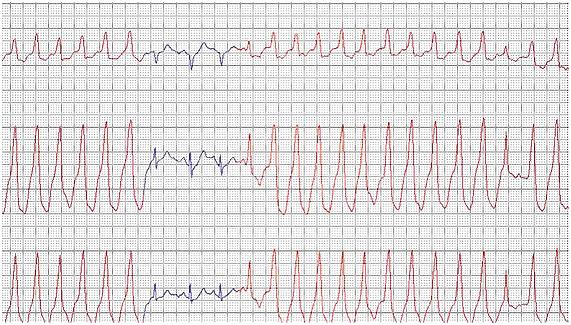
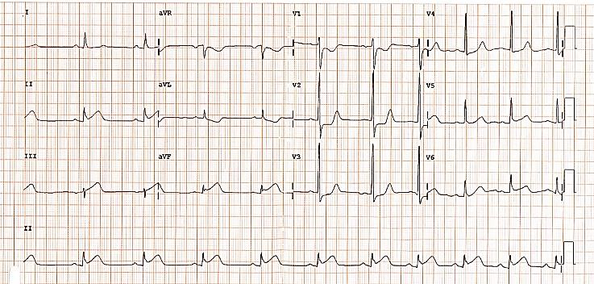

# ENARE 2022-2023 - Prova de Acesso Direto

## Questão 1

Assinale a alternativa correta quanto às características das doenças inflamatórias intestinais – doença de Crohn e retocolite ulcerativa. Em relação ao risco de contaminação, podemos classificar uma cirurgia eletiva de câncer de estômago com abordagem controlada da cavidade gástrica como

**Descrição Técnica da Imagem:** Imagem relacionada à questão.

**Alternativas:**
- A) limpa.
- B) contaminada.
- C) potencialmente contaminada.
- D) suja.
- E) infectada.

**Tags:** #Pergunta #ENARE

---
## Questão 2

Uma paciente de 32 anos teve, recentemente, diagnóstico de PAF (Polipose Adenomatosa Familiar) e possui aversão a cirurgias. Qual é a orientação correta a ser feita nesse caso?

**Descrição Técnica da Imagem:** Imagem relacionada à questão.

**Alternativas:**
- A) A retocolite ulcerativa tem sua maior incidência em pacientes de 50 anos.
- B) A retocolite ulcerativa é uma doença que geralmente acomete mucosa, submucosa e muscular do cólon.
- C) A retocolite ulcerativa pode estar associada a manifestações extraintestinais, como a colangite esclerosante, e geralmente é agravada pelo tabagismo.
- D) Tanto a retocolite ulcerativa como a doença de Crohn são mais comuns entre mulheres que usam contraceptivos orais em comparação com aquelas que não usam.
- E) O tabagismo atua como efeito protetor na doença de Crohn.

**Tags:** #Pergunta #ENARE

---
## Questão 3

Um paciente será submetido a uma tireoidectomia total. Qual das alternativas a seguir apresenta uma complicação que pode ocorrer em consequência desse tipo de cirurgia e sua justificativa?

**Descrição Técnica da Imagem:** Imagem relacionada à questão.

**Alternativas:**
- A) Hiperparatireoidismo por lesão das paratireoides.
- B) Paralisia de prega vocal por lesão do nervo laríngeo recorrente.
- C) Hipertireoidismo por liberação de grande quantidade de hormônios tireoideanos.
- D) Rouquidão por lesão do nervo glossofaríngeo.
- E) Hipercalcemia por paratireoidectomia acidental.

**Tags:** #Pergunta #ENARE

---
## Questão 4

Um paciente será submetido a uma cirurgia cardíaca eletiva. Qual antibiótico deve ser preferencialmente utilizado para a profilaxia antimicrobiana cirúrgica?

**Descrição Técnica da Imagem:** Imagem relacionada à questão.

**Alternativas:**
- A) Cefazolina.
- B) Metronidazol.
- C) Ceftriaxona.
- D) Cefepima.
- E) Ciprofloxacino. PRM - ACESSO DIRETO - TODAS AS ÁREAS Tipo 01 – Página 2 Exame Nacional de Residência INSTITUTO AOCP 6

**Tags:** #Pergunta #ENARE

---
## Questão 5

Um paciente, 20 anos, teve uma fratura exposta de tíbia grau I de Gustillo-Anderson. Qual seria a forma mais correta de realizar o primeiro atendimento hospitalar desse paciente? Uma paciente de 24 anos, com IMC de 32kg/m² e sem comorbidades, procura um médico cirurgião com o desejo de realizar cirurgia bariátrica. Refere que já procurou outros cirurgiões que não quiseram realizar o procedimento. Qual seria a melhor conduta do médico diante dessa situação?

**Descrição Técnica da Imagem:** Imagem relacionada à questão.

**Alternativas:**
- A) Indicar a cirurgia bariátrica, já que a paciente Ciprofloxacino, realizar vacina antirrábica e seguir com lavagem e redução local da fratura.
- B) Orientar a paciente que ela não possui critérios para indicação da cirurgia e que deve iniciar medidas clínicas para a perda de peso.
- C) Orientar a paciente que ela deve realizar exames laboratoriais e que, se estes revelarem que ela é portadora de diabetes, terá indicação de realizar a cirurgia.
- D) Orientar a paciente sobre os riscos da cirurgia e que esta deve ser indicada somente para pacientes com IMC maior que 45kg/m².
- E) Orientar a paciente que ela não possui critérios para indicação da cirurgia, porém, caso a paciente insista em seu desejo, o médico deve realizar o procedimento, respeitando a vontade dela.

**Tags:** #Pergunta #ENARE

---
## Questão 6

Assinale a alternativa que corresponde à sequência correta de marcadores mais relacionados aos seguintes tipos de câncer, nesta ordem: câncer de pâncreas / câncer de ovário / câncer colorretal / hepatocarcinoma.

**Descrição Técnica da Imagem:** Imagem relacionada à questão.

**Alternativas:**
- A) Ca 125 / CEA / Ca 19-9 / alfafetoproteína.
- B) Ca 19-9 / Ca 15-3 / CEA / LDH.
- C) CEA / Ca 125 / CEA / LDH.
- D) Ca 19-9 / Ca 15-3 / CEA / alfafetoproteína.
- E) Ca 19-9 / Ca 125 / CEA / alfafetoproteína.

**Tags:** #Pergunta #ENARE

---
## Questão 7

Um paciente de 27 anos possui uma lesão pigmentada e assimétrica, de aproximadamente 7mm, localizada em pele do dorso. Procurou um médico que indicou biópsia. Qual é o melhor tipo de biópsia a ser indicada para esse paciente?

**Descrição Técnica da Imagem:** Imagem relacionada à questão.

**Alternativas:**
- A) Biópsia incisional.
- B) Biópsia excisional.
- C) Biópsia em shaving superficial.
- D) Biópsia com agulha fina.
- E) Biópsia com agulha grossa. PRM - ACESSO DIRETO - TODAS AS ÁREAS Tipo 01 – Página 3 Exame Nacional de Residência INSTITUTO AOCP 10

**Tags:** #Pergunta #ENARE

---
## Questão 8

Levado por um vizinho, um paciente de 68 anos, previamente lúcido, foi admitido em um hospital com rebaixamento do nível de consciência. Durante a investigação, foi sugerido provável diagnóstico de sepse grave de foco abdominal devido a uma diverticulite aguda perfurada. O paciente permaneceu torporoso e, após a equipe tentar entrar em contato com a família, sem sucesso, o paciente foi encaminhado à cirurgia. O médico cirurgião indicou uma retossigmoidectomia à Hartmann – com colostomia terminal. Qual é a melhor conduta diante dessa situação? Os pacientes submetidos à ressecção cirúrgica de lesões extensas de pele, geralmente, necessitam de retalho ou enxerto como auxílio no fechamento do defeito. Assinale a alternativa que caracteriza corretamente as técnicas empregadas nessas situações.

**Descrição Técnica da Imagem:** Imagem relacionada à questão.

**Alternativas:**
- A) Proceder com a cirurgia, já que se trata de cirurgia de urgência, com risco ao paciente, necessitando que seja feita uma colostomia para melhor tratamento dele, independentemente da opinião da família.
- B) Aguardar a chegada da família para iniciar a cirurgia, já que eles devem decidir sobre a confecção ou não de um estoma.
- C) Proceder com a cirurgia sem a confecção de estoma, pelo risco de não haver aceite da família quanto a esse procedimento, mesmo que seja a melhor estratégia para o paciente.
- D) Orientar o acompanhante sobre o quadro e solicitar que ele decida sobre a confecção ou não do estoma para o paciente, já que está acompanhando o paciente.
- E) Proceder com a cirurgia e realizar a lavagem e drenagem da cavidade para realizar, posteriormente, uma nova abordagem cirúrgica, devido à ausência da família.

**Tags:** #Pergunta #ENARE

---
## Questão 9

Um paciente com uma massa em ápice pulmonar direito apresenta dor e perda de força em ombro e braço direitos, além de ptose palpebral, miose e anidrose ipsilateral. A síndrome que inclui todos esses sinais e sintomas é denominada

**Descrição Técnica da Imagem:** Imagem relacionada à questão.

**Alternativas:**
- A) Enxerto que é um segmento de pele, sem o subcutâneo, com suprimento vascular próprio, rotacionado para a área doadora.
- B) Enxerto que é um pedaço de pele retirado de uma área corpórea e transferido para outra área com um pedículo de comunicação entre as áreas.
- C) Retalho que é um segmento da pele e subcutâneo com suprimento vascular próprio, que será movido de uma área (doadora) para outra (receptora), existindo uma comunicação do retalho com a área doadora por meio de um pedículo.
- D) Retalho que é um segmento de pele e subcutâneo sem nenhum pedículo de comunicação entre eles. Só mais tardiamente desenvolve vascularização própria, restabelecendo, assim, um novo suprimento sanguíneo.
- E) Geralmente o enxerto (área doadora) é retirado de pele adjacente, em continuidade com o defeito, obtendo assim melhores resultados.

**Tags:** #Pergunta #ENARE

---
## Questão 10

Assinale a alternativa que NÃO corresponde a uma indicação usual de intervenção por CPRE (Colangiopancreatografia Retrógrada Endoscópica).

**Descrição Técnica da Imagem:** Imagem relacionada à questão.

**Alternativas:**
- A) síndrome de Claude Bernard-Horner.
- B) síndrome da veia cava superior.
- C) síndrome de Kaposi.
- D) síndrome de Pancoast.
- E) síndrome do desfiladeiro torácico. PRM - ACESSO DIRETO - TODAS AS ÁREAS Tipo 01 – Página 4 Exame Nacional de Residência INSTITUTO AOCP 14

**Tags:** #Pergunta #ENARE

---
## Questão 11

Em um reparo cirúrgico aberto de hérnia inguinal, é importante que o cirurgião tenha conhecimento de anatomia e habilidade para preservar estruturas importantes encontradas na região do canal inguinal. No caso de pacientes homens, quais são os nervos (com suas respectivas funções) que devem ser cuidadosamente dissecados e preservados nesse procedimento? Um paciente de 74 anos recebeu o diagnóstico de HPB (Hiperplasia Prostática Benigna), e o médico indicou duas medicações para o tratamento dessa afecção e seus sintomas: a tansulosina e a finasterida. Qual é a melhor explicação que pode ser dada sobre o efeito desses compostos ao paciente?

**Descrição Técnica da Imagem:** Imagem relacionada à questão.

**Alternativas:**
- A) Ramo genital do nervo genitofemoral (sensibilidade lateral do escroto); nervo iliohipogástrico (sensibilidade da região inguinal e púbis / base do pênis); nervo ilioinguinal (sensibilidade de região medial superior da coxa).
- B) Ramo femoral do nervo genitofemoral (sensibilidade lateral da perna); nervo ilioinguinal (sensibilidade de região medial superior da coxa); nervo obturador (motricidade – adução da perna).
- C) Nervo obturador (motricidade – adução da perna) e nervo cutâneo femoral lateral (sensibilidade de região lateral superior da coxa).
- D) Nervo femoral (motricidade e sensibilidade da perna); nervo ilio-hipogástrico (sensibilidade de região medial superior da coxa); nervo ilioinguinal (sensibilidade da região inguinal e púbis / base do pênis).
- E) Ramo genital do nervo genitofemoral (sensibilidade lateral do escroto); nervo obturador (motricidade – adução da perna); nervo ilioinguinal (sensibilidade da região inguinal e púbis / base do pênis).

**Tags:** #Pergunta #ENARE

---
## Questão 12

Um paciente de 57 anos possui uma lesão esofágica estenosante e não transponível ao aparelho de endoscopia em nível de esôfago médio/distal, com biópsia revelando carcinoma epidermoide escamoso. O paciente iniciará tratamento com radioterapia e quimioterapia neoadjuvantes, porém está com ingesta praticamente nula de alimentos há vários dias. Qual é a melhor estratégia cirúrgica de via alimentar a ser indicada para esse paciente? tansulosina atua diminuindo o volume prostático, e a finasterida contribui para o relaxamento da musculatura na saída da bexiga; ambas facilitam a saída do jato urinário.

**Alternativas:**
- A) 
- B) A tansulosina contribui para o relaxamento da musculatura na saída da bexiga, e a finasterida atua diminuindo o volume prostático; ambas facilitam a saída do jato urinário.
- C) A tansulosina contribui para a contração do corpo da bexiga, e a finasterida age relaxando a musculatura na saída da bexiga; ambas facilitam a saída do jato urinário.
- D) A tansulosina atua na contração da musculatura da próstata, e a finasterina contribui no aumento da contração da musculatura detrusora da bexiga; ambas facilitam a saída do jato urinário.
- E) A tansulosina contribui para o relaxamento da musculatura na saída da bexiga, e a finasterida atua relaxando a musculatura prostática; ambas facilitam a saída do jato urinário.

**Tags:** #Pergunta #ENARE

---
## Questão 13

Durante uma cirurgia de abordagem para ressecção da cabeça do pâncreas, qual das estruturas vasculares a seguir está presente nessa região e é de suma importância para o paciente, devendo-se, por isso, realizar o máximo de esforço para que seja preservada?

**Alternativas:**
- A) Realizar uma gastrostomia endoscópica.
- B) Realizar uma gastrostomia laparoscópica.
- C) Realizar uma jejunostomia.
- D) Realizar uma ileostomia.
- E) Realizar uma esofagostomia. PRM - ACESSO DIRETO - TODAS AS ÁREAS Tipo 01 – Página 5 Exame Nacional de Residência INSTITUTO AOCP 18

**Tags:** #Pergunta #ENARE

---
## Questão 14

Um paciente chega ao hospital com febre há 2 dias e dor em região lombar direita. Ao realizar exames, recebe o diagnóstico de ureterolitíase obstrutiva à direita, com hidronefrose ipsilateral, alteração significativa da função renal e infecção associada com sinais de sepse. Qual é a melhor abordagem para esse paciente? Um paciente foi submetido a uma cirurgia abdominal, e o anestesista introduziu um cateter peridural para analgesia. O paciente se encontra na UTI utilizando heparina de baixo peso molecular como anticoagulação profilática, e a enfermeira questiona o médico plantonista se pode retirar o cateter. Nesse caso, qual é a conduta mais adequada e a respectiva justificativa?

**Alternativas:**
- A) Retirar o cateter, já que a anticoagulação profilática não interfere no risco para hematoma epidural.
- B) Manter o cateter e solicitar orientação ao anestesista quanto ao momento da retirada, devido ao risco de hematoma epidural.
- C) O cateter poderá ser removido se a última dose de heparina tiver sido realizada há mais de 3h.
- D) Manter o cateter e aguardar, pelo menos, 48h, após a última dose da heparina para remover o cateter.
- E) Manter o cateter por, pelo menos, 24h, após a última dose de heparina devido ao risco de hematoma subdural.

**Tags:** #Pergunta #ENARE

---
## Questão 15

Um paciente, vítima de acidente automobilístico, chega ao hospital trazido pela equipe de atendimento pré-hospitalar já intubado, hemodinamicamente instável e anisocórico. Na admissão, foi realizada tomografia computadorizada de crânio que mostrou imagem hiperdensa no encéfalo, próximo à calota craniana, em região parietal, de aspecto côncavoconvexo e com importante desvio de linha média. Qual é o diagnóstico e o tratamento mais indicado para esse paciente?

**Alternativas:**
- A) Hematoma epidural / Abordagem cirúrgica.
- B) Hematoma subdural / Abordagem cirúrgica.
- C) Hematoma intraparenquimatoso / Monitorização da pressão intracraniana.
- D) Lesão axonal difusa / Abordagem cirúrgica.
- E) AVC isquêmico / Manitol endovenoso. PRM - ACESSO DIRETO - TODAS AS ÁREAS Tipo 01 – Página 6 Exame Nacional de Residência INSTITUTO AOCP Clínica Médica 22

**Tags:** #Pergunta #ENARE

---
## Questão 16

Uma mulher de 78 anos procura atendimento médico de urgência com queixa de dor no estômago e náuseas há aproximadamente 2 horas, obtendo-se o seguinte ECG da paciente: Um homem de 46 anos procura atendimento médico de urgência com queixa de palpitações e dor torácica do tipo aperto, de início há aproximadamente 1 hora. Seus sinais vitais são aferidos: • PA: 70x40mmHg (Pressão arterial); • FC: 190bpm (Frequência cardíaca); • SatO2: 88% (Saturação de oxigênio). E seu eletrocardiograma (ECG) é o seguinte: Nesse caso, considerando as apresentadas, é correto afirmar que informações

**Alternativas:**
- A) se trata de uma taquicardia supraventricular, e o uso da manobra vagal modificada está indicado.
- B) uma opção de reperfusão coronariana deve ser indicada imediatamente.
- C) o uso de morfina e nitrato está indicado.
- D) uma endoscopia digestiva alta é prioritária.
- E) a paciente deve ser encaminhada para avaliação ambulatorial com um cardiologista.

**Tags:** #Pergunta #ENARE

---
## Questão 17

Sobre o fenômeno (ou síndrome) de Eisenmenger, assinale a alternativa correta.

**Alternativas:**
- A) É muito comum nos casos de infarto agudo do miocárdio.
- B) Uma das principais características clínicas é a cianose de extremidades. comum nos casos de comunicação interventricular, sendo caracterizado pelo shunt esquerda-direita.
- C) É PRM - ACESSO DIRETO - TODAS AS ÁREAS Tipo 01 – Página 7 Exame Nacional de Residência INSTITUTO AOCP 24
- D) Foi descrito por Frederick Eisenmenger em 1973 em estudo publicado após análise de 52 casos de cardiopatias congênitas cianóticas.
- E) O tratamento com inibidores da enzima conversora de angiotensina (iECA) está indicado.

**Tags:** #Pergunta #ENARE

---
## Questão 18

Em relação à classificação da insuficiência cardíaca, segundo a American Heart Association (AHA), é correto afirmar que Em relação ao hipotireoidismo, é correto afirmar que

**Alternativas:**
- A) um homem de 56 anos, com fração de ejeção na avaliação inicial de nódulos de tireoide. (FE) de 36% no ecocardiograma, é considerado classe A.
- B) a dosagem do T3 reverso (rT3), na avaliação de 25
- C) uma mulher de 42 anos, portadora de miocardiopatia puerperal, com FE de 18% e quadro clínico refratário ao tratamento clínico otimizado, é considerada classe D.
- D) a presença de alterações cardíacas estruturais, sem sintomas de insuficiência cardíaca, é considerada classe C.
- E) a presença de dispneia aos pequenos esforços é considerada classe III.

**Tags:** #Pergunta #ENARE

---
## Questão 19

Um homem de 75 anos, portador de estenose mitral grave, procura atendimento médico com queixa de dispneia e lipotimia. Sobre o exame físico desse paciente, é correto afirmar que Um homem de 27 anos é levado ao pronto atendimento após queda de nível elevado. Depois de assegurar uma via aérea pérvia, a imobilização da coluna cervical e a checagem dos sinais vitais, a resposta ao exame neurológico é a seguinte: flexão normal, sons irreconhecíveis e abertura ocular (todos após estímulos dolorosos). Diante do exposto, assinale a alternativa correta.

**Alternativas:**
- A) a presença de estalido de abertura precoce é frequente.
- B) a hipofonese de B1 é comum.
- C) sinais de insuficiência cardíaca esquerda são comuns.
- D) o exame físico costuma ser normal.
- E) a hipofonese de B2 é característica.

**Tags:** #Pergunta #ENARE

---
## Questão 20

Um homem de 24 anos procura atendimento médico com queixa de falta de ar e boca seca. Sua glicemia capilar é aferida, 467mg/dL. Nega doenças prévias ou uso de medicações. Diante desse caso, assinale a alternativa correta.

**Alternativas:**
- A) A tomografia de crânio é importante para determinar a escala de coma de Glasgow desse paciente.
- B) O uso de insulina de ação rápida pode levar ao aumento do potássio sérico.
- C) A restrição hídrica está indicada nesse caso.
- D) A dosagem da hemoglobina glicosilada é essencial para determinar a conduta correta.
- E) Os títulos de anticorpos antidescarboxilase do ácido glutâmico (GADA) são importantes para o diagnóstico de LADA (latent autoimmune diabetes of the adult). PRM - ACESSO DIRETO - TODAS AS ÁREAS Tipo 01 – Página 8 Exame Nacional de Residência INSTITUTO AOCP 29

**Tags:** #Pergunta #ENARE

---
## Questão 21

Um homem de 63 anos, recebendo medicação para dor epigástrica na sala de observação do pronto atendimento, apresenta um colapso ao levantar-se da poltrona. Qual é a conduta imediata mais adequada nesse caso? Uma mulher de 71 anos, com histórico de DPOC, procura atendimento médico com queixa de falta de ar. O resultado da gasometria arterial é o seguinte: • pH: 7,25; • CO2: 62; • BIC: 35. Nesse caso, é correto afirmar que

**Alternativas:**
- A) Realizar um eletrocardiograma de 12 derivações.
- B) Checar a responsividade.
- C) Aplicar 1mg de epinefrina EV.
- D) Iniciar compressões torácicas.
- E) Solicitar avaliação da cardiologia.

**Tags:** #Pergunta #ENARE

---
## Questão 22

**Alternativas:**
- A) Os nociceptores são responsáveis pela transdução.
- B) A dor neuropática tem como principal característica a melhora à noite e nos meses mais frios.
- C) A migrânea é um exemplo clássico de dor somática superficial.
- D) A pregabalina atua nos receptores opioides do sistema nervoso central, principalmente µ1 e µ2.
- E) A presença de injúria tecidual é essencial para a explicação do fenômeno doloroso.

**Tags:** #Pergunta #ENARE

---
## Questão 23

Um homem de 62 anos é levado ao hospital com história de perda de força em dimídio direito, afasia e desvio de rima labial, de início há aproximadamente 40min. Após a realização de uma tomografia computadorizada de crânio (normal, com laudo oficial do radiologista), seus sinais vitais são os seguintes: • PA: 192x124 mmHg; • Glicemia capilar: 88 mg/dL; • NIHSS: 18 pontos. Nesse caso, qual é a conduta mais adequada?

**Alternativas:**
- A) Chamar o neurologista de plantão.
- B) Uso de um comprimido de nifedipina 20 mg sublingual.
- C) Uso de 300 mg de ácido acetilssalicílico (AAS) por via oral.
- D) Uso de 20 mg de rivaroxabana por via oral.
- E) está indicada reposição de bicarbonato EV.

**Tags:** #Pergunta #ENARE

---
## Questão 24

Sobre a neuromielite óptica, assinale a alternativa correta.

**Alternativas:**
- A) É uma forma de apresentação da Esclerose Múltipla.
- B) Pleocitose é bastante específica para o diagnóstico.
- C) Também é conhecida como síndrome de Devic.
- D) A presença de paralisia espástica é frequente.
- E) A tomografia de crânio apresenta alterações específicas.

**Tags:** #Pergunta #ENARE

---
## Questão 25

Um homem de 56 anos procura atendimento médico por crise de artrite gotosa, apresentando sinais clássicos de podagra. Sobre o tratamento para esse caso, é correto afirmar que

**Alternativas:**
- A) a colchicina está contraindicada se o paciente for portador de doença renal crônica e estiver em uso contínuo de carvedilol.
- B) o uso de corticosteroides por via oral não é recomendado.
- C) o alopurinol está indicado durante a crise aguda.
- D) o uso de inibidores de interleucina-1 é considerado tratamento de primeira escolha.
- E) a prednisona está indicada na dose de 5mg por via oral em dias alternados. endovenosa – alvo abaixo de 180x100 mmHg – seguido de trombólise com alteplase 9 mg/Kg, na ausência de contraindicações. PRM - ACESSO DIRETO - TODAS AS ÁREAS Tipo 01 – Página 9 Exame Nacional de Residência INSTITUTO AOCP 35

**Tags:** #Pergunta #ENARE

---
## Questão 26

São considerados anticoagulantes, por bloqueio do fator Xa, EXCETO Em relação à artrite reumatoide, é correto afirmar que

**Alternativas:**
- A) os anti-inflamatórios não esteroidais (AINE) são
- B) edoxabana.
- C) enoxaparina.
- D) dabigatrana.
- E) apixabana.

**Tags:** #Pergunta #ENARE

---
## Questão 27

Em relação à febre reumática, é correto afirmar que

**Alternativas:**
- A) a coreia de Sydenham é considerada um critério maior para o diagnóstico, sendo muito frequente na apresentação inicial (80-90%).
- B) a dor articular (artralgia) é considerada um critério menor para o diagnóstico.
- C) a presença de febre baixa é essencial para o diagnóstico.
- D) a faixa etária mais acometida é de 40 – 50 anos.
- E) o uso de corticosteroides está indicado na profilaxia da febre reumática.

**Tags:** #Pergunta #ENARE

---
## Questão 28

Um homem de 54 anos procura atendimento médico com queixa de dor ao urinar e urgência miccional. O diagnóstico de prostatite é estabelecido e a urocultura mostra crescimento de pseudomonas aeruginosa. Diante do exposto, assinale a alternativa correta. considerados drogas modificadoras de doença.

**Alternativas:**
- A) 
- B) o diagnóstico deve ser confirmado pela dosagem do fator reumatoide.
- C) a presença de marcadores agudos de inflamação (proteína C reativa ou velocidade de hemossedimentação) adiciona 5 pontos aos critérios mais recentes de diagnóstico.
- D) o metotrexato é considerado droga de primeira escolha.
- E) o uso de corticosteroides intra-articulares está indicado na maioria dos casos.

**Tags:** #Pergunta #ENARE

---
## Questão 29

Sobre o carvedilol, assinale a alternativa correta.

**Alternativas:**
- A) A pseudomonas aeruginosa é responsável pela maioria dos casos de prostatite bacteriana aguda.
- B) O quadro clínico geralmente é pouco sintomático.
- C) A incidência de neoplasia de próstata é comum nesses casos.
- D) A macrodantina é o antimicrobiano de escolha nesses casos.
- E) O uso de ertapenem está contraindicado.

**Tags:** #Pergunta #ENARE

---
## Questão 30

Qual neoplasia maligna é responsável pelo maior número de óbitos no Brasil?

**Alternativas:**
- A) Neoplasia de pulmão.
- B) Neoplasia de intestino.
- C) Neoplasia de mama.
- D) Neoplasia de pele.
- E) Neoplasia de colo de útero. PRM - ACESSO DIRETO - TODAS AS ÁREAS Tipo 01 – Página 10 Exame Nacional de Residência Pediatria

**Tags:** #Pergunta #ENARE

---
## Questão 31

Sobre a predominância das neoplasias em pediatria, de acordo com a idade e o sítio primário, assinale a alternativa correta.

**Alternativas:**
- A) Entre os linfomas, tanto o de Hodgkin quanto o de não Hodgkin, são bastante predominantes em menores de 1 ano.
- B) Entre as leucemias, a leucemia mieloide crônica juvenil é mais predominante na adolescência e é rara em menores de 3 anos.
- C) Das neoplasias de sistema nervoso central, o astrocitoma cerebelar está entre as mais predominantes em maiores de 3 anos.
- D) Das neoplasias com sítio primário em cabeça e pescoço, as mais predominantes, em todas as faixas etárias, são o sarcoma de partes moles e o linfoma.
- E) O neuroblastoma e o tumor de Wilms são as neoplasias de sítio abdominal mais predominantes em adolescentes.

**Tags:** #Pergunta #ENARE

---
## Questão 32

Na fase mais inicial da apendicite aguda, qual é a tríade sintomática mais característica entre as seguintes?

**Alternativas:**
- A) Dor em fossa ilíaca direita, febre alta e INSTITUTO AOCP
- B) 
- C) 
- D) 
- E) 

**Tags:** #Pergunta #ENARE

---
## Questão 33

Você está atendendo uma criança de 6 anos com queixa de lesões de pele, com prurido intenso, que ocorre principalmente à noite, há alguns dias. O paciente não apresentou febre ou qualquer outro sintoma. As lesões são papulovesiculares eritematosas, localizadas em espaços interdigitais, axilas, punhos, regiões glútea e genital. Os pais estão presentes na consulta, e a mãe refere os mesmos sintomas, com lesões semelhantes, mas com presença de lesões em túnel. O pai está assintomático e sem lesões. Qual é a conduta adequada em relação ao paciente e aos seus pais?

**Alternativas:**
- A) Prescrever tratamento para a criança e para os familiares, independentemente da presença de sintomas.
- B) Prescrever o tratamento para a criança e para os familiares sintomáticos.
- C) Prescrever o tratamento apenas para a criança, que é sua paciente.
- D) Prescrever o tratamento para a criança e para a mãe.
- E) Prescrever o tratamento para a criança e indicar avaliação com dermatologista para a mãe.

**Tags:** #Pergunta #ENARE

---
## Questão 34

Em relação à vacina tríplice viral, oferecida pelo Programa Nacional de Imunizações, assinale a alternativa correta. prostração.

**Alternativas:**
- A) A dose zero, dada em situação epidemiológica vômitos.
- B) É contraindicada para gestantes, exceto em situações de surto de sarampo, caxumba ou rubéola.
- C) É contraindicada para crianças abaixo dos 12 meses de idade, mesmo em situações de surto de sarampo, caxumba ou rubéola.
- D) Mulheres em idade fértil devem evitar a gravidez até pelo menos 1 ano após a vacinação.
- E) Pessoas comprovadamente portadoras de alergia à proteína do leite de vaca não podem receber vacina tríplice viral. PRM - ACESSO DIRETO - TODAS AS ÁREAS Tipo 01 – Página 11 Exame Nacional de Residência INSTITUTO AOCP 45

**Tags:** #Pergunta #ENARE

---
## Questão 35

Uma criança em idade escolar está em antibioticoterapia, há 48 horas, por pneumonia bacteriana. Ela é levada ao hospital para reavaliação, pois não teve melhora da curva térmica, está prostrada e com perda de apetite. Ao exame físico, apresenta diminuição do murmúrio vesicular em base esquerda e tem bom padrão respiratório, apesar de manter uma posição antálgica em escoliose. Qual, entre as seguintes, é a conduta mais indicada no momento? Um paciente de 5 anos, assintomático, está em consulta de puericultura. Ao exame físico, é identificado um linfonodo supraclavicular palpável. Nesse caso, está indicada a biópsia desse linfonodo?

**Alternativas:**
- A) Não, pois o paciente deve ser revisado em duas semanas para avaliar se houve regressão.
- B) Não, pois o paciente é assintomático.
- C) Sim, independentemente das características do linfonodo.
- D) Sim, se o linfonodo for firmemente aderido e maior que 2 cm.
- E) Sim, se o linfonodo for maior que 1 cm.

**Tags:** #Pergunta #ENARE

---
## Questão 36

Sobre a rubéola congênita, assinale a alternativa correta.

**Alternativas:**
- A) Perda auditiva é a manifestação mais comum e
- B) 
- C) 
- D) 
- E) 

**Tags:** #Pergunta #ENARE

---
## Questão 37

As infecções sexualmente transmissíveis são um grave problema de saúde pública no Brasil, devendo-se ter especial atenção à população adolescente. Considerando somente as infecções adquiridas, qual, das seguintes, pode ser transmitida de outras formas além da sexual?

**Alternativas:**
- A) Sífilis.
- B) Hepatite B.
- C) Gonorreia.
- D) Linfogranuloma venéreo.
- E) Cancro mole.

**Tags:** #Pergunta #ENARE

---
## Questão 38

usualmente é condutiva bilateral, e a severidade varia de moderada a grave, com progressão ao longo do tempo.

**Alternativas:**
- A) Febre.
- B) Exantema.
- C) Conjuntivite.
- D) Mucosite.
- E) Edema distal. PRM - ACESSO DIRETO - TODAS AS ÁREAS Tipo 01 – Página 12 Exame Nacional de Residência INSTITUTO AOCP 50

**Tags:** #Pergunta #ENARE

---
## Questão 39

A glomerulonefrite difusa aguda pós-estreptocócica é a mais comum das glomerulopatias da infância. Sobre essa glomerulonefrite, assinale a alternativa correta. Você está atendendo um paciente com quadro de púrpura palpável, dor abdominal e artralgia. Sua suspeita inicial é de Púrpura de Henoch-Schönlein. Sobre esse diagnóstico, assinale a alternativa correta.

**Alternativas:**
- A) A púrpura palpável é um achado frequente nos
- B) Nas alterações urinárias, observa-se hematúria, macroscópica ou microscópica, em cerca de 95% dos casos e proteinúria, raramente em níveis nefróticos, o que, na fase aguda, é um importante indicador de gravidade da nefropatia.
- C) A insuficiência renal aguda é uma das complicações mais comuns, apresentando oligoanúria intensa, retenção de escórias proteicas no plasma e distúrbios hidreletrolíticos graves, com tendência à hiperpotassemia.
- D) A encefalopatia hipertensiva é uma complicação que se deve essencialmente à hipertensão e pode cursar com cefaleia, vômitos, alterações visuais, agitação, sonolência, crise convulsiva ou coma e, ao exame de fundo de olho, observamse as alterações características de hipertensão arterial, na maioria dos casos.
- E) Congestão circulatória é a complicação mais frequente, caracterizada por sinais clínicos de hipervolemia e que pode ser agravada por hipertensão, levando a insuficiência cardíaca congestiva e edema agudo de pulmão, com evidência de dano miocárdico intrínseco.

**Tags:** #Pergunta #ENARE

---
## Questão 40

**Alternativas:**
- A) Anorexia nervosa.
- B) Manifestações gastrointestinais são bastante incomuns e, quando presentes, são leves e autolimitadas.
- C) A doença não acomete os rins.
- D) A artrite aguda é um critério obrigatório para o diagnóstico, geralmente incapacitante, aditiva e de pequenas articulações.
- E) Pode ser primária ou desencadeada por infecções virais, bacterianas, alimentos, vacinas, medicamentos e picadas de insetos.

**Tags:** #Pergunta #ENARE

---
## Questão 41

Os pais de uma adolescente relatam ao seu pediatra, na ausência da paciente, que estão percebendo que ela tem mudado o comportamento alimentar. Viram, por diversas vezes, que estava comendo escondida, muito rapidamente e em grandes quantidades. Referem que ela tem vergonha quando é vista nessa situação, que demonstra tristeza após alimentarse e que, muito frequentemente, come até se sentir desconfortável. Das seguintes condições, qual é a mais provável, baseando-se apenas no relato dos pais?

**Alternativas:**
- A) Estabilização de cervical.
- B) Ventilação de resgate.
- C) Posicionar o paciente em decúbito lateral.
- D) Manobra de Heimlich.
- E) Compressões abdominais. PRM - ACESSO DIRETO - TODAS AS ÁREAS Tipo 01 – Página 13 Exame Nacional de Residência INSTITUTO AOCP 54

**Tags:** #Pergunta #ENARE

---
## Questão 42

Assinale a alternativa INCORRETA sobre otite média aguda (OMA). Na Hiperplasia congênita das suprarrenais por deficiência da 21-hidroxilase, ocorre

**Alternativas:**
- A) aumento exagerado da produção de cortisol, sem reconhecida importância, e o aleitamento materno é um fator de proteção.
- B) deficiência 55
- C) aumento do cortisol, com retroalimentação negativa deficiente do cortisol na hipófise e no hipotálamo, seguida por grave redução de hormônio liberador de corticotrofina e hormônio adrenocorticotrófico.
- D) hiperplasia das glândulas por redução dos níveis de hormônio liberador de corticotrofina e de hormônio adrenocorticotrófico.
- E) deficiência da produção de cortisol e, em 75% dos pacientes, deficiência da produção de aldosterona.

**Tags:** #Pergunta #ENARE

---
## Questão 43

Uma criança de 1 ano é levada para avaliação, por ter apresentado cianose, que ocorreu após período de choro prolongado, sem perda de consciência e com resolução espontânea. Após avaliação neurológica detalhada, o quadro é definido como perda de fôlego cianótica. Qual é sua postura perante os pais quanto a esse diagnóstico? Das opções a seguir, qual cita uma das causas metabólicas mais frequentes de catarata na população pediátrica?

**Alternativas:**
- A) Hipercalcemia.
- B) Esclarece as dúvidas dos pais, enfatizando a alta probabilidade de o paciente ter quadros convulsivos subsequentes.
- C) Conversa sobre desenvolvimento infantil e encaminha a família para centro multidisciplinar, dado que o retardo no desenvolvimento neurológico faz parte da maioria dos casos.
- D) Tranquiliza os pais, deixando claro que o episódio é benigno e autolimitado.
- E) Explica que o paciente apresenta maior risco de parada cardiorrespiratória. PRM - ACESSO DIRETO - TODAS AS ÁREAS

**Tags:** #Pergunta #ENARE

---
## Questão 44

A fibrose cística está presente em 99% dos pacientes com diagnóstico de íleo meconial. Na ausência de fibrose cística, qual é um dos grupos de recém-nascidos (RN) mais acometidos?

**Alternativas:**
- A) RN com icterícia.
- B) RN com asfixia perinatal.
- C) RN com doença hemolítica.
- D) RN com hipotireoidismo congênito.
- E) RN prematuro com peso muito baixo. Tipo 01 – Página 14 Exame Nacional de Residência INSTITUTO AOCP 59

**Tags:** #Pergunta #ENARE

---
## Questão 45

Uma criança em idade escolar é levada para consulta de rotina. Ela fazia acompanhamento em outra cidade e vem, hoje, para a primeira consulta com você. Ao exame físico, você detecta um sopro cardíaco. Qual das seguintes características indica se tratar de um sopro patológico? Um bebê de 6 meses é levado ao hospital por tosse, cansaço para respirar e respiração mais “rápida”. Nega ter tido febre, mas teve, logo antes do quadro atual, coriza leve e um pouco de obstrução nasal. Ao exame físico, o paciente apresenta taquipneia, retrações subcostais discretas e sibilos difusos à ausculta. Com base no diagnóstico provável de bronquiolite viral aguda (BVA), informe se é verdadeiro (V) ou falso (F) o que se afirma a seguir e assinale a alternativa com a sequência correta.

**Alternativas:**
- A) F – V – V – V – V.
- B) V – V – V – F – V.
- C) F – F – F – F – F.
- D) F – V – F – V – V.
- E) V – F – V – V – F. PRM - ACESSO DIRETO - TODAS AS ÁREAS Tipo 01 – Página 15 Exame Nacional de Residência Ginecologia e Obstetrícia

**Tags:** #Pergunta #ENARE

---
## Questão 46

Paciente de 26 anos agenda consulta com ginecologista devido à dor pélvica com duração de aproximadamente 30 dias. Relata que não tem parceiro fixo e, nos últimos meses, apresentou relação desprotegida. Ao exame especular, apresenta secreção purulenta proveniente do colo do útero e, no toque vaginal, dor à mobilização do colo do útero e anexos. O ultrassom ginecológico não mostrou anormalidades. Para essa paciente, qual esquema antibiótico é o mais recomendado?

**Alternativas:**
- A) Ceftriaxona e amoxicilina.
- B) Cefalexina e ciprofloxacino.
- C) Doxiciclina e azitromicina.
- D) Ceftriaxona e azitromicina.
- E) Clindamicina e metronidazol.

**Tags:** #Pergunta #ENARE

---
## Questão 47

A bexiga hiperativa é uma das causas de perda urinária na mulher e está relacionada à hiperatividade do músculo detrusor. Sobre esse assunto, é correto afirmar que

**Alternativas:**
- A) o tratamento da bexiga hiperativa é cirúrgico com sling transobturatório.
- B) para o diagnóstico, é imprescindível a realização do estudo urodinâmico em todos os casos.
- C) para o tratamento, é possível usar medicações anticolinérgicas e técnica de biofeedback.
- D) a imipramina é o tratamento de primeira escolha.
- E) a bexiga hiperativa acontece devido ao prolapso de parede vaginal anterior. INSTITUTO AOCP

**Tags:** #Pergunta #ENARE

---
## Questão 48

Uma paciente de 40 anos apresenta leucorreia de odor fétido. Na citologia oncótica cervical, foi demonstrada a presença de clue-cells. Sobre esse assunto, informe se é verdadeiro (V) ou falso (F) o que se afirma a seguir e assinale a alternativa com a sequência correta. ( ) O teste de aminas possivelmente será positivo. ( ) O PH vaginal, nesse caso, será menor que 4,5. ( ) Gardnerella vaginalis, Bacterioides, Mobiluncus e Peptococcus fazem parte da flora normal, desde que em pequenas quantidades. ( ) Nesse caso, é necessário o tratamento do parceiro.

**Alternativas:**
- A) V – V – V – F.
- B) V – F – V – F.
- C) V – V – F – F.
- D) F – F – F – V.
- E) F – F – V – F.

**Tags:** #Pergunta #ENARE

---
## Questão 49

Pacientes que apresentam vaginose citolítica podem ter alguns sintomas semelhantes a outros tipos de vaginites, como prurido e corrimento esbranquiçado antes do período menstrual; ardor; queimação; disúria e dispareunia. Essa semelhança de sintomas com outras patologias do trato genital inferior pode atrasar o seu diagnóstico. Em relação à vaginose citolítica, é correto afirmar que

**Alternativas:**
- A) é causada pela proliferação excessiva de Lactobacillus e pela redução do PH vaginal, que se encontra menor ou igual a quatro.
- B) o processo inflamatório intenso é causado por Streptococcus do grupo B e Escherichia Coli.
- C) tem como agente etiológico o parasita flagelado Trichomonas vaginalis.
- D) é o processo inflamatório vaginal causado pela proliferação de fungos como o Candida tropicalis.
- E) é causada pela substituição da flora microbiana vaginal denominada Lactobacillus por bactérias anaeróbias e facultativas. PRM - ACESSO DIRETO - TODAS AS ÁREAS Tipo 01 – Página 16 Exame Nacional de Residência INSTITUTO AOCP 65

**Tags:** #Pergunta #ENARE

---
## Questão 50

Dentre as alternativas a seguir, qual delas apresenta os achados que seriam mais sugestivos de câncer de mama? Uma paciente de 55 anos, com antecedente de menopausa aos 50 anos, refere que nunca usou terapia hormonal e faz tratamento de hipertensão e diabetes. Relata que, há cerca de um mês, apresentou sangramento vaginal em dois momentos diferentes, durando aproximadamente 2 dias cada episódio. Apresenta citopatológico com atrofia acentuada. Ultrassom transvaginal evidencia a presença de dois miomas intramurais de 0,7 e 1,3 cm respectivamente; volume uterino de 35 cm³; e endométrio de 11 mm. Ovários não foram visualizados. Diante desse caso, qual é a melhor conduta?

**Alternativas:**
- A) Cisto único no quadrante inferior interno da mama esquerda.
- B) Cistos múltiplos em ambas as mamas.
- C) Nódulos difusos, simétricos, em ambas as mamas.
- D) Consolidação na mama direita que aparece logo antes da menstruação.
- E) Nódulo sólido único no quadrante superior externo da mama esquerda.

**Tags:** #Pergunta #ENARE

---
## Questão 51

Uma mulher de 53 anos vem ao ambulatório de uroginecologia referindo perda urinária. Possui histórico de 5 partos via vaginal e apresenta menopausa há 7 anos, sem terapia de reposição hormonal. No exame físico ginecológico, apresenta prolapso de parede anterior grau 1, sem perda urinária à valsalva. Apresenta resultado de estudo urodinâmico que revelou a presença de contrações não inibidas do músculo detrusor como único achado. Nesse caso, a abordagem terapêutica inicial é

**Alternativas:**
- A) Histerectomia total abdominal mais anexectomia.
- B) Acetato de medroxiprogesterona trimestral.
- C) Iniciar estriol creme vaginal.
- D) Histeroscopia diagnóstica.
- E) Miomectomia.

**Tags:** #Pergunta #ENARE

---
## Questão 52

A presença de células “em anel de sinete”, no exame de anatomopatológico, é um achado de qual dos seguintes tumores ovarianos?

**Alternativas:**
- A) Tumor de Brenner.
- B) Tumor de Krukenberg.
- C) Teratoma imaturo do ovário.
- D) Tumor seroso.
- E) Disgerminoma.

**Tags:** #Pergunta #ENARE

---
## Questão 53

Quais dos seguintes sintomas podem estar associados ao aumento do hormônio prolactina no organismo?

**Alternativas:**
- A) Queda de cabelo e acne.
- B) Hirsutismo e aumento do fluxo menstrual.
- C) Amenorreia e galactorreia.
- D) Irregularidade menstrual e disforia pré-menstrual.
- E) Dispareunia e dismenorreia.

**Tags:** #Pergunta #ENARE

---
## Questão 54

Das patologias a seguir, estão associadas à amenorreia primária, EXCETO

**Alternativas:**
- A) síndrome de Rokitansky.
- B) síndrome de Morris.
- C) síndrome de Kallmann.
- D) síndrome de Asherman.
- E) hímen imperfurado. PRM - ACESSO DIRETO - TODAS AS ÁREAS Tipo 01 – Página 17 Exame Nacional de Residência INSTITUTO AOCP 71

**Tags:** #Pergunta #ENARE

---
## Questão 55

Uma gestante de 18 anos, G1, que não realizou pré-natal, com aproximadamente 38 semanas de idade gestacional, calculada pela data da última menstruação, chega à maternidade em trabalho de parto, com 3 contrações em 10 minutos e toque vaginal colo esvaecido com 6 cm de dilatação. Nesse caso, visando reduzir os riscos de transmissão vertical do HIV, é correto afirmar que Gestante, 23 semanas, refere que não fez nenhum dos exames solicitados na rotina de primeiro trimestre. Nega doenças prévias; o peso pré-gestacional era 80 kg e, atualmente, está com 90 kg, sendo que a altura é de 1,60 m. Considerando a disponibilidade técnica adequada, a melhor conduta para o diagnóstico de diabetes gestacional é solicitar

**Alternativas:**
- A) deve ser realizado teste rápido de HIV na admissão e, caso o resultado seja positivo, iniciar infusão de AZT.
- B) deve ser realizado teste rápido de HIV na admissão e, caso o resultado seja positivo, será uma indicação absoluta de cesárea.
- C) deve ser realizado teste rápido de HIV na admissão e, caso o resultado seja positivo, a amniotomia precoce será indicada.
- D) deve ser realizado teste rápido de HIV na admissão e, caso o resultado seja positivo, o parto instrumentalizado e a episiotomia estão indicados para acelerar o nascimento.
- E) deve ser realizado teste rápido de HIV na admissão e, caso o resultado seja negativo, exclui-se completamente a possibilidade de essa paciente possuir o vírus do HIV.

**Tags:** #Pergunta #ENARE

---
## Questão 56

Em relação à síndrome HELLP, assinale alternativa INCORRETA. a momento da consulta.

**Alternativas:**
- A) 
- B) teste oral de tolerância à glicose com 100g em jejum e duas horas após sobrecarga.
- C) teste oral de tolerância à glicose com 75 g em jejum de duas horas imediatamente.
- D) apenas hemoglobina glicada.
- E) teste oral de tolerância à glicose com 75 g em jejum, uma e duas horas após sobrecarga, entre 24 e 28 semanas.

**Tags:** #Pergunta #ENARE

---
## Questão 57

Gestante de 41 semanas, G2C1, procura o hospital para resolução da gestação, sendo que sua última cesárea foi há 3 anos. Pré-natal de risco habitual e sem complicações durante a gestação. Ao exame físico, apresenta sinais vitais normais, vitalidade fetal preservada, altura uterina de 34 cm, contrações ausentes e movimentos fetais presentes. No toque vaginal, apresentação cefálica, colo posterior com 2 cm de dilatação e apagado 20%, De Lee -1 e bolsa íntegra. Nesse caso clínico, qual seria a melhor conduta?

**Alternativas:**
- A) Plaquetas abaixo de 50.000 são contraindicação à anestesia raquidiana.
- B) A cesárea é a via de parto de melhor escolha na síndrome HELLP.
- C) Pode ocorrer síndrome HELLP sem elevação dos níveis pressóricos.
- D) O sulfato de magnésio é indicado quando se apresentar esse diagnóstico.
- E) Pacientes com passado obstétrico de síndrome HELLP devem ser alertadas quanto ao maior risco de apresentar o mesmo quadro em gestação futura.

**Tags:** #Pergunta #ENARE

---
## Questão 58

Gestantes que não consomem carne e derivados animais podem apresentar deficiência de

**Alternativas:**
- A) Misoprostol via vaginal a cada 4 horas.
- B) Misoprostol via vaginal a cada 6 horas.
- C) Indicar cesárea.
- D) Preparo de colo com Sonda Foley.
- E) Indução do trabalho de parto com ocitocina em bomba de infusão.

**Tags:** #Pergunta #ENARE

---
## Questão 59

Para bloqueio imediato da produção de leite em puérpera que tem contraindicação à amamentação, qual é a medicação e a dose de escolha?

**Alternativas:**
- A) Cabergolina 0,5 mg/ 2 comprimidos em dose única.
- B) Cabergolina 0,25 mg/ de 12 em 12 horas, por 4 dias.
- C) Cabergolina 0,25 mg/ 2 comprimidos uma vez ao dia por 3 dias.
- D) Bromocriptina 2,5 mg/ em dose única.
- E) Bromocriptina 2,5 mg/ 2 comprimidos por dia durante dois dias. Tipo 01 – Página 18 Exame Nacional de Residência INSTITUTO AOCP 77

**Tags:** #Pergunta #ENARE

---
## Questão 60

Gestante de 22 semanas comparece ao consultório referindo disúria e polaciúria há 3 dias. Nega outras queixas. Trouxe exame de urocultura realizado há 3 dias que evidenciou E. Coli. O antibiograma mostrou que a bactéria em questão era sensível aos seguintes fármacos: nitrofurantoína, ampicilina, ciprofloxacino e norfloxacino. Refere que já é o terceiro quadro de infecção do trato urinário durante essa gestação. Nesse caso, a conduta mais adequada é prescrever Mulher de 24 anos refere atraso menstrual há 8 semanas e, nos últimos dias, vem apresentando sangramento intermitente. Ao exame ginecológico, apresenta pequena quantidade de sangue coletada em região de fundo de saco vaginal, ausência de sangramento ativo e colo uterino fechado. Dosagem de beta-Hcg evidenciou 40000 UI. O ultrassom demonstrou múltiplas vesículas, e o laudo veio como gestação molar completa. Nesse caso, é necessário

**Alternativas:**
- A) ciprofloxacino 500 mg de 12/12 horas por 7 dias.
- B) realizar raio X de tórax e acompanhar com dosagem seriada de Beta-hCG.
- C) administrar misoprostol vaginal e seguir com realização da curetagem uterina.
- D) realizar aspiração intrauterina e acompanhar com dosagem seriada de Beta-hCG.
- E) realizar dilatação do colo com velas de Hegar e curetagem uterina.

**Tags:** #Pergunta #ENARE

---
## Questão 61

Referente à indução do trabalho de parto em pacientes que possuem cesárea anterior e feto com boa vitalidade, assinale a alternativa correta.

**Alternativas:**
- A) É contraindicado realizar indução do parto devido ao risco de rotura uterina.
- B) Se o índice de Bishop for maior que 6, poderá ser usada ocitocina em bomba de infusão.
- C) Misoprostol 25 mcg é a primeira escolha nesses casos.
- D) Realizar amniotomia e aguardar início do trabalho de parto.
- E) Realizar misoprostol 25 mcg associado à ocitocina.

**Tags:** #Pergunta #ENARE

---
## Questão 62

Paciente de 39 anos, com antecedente de dois partos cesáreas pré-termo devido à préeclâmpsia, deseja programar nova gravidez. É hipertensa crônica com bom controle pressórico. Nesse caso, é necessário

**Alternativas:**
- A) orientar que ela deve evitar uma nova gravidez por ser hipertensa.
- B) orientar que, considerando a idade avançada, uma nova gestação está contraindicada.
- C) orientar que ela deve iniciar heparina de baixo peso molecular no primeiro trimestre a fim de reduzir o risco de trombose.
- D) orientar que existe risco de pré-eclâmpsia na futura gestação e que, caso engravide, ela tem recomendação de profilaxia de pré-eclâmpsia.
- E) prescrever AAS e heparina de baixo peso molecular no início da futura gestação. PRM - ACESSO DIRETO - TODAS AS ÁREAS Tipo 01 – Página 19 Exame Nacional de Residência Medicina Preventiva e Social

**Tags:** #Pergunta #ENARE

---
## Questão 63

Relacione as colunas e assinale a alternativa com a sequência correta. 1. 2. 3. 4. 5. 6. Endemia. Epidemia. Pandemia. Surto epidêmico. Incidência. Prevalência. ( ) Medida de frequência dos novos casos de doença na população ao longo de um período de tempo. ( ) Ocorrência mais do que o esperado de número de casos de determinada doença ou uma condição crônica em uma grande área de abrangência (países ou continentes). ( ) Doença ou condição crônica relativamente constante em uma área geográfica, dentro dos limites esperados, por um período de tempo ilimitado. ( ) Frequência de casos existentes de determinada doença, em determinada população, em um dado momento. ( ) Concentração de casos de uma mesma doença em determinado local e época, claramente em excesso ao que seria esperado. ( ) Ocorrência epidêmica restrita a um espaço extremamente delimitado, como uma escola, quartel, edifício ou bairro.

**Alternativas:**
- A) 5 – 3 – 1 – 6 – 2 – 4.
- B) 5 – 2 – 1 – 3 – 6 – 4.
- C) 6 – 4 – 2 – 1 – 5 – 3.
- D) 6 – 2 – 4 – 1 – 3 – 5.
- E) 3 – 1 – 4 – 5 – 2 – 6. INSTITUTO AOCP

**Tags:** #Pergunta #ENARE

---
## Questão 64

Um grupo de pesquisadores pretende avaliar a associação entre tabagismo e episódios de pneumonia bacteriana entre adultos em certa comunidade. Para isso, decidem acompanhar toda a população adulta de uma pequena cidade e registrar todos os casos de pneumonia bacteriana ao longo de um ano. A informação sobre a exposição ao tabaco será obtida através de um questionário, o qual será enviado por correio antes do início do estudo, aos seis meses de acompanhamento e logo após o final do estudo. Com base no exposto, é correto afirmar que se trata de um estudo

**Alternativas:**
- A) observacional, prospectivo de coorte.
- B) experimental, prospectivo de coorte.
- C) experimental, retrospectivo de coorte.
- D) observacional, retrospectivo de caso-controle.
- E) observacional, de coorte transversal.

**Tags:** #Pergunta #ENARE

---
## Questão 65

José, 55 anos, retorna à UBS para mostrar exames solicitados pelo seu médico da família após queixar-se de cansaço há alguns meses. Dentre os resultados, tem-se: ferro sérico 45 mcg/dl (VR 60-150 mcg/dl), ferritina 170 ng/ml (VR 10-150 ng/ml), TBIC 200 mcg/dl (VR 250-360 mcg/dl) e saturação de transferrina 28% (VR 3040%). Dessa forma, o diagnóstico mais provável é

**Alternativas:**
- A) talassemia.
- B) hemocromatose.
- C) anemia ferropriva.
- D) anemia de doença crônica.
- E) anemia megaloblástica.

**Tags:** #Pergunta #ENARE

---
## Questão 66

Dona Marli queixa-se de edema de membros inferiores após iniciar uso de medicamento para controlar sua pressão arterial e procura atendimento para realizar a troca do remédio, pois sente-se muito incomodada. O fármaco em questão deve ser

**Alternativas:**
- A) hidroclorotiazida.
- B) losartana.
- C) enalapril.
- D) anlodipino.
- E) atenolol. PRM - ACESSO DIRETO - TODAS AS ÁREAS Tipo 01 – Página 20 Exame Nacional de Residência INSTITUTO AOCP 85

**Tags:** #Pergunta #ENARE

---
## Questão 67

Dona Elisa, 50 anos, portadora de transtorno bipolar, retornou para consulta na UBS com exames laboratoriais relacionados à tireoide alterados após iniciar uso de medicamento. Nesse caso, o médico da família deve então reavaliar o uso de Homem de 44 anos chega para consulta acompanhado da esposa, a qual reclama que ele ronca muito à noite. Ao final da avaliação, o médico explica que o diagnóstico provável é de apneia obstrutiva do sono. A orientação do profissional deve ser de que tal condição é fator de risco para

**Alternativas:**
- A) sinusopatia.
- B) hipertensão arterial sistêmica.
- C) pneumonia.
- D) asma brônquica.
- E) doença pulmonar obstrutiva crônica.

**Tags:** #Pergunta #ENARE

---
## Questão 68

Dr. Antônio atende na UBS uma paciente de 34 anos com queixa de poliartralgias a qual traz resultado de exames que demonstram anemia, linfopenia e fator antinuclear positivo em títulos altos. Ao fim da consulta, o médico prescreve hidroxicloroquina para ela. Devido a essa prescrição, Dr. Antônio deve encaminhá-la para avaliação do

**Alternativas:**
- A) 
- B) 
- C) 
- D) 
- E) 

**Tags:** #Pergunta #ENARE

---
## Questão 69

**Alternativas:**
- A) encaminhar Miguel ao neuropediatra.
- B) avaliar os ambientes familiar e escolar da 87
- C) solicitar avaliação adicional tanto auditiva como visual.
- D) realizar testes de aptidão intelectual.
- E) solicitar eletroencefalograma. Os pais levam Miguel de 8 anos para consulta, pois a diretora da escola disse que ele é desatento e tem dificuldade em aprender. A conduta inicial do médico da Atenção Primária nessa situação deve ser

**Tags:** #Pergunta #ENARE

---
## Questão 70

Jovem de 22 anos apresenta quadro de dores no corpo, febre alta e astenia há 3 dias e seu exame confirma o diagnóstico de dengue. O médico da UBS, mantendo uma boa comunicação com o paciente, deve orientá-lo sobre sinais de alerta para dengue hemorrágica. Assinale a alternativa que contempla tais sinais. Paulo foi encaminhado ao dermatologista pelo médico da família com suspeita de carcinoma basocelular. Nessa patologia, a forma clínica mais comum apresenta qual das seguintes características?

**Alternativas:**
- A) nódulo, com posterior ulceração recoberta por crosta.
- B) lesão eritematodescamativa, não infiltrada, com bordas regulares.
- C) placa acastanhada endurecida, às vezes com telangiectasia.
- D) úlcera destrutiva, com bordas peroláceas.
- E) pápulas claras que evoluem para vesículas. Tipo 01 – Página 21 Exame Nacional de Residência INSTITUTO AOCP 91

**Tags:** #Pergunta #ENARE

---
## Questão 71

Paciente, 50 anos, procura atendimento em UBS próxima a sua residência com queixa de mal-estar e é acolhido pela equipe de enfermagem, sendo aferida pressão arterial de 160x100mmHg. Nesse caso, o médico da unidade deve M.F.J., 49 anos, procura atendimento por queixa de dispneia progressiva e nega tabagismo. Trabalha em vidraçaria desde os 30 anos de idade. O exame de imagem do tórax apresenta infiltrado micronodular bilateral com predomínio nas zonas pulmonares superiores, poupando os seios costofrênicos. Qual é o diagnóstico mais provável para esse caso?

**Alternativas:**
- A) realizar o atendimento, prescrever e solicitar exames e retorno para acompanhamento.
- B) solicitar que o paciente agende consulta após ter encaminhamento do pronto atendimento.
- C) realizar atendimento, encaminhá-lo ao cardiologista e orientar que o seguimento será no serviço secundário.
- D) realizar atendimento e medicar a situação atual, sem criar vínculo de seguimento.
- E) encaminhar o paciente ao serviço de urgência e emergência.

**Tags:** #Pergunta #ENARE

---
## Questão 72

J.N.S., 37 anos, trabalhador da construção civil, sofreu queda de andaime a 2 metros de altura, resultando em fratura fechada de tíbia direita. Sobre o caso, assinale a alternativa correta.

**Alternativas:**
- A) Não é considerado acidente de trabalho.
- B) Trata-se de um acidente de trabalho grave, e a CAT (Comunicação de Acidente de Trabalho) deve ser preenchida em 4 vias.
- C) Trata-se de um acidente típico, e a CAT deve ser preenchida em 2 vias.
- D) Trata-se de um acidente de trajeto, e não deve ser preenchida CAT.
- E) Trata-se de um acidente de trabalho típico, e a CAT é de responsabilidade do médico assistente.

**Tags:** #Pergunta #ENARE

---
## Questão 73

M.J.F., 42 anos, procura UBS com queixa de febre, mialgia, cefaleia e dor retrorbital há 2 dias. Relata que, na sua rua, ocorreram vários casos semelhantes nesta semana. Após diagnosticar o caso de dengue e propor tratamento, cabe aos profissionais da UBS

**Alternativas:**
- A) DPOC.
- B) Asbestose.
- C) Silicose.
- D) Asma.
- E) Pneumopatia por berílio.

**Tags:** #Pergunta #ENARE

---
## Questão 74

L.B.C., 53 anos, sexo feminino, casada, trabalha há anos em fábrica de lâmpadas fluorescentes, procura UPA com queixa de fadiga, perda de peso, perda de apetite, sialorreia, afrouxamento dos dentes, irritabilidade e tremores. Diante do exposto, pode-se afirmar que se trata de intoxicação exógena por

**Alternativas:**
- A) cromo.
- B) chumbo.
- C) benzeno.
- D) solventes orgânicos.
- E) mercúrio.

**Tags:** #Pergunta #ENARE

---
## Questão 75

Marcos, 22 anos, HIV positivo, participou de um estudo sobre testes rápidos para HIV e seu resultado foi o único negativo entre as 50 pessoas soropositivas do estudo, com um total de 100 participantes. Nesse caso, qual foi a sensibilidade do teste?

**Alternativas:**
- A) 96%.
- B) 99%.
- C) tratar caso a caso e verificar situação vacinal dos doentes.
- D) notificar imediatamente para fins informativos, sem interesse em prevenção e promoção de saúde.
- E) notificar semanalmente os casos de dengue, sem interesse em prevenção ou promoção de saúde. PRM - ACESSO DIRETO - TODAS AS ÁREAS Tipo 01 – Página 22 Exame Nacional de Residência INSTITUTO AOCP 97

**Tags:** #Pergunta #ENARE

---
## Questão 76

Paulo, 67 anos, engenheiro civil, casado e previamente hígido, recebeu diagnóstico de adenocarcinoma de cólon e, após toda adequada explicação do médico assistente sobre o caso, opta por não realizar o tratamento. Qual princípio ético deve ser respeitado nesse caso? Gestante, 27 anos, com parto prematuro de 34 semanas gestacionais. Após alta para casa, evolui com infecção uterina, sepse e tem óbito confirmado 60 dias após o parto. Diante do exposto, qual é o tipo de morte?

**Alternativas:**
- A) Não maleficência.
- B) Justiça.
- C) Beneficência.
- D) Morte materna tardia.
- E) Morte pós-materna.

**Tags:** #Pergunta #ENARE

---
## Questão 77

Paciente, sexo feminino, casada, 53 anos e obesa, procura atendimento médico em UBS pela primeira vez e relata nunca ter realizado exames de rotina. Sobre o caso, qual conduta NÃO deve ser tomada?

**Alternativas:**
- A) Solicitar TC de abdome.
- B) Solicitar hemograma, glicemia de jejum e lipidograma.
- C) Solicitar/realizar citologia oncótica.
- D) Solicitar mamografia.
- E) Verificar situação vacinal e atualizar necessário. se

**Tags:** #Pergunta #ENARE

---
## Questão 78

Paulo, 41 anos, é trabalhador rural e procura atendimento com queixa de sudorese, sialorreia e vômitos. Relata ter trabalhado aplicando Folidol na sua lavoura. Ao exame, apresenta miose e confusão mental. Qual é o provável diagnóstico e o órgão a ser notificado?

**Alternativas:**
- A) Saturnismo / SINAN.
- B) Intoxicação por organofosforado / SINASC.
- C) Intoxicação por organofosforado / SINAN.
- D) Intoxicação por cromo / SINASC.
- E) Saturnismo / SISVAN. PRM - ACESSO DIRETO - TODAS AS ÁREAS Tipo 01 – Página 23

**Tags:** #Pergunta #ENARE

---
