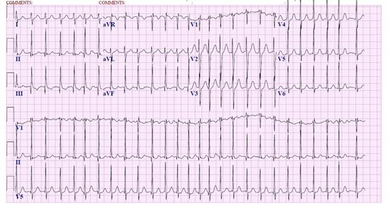
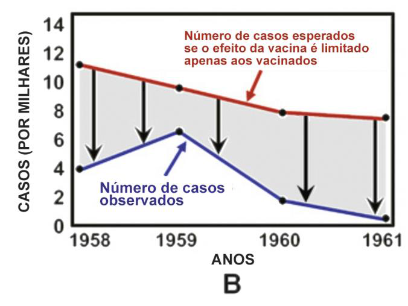
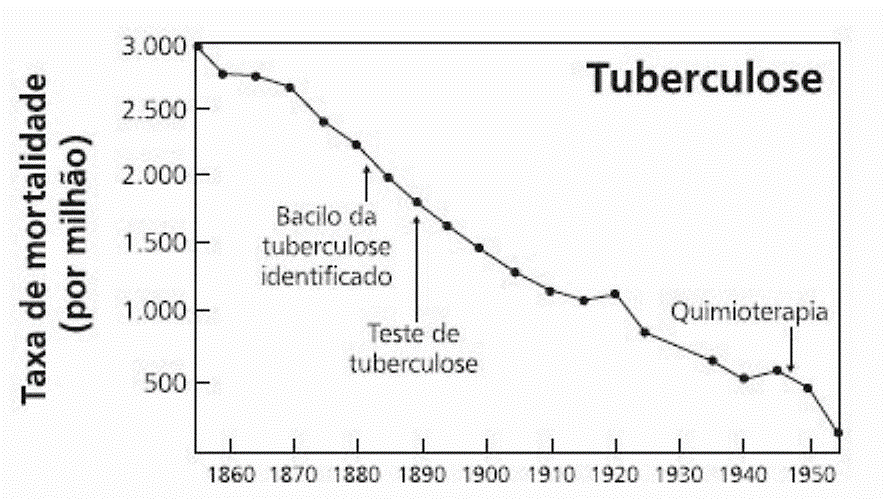

# ENARE 2023-2024 - Prova de Acesso Direto

## Questão 1

Lembre-se de marcar o número acima na folha de respostas! ✓ Confira seu nome, o número do seu documento e o número de sua inscrição em todos os documentos entregues pelo fiscal. Além disso, não se esqueça de conferir seu Caderno de Questões quanto a falhas de impressão e de numeração e se o programa corresponde àquele para o qual você se inscreveu. ✓ O não cumprimento a qualquer uma das determinações constantes em Edital, no presente Caderno e na Folha de Respostas incorrerá na eliminação do candidato. Sobre o material a ser devolvido pelo candidato ✓ O único documento válido para avaliação é a Folha de Respostas. ✓ Na Folha de Respostas, preencha o campo destinado à assinatura. As respostas das questões objetivas devem ser preenchidas da seguinte maneira: ✓ Na Folha de Respostas, só é permitido o uso de caneta esferográfica transparente de cor azul ou preta. Esse documento deve ser devolvido ao fiscal na saída, devidamente preenchido e assinado. Sobre a duração da prova e a permanência na sala ✓ O prazo de realização da prova é de 04 (quatro) horas, incluindo a marcação da Folha de Respostas. ✓ Após 60 (sessenta) minutos do início da prova, o candidato estará liberado para utilizar o sanitário ou deixar definitivamente o local de aplicação, não podendo, no entanto, levar o Caderno de Questões e nenhum tipo de anotação de suas respostas. ✓ O candidato poderá levar consigo o Caderno de Questões somente se aguardar em sala até o término do prazo de realização da prova estabelecido em Edital. Fraudar ou tentar fraudar Concursos Públicos é Crime! Previsto no art. 311 - A do Código Penal ✓ Os três últimos candidatos só poderão retirar-se da sala juntos, após assinatura do Termo de Fechamento do Envelope de Retorno. Sobre a divulgação das provas e dos gabaritos ✓ O Caderno de Questões e o Gabarito Preliminar estarão disponíveis no site do Enare no endereço eletrônico https://enare.ebserh.gov.br, conforme previsto em Edital. EXAME NACIONAL DE RESIDÊNCIA INSTITUTO AOCP Clínica Médica Dentre as alternativas a seguir, qual apresenta o agente infeccioso bacteriano mais comum na pneumonia adquirida na comunidade? Homem, 46 anos, hipertenso e etilista, comparece à emergência médica após hematêmese e confusão mental aguda. Apresenta-se, ao exame físico, ictérico, confuso, desorientado, sarcopênico e hipotenso. Após estabilização clínica inicial, foi submetido a exames laboratoriais que evidenciaram: INR 3.2; Albumina 1.8 g/dL; Bilirrubinas totais 9.5 mg/dL e Creatinina de 4.2 mg/dL. Assinale a alternativa que NÃO contribui, dentro do caso apresentado, para a classificação de Child-Pugh do paciente.

**Descrição Técnica da Imagem:**
Imagem ilustrativa relevante à questão.

**Descrição Técnica da Imagem:**
Imagem ilustrativa relevante à questão.

**Alternativas:**

- A) INR.

- B) Albumina.

- C) Bilirrubinas.

- D) Creatinina.

- E) Grau de Encefalopatia.

**Tags:** #Outra

---

## Questão 2

Sobre delirium tremens, assinale a alternativa correta.

**Alternativas:**

- A) Streptococcus pneumoniae.

- B) Mycoplasma pneumoniae.

- C) Streptococcus aureus.

- D) Chlamydia pneumoniae.

- E) Pseudomonas aeruginosa.

**Tags:** 

---

## Questão 3

Dentre as alternativas a seguir, qual apresenta o agente infeccioso bacteriano mais comum na pneumonia adquirida na comunidade? Homem, 46 anos, hipertenso e etilista, comparece à emergência médica após hematêmese e confusão mental aguda. Apresenta-se, ao exame físico, ictérico, confuso, desorientado, sarcopênico e hipotenso. Após estabilização clínica inicial, foi submetido a exames laboratoriais que evidenciaram: INR 3.2; Albumina 1.8 g/dL; Bilirrubinas totais 9.5 mg/dL e Creatinina de 4.2 mg/dL. Assinale a alternativa que NÃO contribui, dentro do caso apresentado, para a classificação de Child-Pugh do paciente.

**Alternativas:**

- A) INR.

- B) Albumina.

- C) Bilirrubinas.

- D) Creatinina.

- E) Grau de Encefalopatia.

**Tags:** 

---

## Questão 4

Mulher de 68 anos, acompanhada da filha, foi encaminhada para nefrologia pela unidade básica de saúde (UBS) devido à alteração no exame de creatinina. Trouxe exames laboratoriais que evidenciavam: Hb 8,7g/L; Creatinina 2,8 mg/dL; Ureia mg/dL; Gasometria arterial: pH 7,3, Bicarbonato 18 mmol/L, Na 140 mmol/L, K 5.2 mmol/L. Um exame realizado há 4 anos já evidenciava creatinina sérica basal de 2,3 mg/dL. O peso da paciente é de 56 Kg. Conforme o caso apresentado, assinale a alternativa correta.

**Alternativas:**

- A) Está contraindicada vacina contra hepatite B para essa paciente.

- B) O clearence de creatinina pela equação de Cockcroft-Gault é de 20 ml/min. A paciente está em estágio 3 de doença renal crônica.

- C) Essa paciente não deveria ter sido encaminhada para a nefrologia, devendo ser acompanhada somente em UBS.

- D) O tratamento para essa paciente deve ser classificado como conservador, pois ela está entre os estágios 1 e 3 de doença renal crônica.

- E) O clearance de creatinina pela equação de Cockcroft-Gault é de 17 ml/min. A paciente está em estágio 4 de doença renal crônica.

**Tags:** 

---

## Questão 5

É considerada uma manifestação clínica comum da Doença de Parkinson a

**Alternativas:**

- A) estabilidade postural.

- B) hipercinesia.

- C) fasciculação.

- D) hipermobilidade.

- E) rigidez em roda dentada.  PROGRAMA DE RESIDÊNCIA COM ACESSO DIRETO - TODOS OS PROGRAMAS  Tipo 01 – Página 2   EXAME NACIONAL DE RESIDÊNCIA  INSTITUTO AOCP

**Tags:** 

---

## Questão 6

Em relação à reação de Jarisch-Herxheimer, assinale a alternativa correta. Durante atendimento de um paciente portador de artrite reumatoide, ele demonstra bastante resistência para realizar o tratamento com medicações injetáveis. Diante desse cenário, qual atitude é a mais adequada?

**Alternativas:**

- A) Ameaçar abandonar o acompanhamento, caso o paciente não aceite a medicação indicada.

- B) Respeitar o direito do paciente de decidir livremente sobre seu tratamento, salvo em risco iminente de morte.

- C) Prescrever o que há de melhor para o paciente, independentemente das preferências individuais dele.

- D) Oferecer apenas o tipo de tratamento que julgar melhor, não sendo necessário utilizar todos os meios disponíveis de promoção de saúde e de tratamento.

- E) Exagerar a gravidade do diagnóstico ou do prognóstico e complicar a terapêutica, para que o paciente entenda que a medicação injetável é extremamente necessária.

**Tags:** 

---

## Questão 7

Assinale a alternativa correta que apresenta uma medicação osteoformadora indicada no tratamento da osteoporose de alto e muito alto risco de fraturas.

**Alternativas:**

- A) Alendronato.

- B) Denosumabe.

- C) Ácido Zoledrônico.

- D) Teriparatida.

- E) Raloxifeno.

**Tags:** 

---

## Questão 8

Em relação à reação de Jarisch-Herxheimer, assinale a alternativa correta. Durante atendimento de um paciente portador de artrite reumatoide, ele demonstra bastante resistência para realizar o tratamento com medicações injetáveis. Diante desse cenário, qual atitude é a mais adequada?

**Alternativas:**

- A) Ameaçar abandonar o acompanhamento, caso o paciente não aceite a medicação indicada.

- B) Respeitar o direito do paciente de decidir livremente sobre seu tratamento, salvo em risco iminente de morte.

- C) Prescrever o que há de melhor para o paciente, independentemente das preferências individuais dele.

- D) Oferecer apenas o tipo de tratamento que julgar melhor, não sendo necessário utilizar todos os meios disponíveis de promoção de saúde e de tratamento.

- E) Exagerar a gravidade do diagnóstico ou do prognóstico e complicar a terapêutica, para que o paciente entenda que a medicação injetável é extremamente necessária.

**Tags:** 

---

## Questão 9

Em relação ao tema manifestações paraneoplásicas relacionadas ao câncer de pulmão, assinale a alternativa INCORRETA.

**Alternativas:**

- A) A neuropatia periférica aguda é mais prevalente como síndrome paraneoplásica pulmonar no subtipo não pequenas células.

- B) Síndrome de Lambert-Eaton está associada ao quadro de síndrome miastênica, frequentemente associado ao carcinoma indiferenciado de pequenas células.

- C) A síndrome de Cushing foi descrita como secreção ectópica do ACTH pelo tumor do pulmão, sendo frequente no carcinoma de pequenas células.

- D) A SIADH (Síndrome da Secreção Inadequada do Hormônio Antidiurético) está correlacionada ao carcinoma indiferenciado de pequenas células.

- E) A osteoartropatia pulmonar hipertrófica pode preceder os sintomas pulmonares do câncer de pulmão em meses.

**Tags:** 

---

## Questão 10

Qual é a coloração utilizada na baciloscopia para investigação de hanseníase?

**Alternativas:**

- A) Tinta da China.

- B) Ziehl-Neelsen.

- C) Vermelho congo.

- D) Azul da Prússia.

- E) Grocott. PROGRAMA DE RESIDÊNCIA COM ACESSO DIRETO - TODOS OS PROGRAMAS  Tipo 01 – Página 3   EXAME NACIONAL DE RESIDÊNCIA  INSTITUTO AOCP

**Tags:** 

---

## Questão 11

Um médico assistente é o responsável por comunicar ao paciente que os resultados dos exames mostraram o diagnóstico de câncer metastático. Assinale a alternativa que aborda de forma adequada a comunicação de más notícias como nesse caso. Assinale a alternativa que apresenta corretamente as principais manifestações extra-articulares da artrite psoriática.

**Alternativas:**

- A) O paciente precisa ser informado a qualquer custo naquele momento, mesmo que ele deixe claro que não deseja saber.

- B) Deve-se deixar claro que não há mais nada a ser feito pelo paciente.

- C) A comunicação deve ser rápida e objetiva, sem espaço para dúvidas.

- D) Deve-se utilizar termos técnicos independente da compreensão do paciente, garantindo a passagem de informações corretas.

- E) Deve-se usar palavras adequadas ao vocabulário do paciente, formular frases curtas e perguntar, com certa frequência, como o paciente está e o que está entendendo.

**Tags:** 

---

## Questão 12

Homem, 24 anos, sem comorbidades conhecidas, sob estresse emocional intenso relacionado ao preparo para uma prova de um concurso público, procurou o pronto atendimento com queixa principal de que o lado direito do rosto não se mexia havia 1 dia. Ao exame físico, apresentava paralisia em hemiface superior e inferior à direita, paralisia da pálpebra superior direita que levava à dificuldade de fechar o olho e piscar, além de desvio da rima labial para o lado esquerdo. As pupilas estavam isocóricas e fotorreagentes, e a força estava preservada (grau V) em membros superiores e inferiores bilaterais. De acordo com o caso clínico apresentado, qual é a principal hipótese diagnóstica?

**Alternativas:**

- A) Pneumopatia intersticial padrão não específico; esclerodactilia; microstomia, fenômeno de Raynaud.

- B) Entesite; pneumopatia intersticial usual; hipertensão pulmonar; mãos de mecânico.

- C) Sinal do Coldre; heliótropo; dactilite; ganglionopatia.

- D) Doença inflamatória intestinal; pneumopatia intersticial usual; xeroftalmia; fenômeno de Raynaud.

- E) Doença inflamatória intestinal; uveíte; dactilite; entesite.

**Tags:** 

---

## Questão 13

Um médico assistente é o responsável por comunicar ao paciente que os resultados dos exames mostraram o diagnóstico de câncer metastático. Assinale a alternativa que aborda de forma adequada a comunicação de más notícias como nesse caso. Assinale a alternativa que apresenta corretamente as principais manifestações extra-articulares da artrite psoriática.

**Alternativas:**

- A) O paciente precisa ser informado a qualquer custo naquele momento, mesmo que ele deixe claro que não deseja saber.

- B) Deve-se deixar claro que não há mais nada a ser feito pelo paciente.

- C) A comunicação deve ser rápida e objetiva, sem espaço para dúvidas.

- D) Deve-se utilizar termos técnicos independente da compreensão do paciente, garantindo a passagem de informações corretas.

- E) Deve-se usar palavras adequadas ao vocabulário do paciente, formular frases curtas e perguntar, com certa frequência, como o paciente está e o que está entendendo.

**Tags:** 

---

## Questão 14

Um médico, trabalhando em uma unidade de pronto atendimento, atende um paciente de 70 anos com queixa de febre de início há 4 dias, acompanhada de tosse produtiva e astenia. O paciente é diabético e hipertenso, encontra-se consciente e orientado, porém, no momento, está com a visão prejudicada, devido à cirurgia recente de correção de catarata. Ele não tem tomado as medicações de uso contínuo por não estar conseguindo identificá-las. Seu filho, que mora há 450 Km de distância, chegará em 2 dias para poder acompanhá-lo. Ao exame físico, apresenta frequência respiratória de 24 irpm, pressão arterial de 100x64 mmHg, exame laboratorial: ureia 45 mg/dl e creatinina 0,6 mg/dL. Diante do exposto, qual seria a conduta adequada?

**Descrição Técnica da Imagem:**
Imagem ilustrativa relevante à questão.

**Alternativas:**

- A) Internar o paciente para início do tratamento, por possuir 4 pontos no escore de prognóstico “CURB-65.”

- B) O paciente pode realizar o tratamento ambulatorial por possuir apenas 1 ponto no escore de prognóstico “CURB-65”.

- C) Apesar de o paciente ter somente 1 ponto no escore de prognóstico “CURB-65”, devido às comorbidades e ao seu contexto social, a conduta mais adequada é interná-lo para o tratamento.

- D) O paciente pode realizar o tratamento ambulatorial por possuir apenas 2 pontos no escore de prognóstico “CURB-65”.

- E) Internar o paciente para início do tratamento, por possuir 3 pontos no escore de prognóstico “CURB-65.”  PROGRAMA DE RESIDÊNCIA COM ACESSO DIRETO - TODOS OS PROGRAMAS  Tipo 01 – Página 4   EXAME NACIONAL DE RESIDÊNCIA  INSTITUTO AOCP

**Tags:** #Outra

---

## Questão 15

Paciente do sexo feminino, 56 anos, em pós-operatório de tireoidectomia radical, deu entrada no pronto atendimento com queixa de formigamento em membros superiores e tremores, associados a sudorese. No exame físico, são encontrados sinais de Trousseau e Chvostek positivos. Considerando o antecedente da paciente, qual eletrólito pode estar em níveis alterados e que poderia explicar a clínica e os achados no exame físico? De acordo com o tema “publicidade médica”, é correto afirmar que

**Alternativas:**

- A) Cálcio.

- B) Sódio.

- C) Potássio.

- D) Magnésio.

- E) Cloro.

**Tags:** 

---

## Questão 16

Uma mulher de 58 anos apresentou-se à sala de emergência com palpitações intensas, dor torácica e dispneia. Ela relatou que as palpitações começaram repentinamente enquanto estava em repouso em casa. Não havia histórico prévio de arritmias. A seguir está o eletrocardiograma realizado:

**Alternativas:**

- A) Taquicardia supraventricular / Sedação leve e cardioversão química.

- B) Fibrilação atrial / Sedação leve e cardioversão elétrica.

- C) Flutter atrial / Desfibrilação.

- D) Taquicardia sinusal / Conduta expectante.

- E) Fibrilação atrial / Sedação leve e cardioversão química.  PROGRAMA DE RESIDÊNCIA COM ACESSO DIRETO - TODOS OS PROGRAMAS  Tipo 01 – Página 5   EXAME NACIONAL DE RESIDÊNCIA  INSTITUTO AOCP

**Tags:** 

---

## Questão 17

Paciente do sexo feminino, 56 anos, em pós-operatório de tireoidectomia radical, deu entrada no pronto atendimento com queixa de formigamento em membros superiores e tremores, associados a sudorese. No exame físico, são encontrados sinais de Trousseau e Chvostek positivos. Considerando o antecedente da paciente, qual eletrólito pode estar em níveis alterados e que poderia explicar a clínica e os achados no exame físico? De acordo com o tema “publicidade médica”, é correto afirmar que

**Alternativas:**

- A) Cálcio.

- B) Sódio.

- C) Potássio.

- D) Magnésio.

- E) Cloro.

**Tags:** 

---

## Questão 18

Paciente do sexo masculino, 73 anos, apresentou desconforto respiratório progressivo na última semana e foi avaliado no pronto-socorro. Ao exame físico, apresentava, na ausculta pulmonar, murmúrio vesicular abolido em 2/3 inferiores, tendo sido confirmado derrame pleural moderado por radiografia de tórax. Após ser avaliado pela cirurgia torácica, optou-se por toracocentese de alívio e diagnóstica. Os exames séricos do paciente eram: Proteína total 3,8/dl, DHL 154 U/L. A rotina laboratorial de líquido pleural: Proteína total 1,7 g/dl, DHL 60 U/L. Observação: Desidrogenase láctica (DHL) – valores séricos normais de referência 120 a 246 U/L. Após análise dos resultados dos exames séricos e da rotina do líquido pleural do paciente, são aplicados os critérios de Light. Assinale a alternativa correta em relação a esse caso. Diante de um atendimento a um paciente em parada cardiorrespiratória, o líder precisa conduzir a equipe que está realizando a Reanimação Cardiopulmonar (RCP). Qual é a maneira de comunicação mais apropriada entre o líder e a equipe nessa situação?

**Alternativas:**

- A) Apenas o líder da equipe possui a competência necessária para verbalizar informações, devendo o restante da equipe permanecer em silêncio durante todo o atendimento.

- B) O líder deve transmitir mensagens simultâneas a cada membro da equipe para que sejam evitados atos de procrastinação e a situação possa ser revertida o mais rápido possível.

- C) O líder deve transmitir uma mensagem, ordem ou atribuição a um membro da equipe; solicitar uma resposta clara e contato visual do membro da equipe para garantir que tenha entendido a mensagem; confirmar que o membro da equipe concluiu a tarefa, antes de lhe atribuir outra tarefa.

- D) O líder deve elevar o tom de voz ao perceber que um dos membros da equipe não compreendeu a ordem dada, a fim de que tal atitude não se repita.

- E) É necessário que o líder reconheça sua equipe com elogios, como forma de incentivá-la quando o atendimento é bem sucedido, bem como repreender em alto tom de voz ao perceber quaisquer falhas durante o atendimento.

**Tags:** 

---

## Questão 19

Paciente do sexo masculino, 73 anos, apresentou desconforto respiratório progressivo na última semana e foi avaliado no pronto-socorro. Ao exame físico, apresentava, na ausculta pulmonar, murmúrio vesicular abolido em 2/3 inferiores, tendo sido confirmado derrame pleural moderado por radiografia de tórax. Após ser avaliado pela cirurgia torácica, optou-se por toracocentese de alívio e diagnóstica. Os exames séricos do paciente eram: Proteína total 3,8/dl, DHL 154 U/L. A rotina laboratorial de líquido pleural: Proteína total 1,7 g/dl, DHL 60 U/L. Observação: Desidrogenase láctica (DHL) – valores séricos normais de referência 120 a 246 U/L. Após análise dos resultados dos exames séricos e da rotina do líquido pleural do paciente, são aplicados os critérios de Light. Assinale a alternativa correta em relação a esse caso. Diante de um atendimento a um paciente em parada cardiorrespiratória, o líder precisa conduzir a equipe que está realizando a Reanimação Cardiopulmonar (RCP). Qual é a maneira de comunicação mais apropriada entre o líder e a equipe nessa situação?

**Alternativas:**

- A) Apenas o líder da equipe possui a competência necessária para verbalizar informações, devendo o restante da equipe permanecer em silêncio durante todo o atendimento.

- B) O líder deve transmitir mensagens simultâneas a cada membro da equipe para que sejam evitados atos de procrastinação e a situação possa ser revertida o mais rápido possível.

- C) O líder deve transmitir uma mensagem, ordem ou atribuição a um membro da equipe; solicitar uma resposta clara e contato visual do membro da equipe para garantir que tenha entendido a mensagem; confirmar que o membro da equipe concluiu a tarefa, antes de lhe atribuir outra tarefa.

- D) O líder deve elevar o tom de voz ao perceber que um dos membros da equipe não compreendeu a ordem dada, a fim de que tal atitude não se repita.

- E) É necessário que o líder reconheça sua equipe com elogios, como forma de incentivá-la quando o atendimento é bem sucedido, bem como repreender em alto tom de voz ao perceber quaisquer falhas durante o atendimento.

**Tags:** 

---

## Questão 20

Em relação ao uso de trombolíticos em paciente com infarto agudo do miocárdio com supra de ST no eletrocardiograma, é considerado(a) contraindicação absoluta

**Alternativas:**

- A) uso crônico de AAS 100 mg diário.

- B) trauma cranioencefálico importante nos últimos 3 meses.

- C) histórico de úlcera péptica mesmo sem evidência de sangramento ativo.

- D) acidente vascular encefálico isquêmico há 1 ano.

- E) gestação.  PROGRAMA DE RESIDÊNCIA COM ACESSO DIRETO - TODOS OS PROGRAMAS  Tipo 01 – Página 6   EXAME NACIONAL DE RESIDÊNCIA  INSTITUTO AOCP  Cirurgia Geral

**Tags:** 

---

## Questão 21

Em um paciente com doença coronariana, qual dos seguintes agentes NÃO seria indicado para indução anestésica, por ter como efeito colateral a hipertensão? Os tecidos tentam restaurar a sua função normal e a integridade estrutural após uma lesão, passando pelo processo de cicatrização. Quais são as 3 fases desse processo, em ordem cronológica, e suas respectivas características?

**Alternativas:**

- A) Fase reativa (proliferação e migração epitelial), fase de maturação (regeneração do tecido conjuntivo) e fase proliferativa (proliferação de colágeno e formação da cicatriz).

- B) Fase inflamatória (hemostasia e quimiotaxia), fase proliferativa (regeneração do tecido conjuntivo) e fase de maturação (contração, formação e remodelamento da cicatriz).

- C) Fase inflamatória (hemostasia e inflamação), fase regenerativa (formação e contração da cicatriz) e fase de remodelagem (migração epitelial e proliferação/regeneração do tecido conjuntivo).

- D) Fase de remodelagem (hemostasia e quimiotaxia), fase reativa (proliferação e migração epitelial) e fase maturacional (contração e formação da cicatriz).

- E) Fase proliferativa (migração e proliferação epitelial), fase maturacional (contração e formação da cicatriz) e fase reativa (hemostasia e quimiotaxia).

**Tags:** 

---

## Questão 22

Assinale a alternativa que apresenta 2 tipos de bactérias que estão entre as mais frequentemente encontradas/isoladas na apendicite aguda perfurada.

**Alternativas:**

- A) Tiopental.

- B) Propofol.

- C) Cetamina.

- D) Etomidato.

- E) Midazolam.

**Tags:** 

---

## Questão 23

Em um paciente com doença coronariana, qual dos seguintes agentes NÃO seria indicado para indução anestésica, por ter como efeito colateral a hipertensão? Os tecidos tentam restaurar a sua função normal e a integridade estrutural após uma lesão, passando pelo processo de cicatrização. Quais são as 3 fases desse processo, em ordem cronológica, e suas respectivas características?

**Alternativas:**

- A) Fase reativa (proliferação e migração epitelial), fase de maturação (regeneração do tecido conjuntivo) e fase proliferativa (proliferação de colágeno e formação da cicatriz).

- B) Fase inflamatória (hemostasia e quimiotaxia), fase proliferativa (regeneração do tecido conjuntivo) e fase de maturação (contração, formação e remodelamento da cicatriz).

- C) Fase inflamatória (hemostasia e inflamação), fase regenerativa (formação e contração da cicatriz) e fase de remodelagem (migração epitelial e proliferação/regeneração do tecido conjuntivo).

- D) Fase de remodelagem (hemostasia e quimiotaxia), fase reativa (proliferação e migração epitelial) e fase maturacional (contração e formação da cicatriz).

- E) Fase proliferativa (migração e proliferação epitelial), fase maturacional (contração e formação da cicatriz) e fase reativa (hemostasia e quimiotaxia).

**Tags:** 

---

## Questão 24

Um paciente será submetido a uma tireoidectomia total devido a um câncer de tireoide. Diante disso, as principais complicações que podem ocorrer após o procedimento e devem ser informadas ao paciente pelo médico são:

**Alternativas:**

- A) hipercalcemia e alteração da voz.

- B) hipocalemia e rouquidão.

- C) hipocalcemia e paresia dos músculos da face.

- D) hipercalemia e dificuldade de deglutição.

- E) hipocalcemia e alteração da voz.

**Tags:** 

---

## Questão 25

Segundo a classificação de Caprini para pacientes cirúrgicos, assinale a alternativa correta quanto à classificação de risco para TEV (Tromboembolismo Venoso) de um paciente de 54 anos que foi submetido a uma cirurgia de câncer de cólon, aberta, que durou aproximadamente 2h.

**Alternativas:**

- A) Risco muito baixo.

- B) Risco baixo.

- C) Risco moderado.

- D) Risco alto.

- E) Risco muito alto.

**Tags:** 

---

## Questão 26

Qual das seguintes alternativas apresenta a maior causa de obstrução do intestino delgado?

**Alternativas:**

- A) Hérnias.

- B) Doença de Crohn.

- C) Aderências.

- D) Neoplasias.

- E) Doenças neurológicas.  PROGRAMA DE RESIDÊNCIA COM ACESSO DIRETO - TODOS OS PROGRAMAS  Tipo 01 – Página 7   EXAME NACIONAL DE RESIDÊNCIA  INSTITUTO AOCP

**Tags:** 

---

## Questão 27

Um paciente de 65 anos apresenta dor, distensão abdominal e vômitos repetidos há 2 dias. Não evacua e não elimina flatos há 3 dias. Os exames de imagem mostram distensão de intestino delgado e fezes em reto. Assinale a alternativa que apresenta a melhor conduta inicial para tratamento desse paciente. Um paciente encontra-se internado devido a uma infecção de partes moles associada à lesão vegetante, friável e ulcerativa em perna, com crescimento há 2 meses, sem melhora. É solicitada uma avaliação médica para biópsia. A enfermeira do setor do paciente liga para o médico, que se encontra em outro setor do hospital atendendo a um segundo paciente, e questiona se ela pode ir realizando a biópsia enquanto ele não chega. Quanto a essa situação, assinale a alternativa correta.

**Alternativas:**

- A) Coletar exames laboratoriais para detectar se há distúrbios hidroeletrolíticos e efetuar passagem de sonda nasogástrica para drenagem e hidratação.

- B) Indicar laparotomia exploradora para melhor diagnosticar e tratar o paciente, já que ele apresenta o quadro há mais de 2 dias.

- C) Coletar exames laboratoriais para detectar se há sinais de infecção associada; passar sonda nasoenteral para alimentação pós-pilórica e iniciar antibióticos de forma profilática.

- D) Conversar com os familiares e indicar laparotomia exploradora com ileostomia associada, pois, nesses casos de distensão grande do delgado, não é recomendada anastomose primária.

- E) Coletar exames laboratoriais; realizar tomografia para melhor avaliação e, a seguir, encaminhar o paciente para cirurgia, pois a maior parte desses casos é solucionada por meio de cirurgia.

**Tags:** 

---

## Questão 28

Um paciente de 72 anos foi submetido a uma laparotomia exploradora por diverticulite complicada de cólon sigmoide, tendo sido realizada uma cirurgia com ressecção do sigmoide, fechamento do coto retal e confecção de colostomia terminal no cólon descendente. Esse tipo de cirurgia denomina-se

**Alternativas:**

- A) O médico deve permitir que a enfermeira realize a biópsia, tendo em vista que será de fácil execução e que poderá agilizar o diagnóstico, já que provavelmente é compatível com um câncer de pele.

- B) O médico deve permitir que a enfermeira realize a biópsia, porém deve orientá-la sobre a execução do procedimento, passo a passo, antes de iniciá-lo.

- C) O médico deve solicitar à enfermeira que aguarde a sua chegada para iniciar a realização da biópsia, permitindo que ela a realize para ampliar seu conhecimento prático.

- D) O médico deve pedir à enfermeira que não realize a biópsia nesse momento, porque, primeiro, deve ser avaliada a existência de outras lesões que necessitam de biópsia a fim de que ela realize todas em um mesmo tempo.

- E) O médico deve pedir à enfermeira que não realize a biópsia, pois esse tipo de procedimento é considerado um ato privativo do médico.

**Tags:** 

---

## Questão 29

Um paciente de 65 anos apresenta dor, distensão abdominal e vômitos repetidos há 2 dias. Não evacua e não elimina flatos há 3 dias. Os exames de imagem mostram distensão de intestino delgado e fezes em reto. Assinale a alternativa que apresenta a melhor conduta inicial para tratamento desse paciente. Um paciente encontra-se internado devido a uma infecção de partes moles associada à lesão vegetante, friável e ulcerativa em perna, com crescimento há 2 meses, sem melhora. É solicitada uma avaliação médica para biópsia. A enfermeira do setor do paciente liga para o médico, que se encontra em outro setor do hospital atendendo a um segundo paciente, e questiona se ela pode ir realizando a biópsia enquanto ele não chega. Quanto a essa situação, assinale a alternativa correta.

**Alternativas:**

- A) Coletar exames laboratoriais para detectar se há distúrbios hidroeletrolíticos e efetuar passagem de sonda nasogástrica para drenagem e hidratação.

- B) Indicar laparotomia exploradora para melhor diagnosticar e tratar o paciente, já que ele apresenta o quadro há mais de 2 dias.

- C) Coletar exames laboratoriais para detectar se há sinais de infecção associada; passar sonda nasoenteral para alimentação pós-pilórica e iniciar antibióticos de forma profilática.

- D) Conversar com os familiares e indicar laparotomia exploradora com ileostomia associada, pois, nesses casos de distensão grande do delgado, não é recomendada anastomose primária.

- E) Coletar exames laboratoriais; realizar tomografia para melhor avaliação e, a seguir, encaminhar o paciente para cirurgia, pois a maior parte desses casos é solucionada por meio de cirurgia.

**Tags:** 

---

## Questão 30

Um paciente com obstrução e infecção das vias biliares apresenta a chamada tríade de Charcot, a qual é caracterizada por:

**Alternativas:**

- A) icterícia, hipotensão e confusão mental.

- B) dor em hipocôndrio direito, icterícia e hipotensão.

- C) febre, hipotensão e icterícia.

- D) icterícia, dor em hipocôndrio direito e febre.

- E) febre, icterícia e confusão mental.  PROGRAMA DE RESIDÊNCIA COM ACESSO DIRETO - TODOS OS PROGRAMAS  Tipo 01 – Página 8   EXAME NACIONAL DE RESIDÊNCIA  INSTITUTO AOCP

**Tags:** 

---

## Questão 31

Sobre doença de Crohn e colite ulcerativa, informe se é verdadeiro (V) ou falso (F) o que se afirma a seguir e assinale a alternativa com a sequência correta. Um paciente de 45 anos teve uma pancreatite aguda e, após 6 semanas, passou a notar dor abdominal persistente, saciedade precoce, náusea e perda de peso. Ao procurar o serviço médico, foram verificados níveis elevados das enzimas pancreáticas e uma lesão cística de aproximadamente 8 cm em cauda do pâncreas, em contato com a parede gástrica. Qual é o provável diagnóstico e a conduta mais adequada nesse caso? ( ) O tabagismo parece conferir um efeito protetor na colite ulcerativa. ( ) A lesão mais característica da colite ulcerativa é o abscesso das criptas de Lieberkühn. ( ) Uma característica histológica importante da doença de Crohn é o granuloma não caseoso, um agregado de histiócitos epitelioides circundados por neutrófilos e células gigantes. ( ) O paciente com doença de Crohn pode desenvolver fístulas entre o intestino e qualquer outro órgão intra‑abdominal, a maioria delas envolve o intestino delgado.

**Alternativas:**

- A) Trata-se provavelmente de necrose pancreática que deve ser tratada com antibióticos de amplo espectro como o meropenem.

- B) Trata-se provavelmente de um pseudocisto pancreático que deve ser tratado com antibióticos de amplo espectro como o meropenem.

- C) Trata-se provavelmente de pseudocisto pancreático e pode-se tentar uma drenagem endoscópica transgástrica.

- D) Trata-se provavelmente de necrose pancreática que deve ser tratada de maneira expectante, com indicação de intervenção cirúrgica se o paciente apresentar febre.

- E) Trata-se provavelmente de pseudocisto pancreático que deve ser tratado com abordagem cirúrgica por laparotomia.

**Tags:** 

---

## Questão 32

O médico de um paciente cirrótico está verificando a possibilidade de uma cirurgia hepática para esse paciente, porém, para isso, quer primeiro verificar qual seu escore Child-Pugh, já que este possui correlação com a sobrevida do paciente. Nesse sentido, o paciente apresenta os seguintes exames: bilirrubina de 2,5 mg/dL; albumina de 2,6 g/dL; tempo de protrombina de 2 segundos; nenhuma ascite ou encefalopatia. Diante desses resultados, qual é a classificação de Child-Pugh desse paciente e sua chance de sobrevida?

**Alternativas:**

- A) Child-Pugh A / Sobrevida alta.

- B) Child-Pugh B / Sobrevida intermediária.

- C) Child-Pugh C / Sobrevida baixa.

- D) Child-Pugh D / Sobrevida alta.

- E) Child-Pugh C / Sobrevida intermediária.  PROGRAMA DE RESIDÊNCIA COM ACESSO DIRETO - TODOS OS PROGRAMAS  Tipo 01 – Página 9   EXAME NACIONAL DE RESIDÊNCIA  INSTITUTO AOCP

**Tags:** 

---

## Questão 33

Sobre doença de Crohn e colite ulcerativa, informe se é verdadeiro (V) ou falso (F) o que se afirma a seguir e assinale a alternativa com a sequência correta. Um paciente de 45 anos teve uma pancreatite aguda e, após 6 semanas, passou a notar dor abdominal persistente, saciedade precoce, náusea e perda de peso. Ao procurar o serviço médico, foram verificados níveis elevados das enzimas pancreáticas e uma lesão cística de aproximadamente 8 cm em cauda do pâncreas, em contato com a parede gástrica. Qual é o provável diagnóstico e a conduta mais adequada nesse caso? ( ) O tabagismo parece conferir um efeito protetor na colite ulcerativa. ( ) A lesão mais característica da colite ulcerativa é o abscesso das criptas de Lieberkühn. ( ) Uma característica histológica importante da doença de Crohn é o granuloma não caseoso, um agregado de histiócitos epitelioides circundados por neutrófilos e células gigantes. ( ) O paciente com doença de Crohn pode desenvolver fístulas entre o intestino e qualquer outro órgão intra‑abdominal, a maioria delas envolve o intestino delgado.

**Alternativas:**

- A) Trata-se provavelmente de necrose pancreática que deve ser tratada com antibióticos de amplo espectro como o meropenem.

- B) Trata-se provavelmente de um pseudocisto pancreático que deve ser tratado com antibióticos de amplo espectro como o meropenem.

- C) Trata-se provavelmente de pseudocisto pancreático e pode-se tentar uma drenagem endoscópica transgástrica.

- D) Trata-se provavelmente de necrose pancreática que deve ser tratada de maneira expectante, com indicação de intervenção cirúrgica se o paciente apresentar febre.

- E) Trata-se provavelmente de pseudocisto pancreático que deve ser tratado com abordagem cirúrgica por laparotomia.

**Tags:** 

---

## Questão 34

Uma paciente gestante de 25 semanas apresenta dor em região de flanco direito há 1 dia, associada a náuseas e vômitos. No hemograma, apresenta uma leucocitose de 11.500 (VR = 10.000). Quanto a esse caso, é correto afirmar que No caso de um paciente que realizou gastrectomia parcial e tem apresentado, 20 minutos após a ingesta alimentar, sintomas como náuseas, vômitos, sensação de plenitude gástrica, diarreia explosiva, palpitações e taquicardia, qual é o provável diagnóstico e a orientação que o médico deve fornecer para a melhora dos sintomas?

**Alternativas:**

- A) Dumping tardio / Orientar a evitar hipoglicemia, ingerindo maiores quantidades de alimentos com açúcar em um menor intervalo de tempo.

- B) Síndrome da alça aferente / Orientar o paciente a provocar vômitos quando tiver os sintomas de plenitude gástrica, pois geralmente gera um alívio imediato dos sintomas.

- C) Gastrite alcalina de refluxo / Orientar o paciente a utilizar inibidor de bomba de prótons a cada 12 horas e evitar a ingestão de alimentos ácidos.

- D) Atonia gástrica / Utilizar pró-cinéticos como a metoclopramida e fazer a ingestão de várias refeições com menores quantidades de alimentos.

- E) Dumping precoce / Orientar a evitar alimentos que contenham grande quantidade de açúcar, realizar pequenas refeições com proteínas e gorduras em menor intervalo de tempo e separar os líquidos dos sólidos durante as refeições.

**Tags:** 

---

## Questão 35

Uma paciente gestante de 25 semanas apresenta dor em região de flanco direito há 1 dia, associada a náuseas e vômitos. No hemograma, apresenta uma leucocitose de 11.500 (VR = 10.000). Quanto a esse caso, é correto afirmar que No caso de um paciente que realizou gastrectomia parcial e tem apresentado, 20 minutos após a ingesta alimentar, sintomas como náuseas, vômitos, sensação de plenitude gástrica, diarreia explosiva, palpitações e taquicardia, qual é o provável diagnóstico e a orientação que o médico deve fornecer para a melhora dos sintomas?

**Alternativas:**

- A) Dumping tardio / Orientar a evitar hipoglicemia, ingerindo maiores quantidades de alimentos com açúcar em um menor intervalo de tempo.

- B) Síndrome da alça aferente / Orientar o paciente a provocar vômitos quando tiver os sintomas de plenitude gástrica, pois geralmente gera um alívio imediato dos sintomas.

- C) Gastrite alcalina de refluxo / Orientar o paciente a utilizar inibidor de bomba de prótons a cada 12 horas e evitar a ingestão de alimentos ácidos.

- D) Atonia gástrica / Utilizar pró-cinéticos como a metoclopramida e fazer a ingestão de várias refeições com menores quantidades de alimentos.

- E) Dumping precoce / Orientar a evitar alimentos que contenham grande quantidade de açúcar, realizar pequenas refeições com proteínas e gorduras em menor intervalo de tempo e separar os líquidos dos sólidos durante as refeições.

**Tags:** 

---

## Questão 36

Assinale a alternativa que apresenta alguns dos principais genes mutados que contribuem para o surgimento do câncer colorretal hereditário e um dos fatores que pode contribuir para a prevenção do câncer colorretal esporádico.

**Alternativas:**

- A) BRCA 1 e BRCA 2 / Consumo diário de grandes quantidades de proteína.

- B) VHL e KRAS / Ingestão diária de ômega 3.

- C) BRAF e MEN1 / Dieta restrita em carnes vermelhas e gorduras.

- D) APC e MSH2 / Atividade física regular.

- E) BRCA 2 e p53 / Alimentação rica em frutas e vegetais.  PROGRAMA DE RESIDÊNCIA COM ACESSO DIRETO - TODOS OS PROGRAMAS  Tipo 01 – Página 10   EXAME NACIONAL DE RESIDÊNCIA  INSTITUTO AOCP

**Tags:** 

---

## Questão 37

Um médico está realizando uma live (transmissão ao vivo) para alunos de medicina dentro do centro cirúrgico e, sem avisar, adentra a sala de um segundo médico (cirurgião) durante a realização de uma gastroduodenopancreatectomia, solicitando que o colega descreva e demonstre os passos dessa cirurgia. Assinale a melhor conduta e a justificativa do segundo cirurgião diante dessa situação. Um paciente, que mora sozinho, está, no momento, acompanhado de um familiar que reside em uma cidade distante e permite que o médico lhe forneça o resultado de uma biópsia realizada de algumas lesões da pele. O diagnóstico é sarcoma de Kaposi. Esse familiar questiona o médico, junto ao paciente, sobre a doença e se sente surpreso, dizendo que o paciente sempre foi saudável e não possuía nenhuma doença prévia. Diante dessa situação, assinale a alternativa correta.

**Alternativas:**

- A) Tendo  em vista o aprendizado que os expectadores terão sobre uma cirurgia não tão comum, o cirurgião deve aceitar a proposta e demostrar a cirurgia durante a live.

- B) O cirurgião deve aceitar a proposta e, posteriormente, informar ao paciente que foi realizada a live com o intuito de contribuir para o avanço da medicina.

- C) O cirurgião não deve aceitar a proposta devido à proibição do Conselho Federal de Medicina quanto à realização de lives realizadas por médicos.

- D) O cirurgião deve aceitar a proposta desde que, posteriormente, o paciente seja compensado monetariamente pelo uso de sua imagem.

- E) O cirurgião não deve aceitar a proposta, pois a imagem do paciente não deve ser exposta na mídia, especialmente sem sua prévia autorização.

**Tags:** 

---

## Questão 38

Um paciente de 37 anos, com pele e olhos claros e história familiar de melanoma, possui uma lesão pigmentada em região da mão esquerda de, aproximadamente, 1 cm. Nesse caso, a melhor conduta a ser seguida para esse paciente é realizar

**Alternativas:**

- A) Deve-se informar ao familiar, junto ao paciente, que o Kaposi é frequentemente observado em pacientes com Imunodeficiência Adquirida (AIDS) e, portanto, deve ser investigada a presença da doença imediatamente.

- B) Deve-se informar ao familiar que o Kaposi é uma neoplasia maligna de tecidos moles de baixo grau, porém não se deve fornecer mais informações sem o consentimento do paciente, pois ele pode ter o diagnóstico de AIDS em sigilo, já que o Kaposi é frequentemente associado à Imunodeficiência Adquirida.

- C) Já que o paciente permitiu fornecer o resultado da biópsia, é possível inferir que o familiar é próximo e deve-se orientar os dois sobre a possibilidade de o paciente também ter AIDS, já que o Kaposi é frequentemente associado a essa patologia.

- D) Deve-se informar ao paciente e ao familiar que o Kaposi é uma neoplasia maligna associada à AIDS, já que, nesse momento, o familiar é representante legal do paciente e não é preciso manter sigilo profissional em relação a esse familiar.

- E) Deve-se informar ao paciente e ao familiar sobre o Kaposi, sobre a possível associação da doença com a AIDS e que o paciente pode estar infectado com o vírus, já que, nessa ocasião de risco a um terceiro (possibilidade de transmissão da doença por contato entre eles), o acompanhante também deve ter acesso a essas informações.  PROGRAMA DE RESIDÊNCIA COM ACESSO DIRETO - TODOS OS PROGRAMAS  Tipo 01 – Página 11   EXAME NACIONAL DE RESIDÊNCIA

**Tags:** 

---

## Questão 39

Um médico está realizando uma live (transmissão ao vivo) para alunos de medicina dentro do centro cirúrgico e, sem avisar, adentra a sala de um segundo médico (cirurgião) durante a realização de uma gastroduodenopancreatectomia, solicitando que o colega descreva e demonstre os passos dessa cirurgia. Assinale a melhor conduta e a justificativa do segundo cirurgião diante dessa situação. Um paciente, que mora sozinho, está, no momento, acompanhado de um familiar que reside em uma cidade distante e permite que o médico lhe forneça o resultado de uma biópsia realizada de algumas lesões da pele. O diagnóstico é sarcoma de Kaposi. Esse familiar questiona o médico, junto ao paciente, sobre a doença e se sente surpreso, dizendo que o paciente sempre foi saudável e não possuía nenhuma doença prévia. Diante dessa situação, assinale a alternativa correta.

**Alternativas:**

- A) Tendo  em vista o aprendizado que os expectadores terão sobre uma cirurgia não tão comum, o cirurgião deve aceitar a proposta e demostrar a cirurgia durante a live.

- B) O cirurgião deve aceitar a proposta e, posteriormente, informar ao paciente que foi realizada a live com o intuito de contribuir para o avanço da medicina.

- C) O cirurgião não deve aceitar a proposta devido à proibição do Conselho Federal de Medicina quanto à realização de lives realizadas por médicos.

- D) O cirurgião deve aceitar a proposta desde que, posteriormente, o paciente seja compensado monetariamente pelo uso de sua imagem.

- E) O cirurgião não deve aceitar a proposta, pois a imagem do paciente não deve ser exposta na mídia, especialmente sem sua prévia autorização.

**Tags:** 

---

## Questão 40

Um paciente de 82 anos, lúcido, realizará uma cirurgia eletiva para câncer de reto. Sabendo da grande chance de o paciente precisar de um estoma, os familiares solicitam ao médico que não revele ao paciente essa informação antes do procedimento, pois referem que ele não irá aceitar a cirurgia. Assinale a alternativa que apresenta a melhor conduta diante desse caso.

**Alternativas:**

- A) Não revelar ao paciente a possibilidade do estoma, pois essa informação pode prejudicar psicologicamente o paciente.

- B) Informar o paciente sobre a cirurgia, porém não sobre o estoma, deixando a explicação apenas para depois do procedimento, com a finalidade de que ele não deixe de fazer a cirurgia, já que esta é fundamental para seu tratamento.

- C) Revelar ao paciente apenas as informações que os familiares julgarem necessárias.

- D) Informar o paciente sobre a possibilidade do estoma apenas se ele questionar sobre tal assunto.

- E) Informar o paciente sobre a possibilidade do estoma, independente da vontade dos familiares, já que o paciente é lúcido e é dever do médico informar os riscos do tratamento ao paciente.  INSTITUTO AOCP  Pediatria

**Tags:** 

---

## Questão 41

Um menino de cinco anos de idade comparece à consulta com sua mãe, a qual se queixa de que o filho não está crescendo como o irmão mais velho. Qual é o principal indicador para avaliar se existe baixa estatura?

**Alternativas:**

- A) Prega cutânea tricipital no percentil 25.

- B) Circunferência cefálica abaixo do percentil 10 para a idade.

- C) Comprimento abaixo do percentil 3 para a idade.

- D) Perímetro torácico abaixo do percentil 10 para a idade.

- E) Peso abaixo do percentil 10 para a idade.

**Tags:** 

---

## Questão 42

Na consulta de rotina, o pediatra está em dúvida sobre um sopro cardíaco em uma criança de dois anos que não apresenta sinais de insuficiência cardíaca. Suspeita-se de Comunicação Interventricular (CIV). Para auscultar o sopro cardíaco nesse caso,

**Alternativas:**

- A) o paciente deve estar, preferencialmente, em decúbito dorsal com o tórax elevado.

- B) o paciente deve estar em posição supina, com o braço esquerdo apoiado no peito, subclavicular.

- C) o paciente deve estar em posição sentada com o tronco inclinado para frente, axilar direito.

- D) o melhor local é o quarto espaço intercostal esquerdo.

- E) o paciente deve estar em decúbito ventral, interescapular.  PROGRAMA DE RESIDÊNCIA COM ACESSO DIRETO - TODOS OS PROGRAMAS  Tipo 01 – Página 12   EXAME NACIONAL DE RESIDÊNCIA  INSTITUTO AOCP

**Tags:** 

---

## Questão 43

Uma criança de dez anos de idade apresenta quadro de abdome agudo, após período de dois dias com febre, vômitos e importante distensão do abdome. Assinale a alternativa que apresenta uma das condutas corretas nesse caso. Uma criança de sete anos, previamente saudável, é levada ao pronto-socorro com queixas de poliúria, polidipsia, perda de peso e vômitos. Ao exame físico, apresenta desidratação, taquipneia e hálito cetônico. Os exames laboratoriais revelam glicemia de 450 mg/dL, sódio e potássio de 140 mEq/L e 5,5 mEq/L, respectiva; pH arterial de 7,2, bicarbonato de 18 mEq/L. Qual deve ser a conduta inicial nesse caso?

**Alternativas:**

- A) Iniciar hidratação venosa com solução salina isotônica e, após hidratação, reavaliar a necessidade de insulina regular em infusão contínua.

- B) Iniciar hidratação venosa com solução salina isotônica e bicarbonato em infusão contínua.

- C) Iniciar hidratação venosa com solução glicosada hipotônica e tiamina em bolus.

- D) Iniciar hidratação venosa com solução salina isotônica e glicose em infusão contínua.

- E) Iniciar hidratação venosa com solução salina hipertônica e insulina NPH em bolus.

**Tags:** 

---

## Questão 44

Menina de três anos de idade foi levada ao pronto-socorro após ser picada por uma abelha. Ela apresentou sintomas de uma reação alérgica grave que pode ser fatal se não tratada rapidamente. Nesse caso, a conduta mais adequada é

**Alternativas:**

- A) usar injeção de adrenalina na coxa da criança, evitando complicações mais graves.

- B) administrar um antialérgico oral e encaminhar a criança para o hospital mais próximo.

- C) remover o ferrão da abelha com uma pinça e prescrever pomada anti-inflamatória no local.

- D) aplicar uma compressa fria no local da picada e observar a evolução dos sintomas.

- E) transferir para a UTI pediátrica e iniciar dobutamina.

**Tags:** 

---

## Questão 45

Uma criança de dez anos de idade apresenta quadro de abdome agudo, após período de dois dias com febre, vômitos e importante distensão do abdome. Assinale a alternativa que apresenta uma das condutas corretas nesse caso. Uma criança de sete anos, previamente saudável, é levada ao pronto-socorro com queixas de poliúria, polidipsia, perda de peso e vômitos. Ao exame físico, apresenta desidratação, taquipneia e hálito cetônico. Os exames laboratoriais revelam glicemia de 450 mg/dL, sódio e potássio de 140 mEq/L e 5,5 mEq/L, respectiva; pH arterial de 7,2, bicarbonato de 18 mEq/L. Qual deve ser a conduta inicial nesse caso?

**Alternativas:**

- A) Iniciar hidratação venosa com solução salina isotônica e, após hidratação, reavaliar a necessidade de insulina regular em infusão contínua.

- B) Iniciar hidratação venosa com solução salina isotônica e bicarbonato em infusão contínua.

- C) Iniciar hidratação venosa com solução glicosada hipotônica e tiamina em bolus.

- D) Iniciar hidratação venosa com solução salina isotônica e glicose em infusão contínua.

- E) Iniciar hidratação venosa com solução salina hipertônica e insulina NPH em bolus.

**Tags:** 

---

## Questão 46

Paciente de onze anos que apresenta crises convulsivas, que iniciaram há seis meses, sem déficits até o momento. Existe história familiar de uma síndrome epiléptica generalizada, caracterizada por movimentos súbitos e involuntários de um grupo ou de um único músculo. Qual das seguintes alternativas apresenta o diagnóstico mais provável para esse paciente?

**Alternativas:**

- A) Síndrome de Dravet.

- B) Síndrome de Lennox-Gastaut.

- C) Síndrome do lobo temporal.

- D) Síndrome de West.

- E) Epilepsia mioclônica juvenil.  PROGRAMA DE RESIDÊNCIA COM ACESSO DIRETO - TODOS OS PROGRAMAS  Tipo 01 – Página 13   EXAME NACIONAL DE RESIDÊNCIA  INSTITUTO AOCP

**Tags:** 

---

## Questão 47

Sobre a atuação do zinco nas diarreias agudas, assinale alternativa correta. Assinale a alternativa correta sobre Diabetes na infância.

**Alternativas:**

- A) Diabetes na infância é uma condição muito rara  funcionamento adequado do sistema imunológico, porém não deve ser prescrito antes dos doze meses de idade.

- B) Esse íon pode interferir na adesão, na invasão e na produção de toxinas por alguns agentes patogênicos causadores de diarreia.

- C) Na diarreia aguda, o zinco pode aumentar a duração, a gravidade e a frequência das evacuações.

- D) O mecanismo de ação do zinco na diarreia aguda não envolve a modulação da resposta inflamatória.

- E) O zinco aumenta a secreção de água e eletrólitos pelo intestino e a redução da absorção de sódio e água pelas células epiteliais.

**Tags:** 

---

## Questão 48

Os quadros de insuficiência respiratória em crianças podem ter características próprias, dependendo da faixa etária e dos fatores de risco. Sobre o tema, assinale a alternativa correta.

**Alternativas:**

- A) Nos casos de insuficiência respiratória com aumento de CO2, o uso de oxigênio inalatório pode lavar à piora do quadro.

- B) Diabetes tipo I é a mais frequente na infância.

- C) Diabetes do tipo gestacional é mais prevalente na pré-adolescência do que nas demais faixas etárias das mulheres.

- D) Diabetes na infância acomete apenas meninos.

- E) A resistência insulínica nos lactentes é de grande importância para a manutenção da glicemia.

**Tags:** 

---

## Questão 49

Sobre a atuação do zinco nas diarreias agudas, assinale alternativa correta. Assinale a alternativa correta sobre Diabetes na infância.

**Alternativas:**

- A) Diabetes na infância é uma condição muito rara  funcionamento adequado do sistema imunológico, porém não deve ser prescrito antes dos doze meses de idade.

- B) Esse íon pode interferir na adesão, na invasão e na produção de toxinas por alguns agentes patogênicos causadores de diarreia.

- C) Na diarreia aguda, o zinco pode aumentar a duração, a gravidade e a frequência das evacuações.

- D) O mecanismo de ação do zinco na diarreia aguda não envolve a modulação da resposta inflamatória.

- E) O zinco aumenta a secreção de água e eletrólitos pelo intestino e a redução da absorção de sódio e água pelas células epiteliais.

**Tags:** 

---

## Questão 50

Menina de 11 anos apresenta peso de 39 Kg, altura de 144 cm e seu índice de massa corporal é de 23 Kg/m2. Ela passou por consulta com dois médicos que prescreveram medicamentos “para emagrecer”. Caso não haja outras complicações associadas, a conduta para esse caso deve ser

**Alternativas:**

- A) manter os medicamentos prescritos.

- B) encaminhar para academia de ginástica e psicoterapia.

- C) colher exames: hemograma, triglicerídeos, colesterol e iniciar ansiolítico.

- D) indicar tomografia de crânio para avaliação da sela túrcica e investigar cariótipo.

- E) controlar ingesta calórica e oferecer oportunidade de exercícios físicos regulares.

**Tags:** 

---

## Questão 51

A Intolerância à Lactose (IL) e a Alergia à Proteína do Leite de Vaca (APLV) possuem sinais e sintomas semelhantes, por isso a importância de avaliar a diferença em sua origem, sinais e sintomas. Sobre esse assunto, assinale a alternativa correta.

**Alternativas:**

- A) Na sua grande maioria, os casos de IL são associados a uma condição genética de pessoas de origem asiática.

- B) Urticária, inchaço e vômito podem ser consequência da APLV.

- C) A APLV é uma condição benigna que afeta apenas crianças e desaparece na adolescência.

- D) Na IL, não são recomendados testes de tolerância à lactose e de hidrogênio no ar expirado, devido ao risco de insuficiência respiratória.

- E) Na APLV, a conduta será prescrever medicamentos antialérgicos ou anti-inflamatórios.  PROGRAMA DE RESIDÊNCIA COM ACESSO DIRETO - TODOS OS PROGRAMAS  Tipo 01 – Página 14   EXAME NACIONAL DE RESIDÊNCIA  INSTITUTO AOCP

**Tags:** 

---

## Questão 52

Um menino de dois anos tem uma pneumonia, com derrame pleural extenso, causada por estafilococo. Ele encontra-se acordado com sinais moderados de desconforto respiratório e com cateter nasal de oxigênio a 3L/min. Em decorrência do quadro, há necessidade de drenagem torácica e, ao preparar o material, o cirurgião passa orientações ao residente. Assinale a alternativa que apresenta a orientação correta repassada pelo cirurgião ao residente. Uma criança de dois anos de idade teve, há 10 dias, um quadro diarreico. Foi internado há 48h, apresentando plaquetopenia, queda do hematócrito e insuficiência renal. Nesse caso, o diagnóstico é

**Alternativas:**

- A) síndrome hemolítica urêmica.

- B) Quanto menor o calibre do dreno, melhor será a recuperação do paciente.

- C) Em geral, a melhor conduta é apenas a punção de alívio.

- D) As imagens de ultrassom podem guiar melhor a posição do dreno e, assim, alcançar áreas com abscessos fechados.

- E) O paciente deve estar sob intubação mecânica para a drenagem.

**Tags:** 

---

## Questão 53

Em relação à Doença Falciforme, assinale a alternativa INCORRETA. Uma menina de cinco anos está em investigação por apresentar febre de origem não esclarecida há um mês, associada à perda de peso nas últimas semanas, sem outras queixas. Seu pai, que morava na mesma casa, teve uma doença de pulmão, tratada por longo período, segundo a pessoa que acompanha a menina. A radiografia de tórax apresenta imagens micronodulares disseminadas. Ao exame físico: eupneica, ausculta pulmonar rude, com queixa de tosse eventual. A principal hipótese diagnóstica e orientação nesse caso serão:

**Alternativas:**

- A) Não é indicado aconselhamento genético futuro, para evitar preocupações para a família.

- B) Pneumonia atípica por vírus sincicial respiratório / Isolar por 15 dias.

- C) Tuberculose miliar pulmonar / Iniciar esquema preconizado.

- D) Pneumonia linfocítica intersticial / Broncoscopia.

- E) Pneumonia por Pneumocystis Carinii / Descolonizar com antibiótico via oral.

**Tags:** 

---

## Questão 54

Um recém-nascido está sendo examinado pelo pediatra ainda no alojamento conjunto e, quando é realizada a flexão da coxa sobre o quadril, depois abdução e extensão da coxa, existe uma alteração do movimento sentida pelo examinador. Esse procedimento descrito denomina-se

**Alternativas:**

- A) teste de Manchester.

- B) manobra de Ortolani.

- C) exame de Denver.

- D) prova de Adams.

- E) teste de Dick.  PROGRAMA DE RESIDÊNCIA COM ACESSO DIRETO - TODOS OS PROGRAMAS  Tipo 01 – Página 15   EXAME NACIONAL DE RESIDÊNCIA  INSTITUTO AOCP

**Tags:** 

---

## Questão 55

Um menino de dois anos tem uma pneumonia, com derrame pleural extenso, causada por estafilococo. Ele encontra-se acordado com sinais moderados de desconforto respiratório e com cateter nasal de oxigênio a 3L/min. Em decorrência do quadro, há necessidade de drenagem torácica e, ao preparar o material, o cirurgião passa orientações ao residente. Assinale a alternativa que apresenta a orientação correta repassada pelo cirurgião ao residente. Uma criança de dois anos de idade teve, há 10 dias, um quadro diarreico. Foi internado há 48h, apresentando plaquetopenia, queda do hematócrito e insuficiência renal. Nesse caso, o diagnóstico é

**Alternativas:**

- A) síndrome hemolítica urêmica.

- B) Quanto menor o calibre do dreno, melhor será a recuperação do paciente.

- C) Em geral, a melhor conduta é apenas a punção de alívio.

- D) As imagens de ultrassom podem guiar melhor a posição do dreno e, assim, alcançar áreas com abscessos fechados.

- E) O paciente deve estar sob intubação mecânica para a drenagem.

**Tags:** 

---

## Questão 56

Uma menina de cinco anos está em investigação por apresentar febre de origem não esclarecida há um mês, associada à perda de peso nas últimas semanas, sem outras queixas. Seu pai, que morava na mesma casa, teve uma doença de pulmão, tratada por longo período, segundo a pessoa que acompanha a menina. A radiografia de tórax apresenta imagens micronodulares disseminadas. Ao exame físico: eupneica, ausculta pulmonar rude, com queixa de tosse eventual. A principal hipótese diagnóstica e orientação nesse caso serão:

**Alternativas:**

- A) Não é indicado aconselhamento genético futuro, para evitar preocupações para a família.

- B) Pneumonia atípica por vírus sincicial respiratório / Isolar por 15 dias.

- C) Tuberculose miliar pulmonar / Iniciar esquema preconizado.

- D) Pneumonia linfocítica intersticial / Broncoscopia.

- E) Pneumonia por Pneumocystis Carinii / Descolonizar com antibiótico via oral.

**Tags:** 

---

## Questão 57

Um lactente de seis meses apresenta sintomas que incluem tosse, chiado, dificuldade para respirar e taquipneia, sem cianose. Considerando que a bronquiolite é a principal causa de insuficiência respiratória aguda em crianças menores de 5 anos, especialmente nos meses de inverno, em que consiste o tratamento a ser prescrito nesse caso? Um menino de um ano e meio de idade apresenta febre há três dias, com poucos pródromos de infecção respiratória aguda, e apresenta erupção maculo-papular que cursa por dois dias. O que chamou a atenção da mãe foi que, “no dia em que apareceram as manchas na pele, a febre desapareceu”. Clinicamente a criança encontra-se bem. Qual é o diagnóstico provável nesse caso?

**Alternativas:**

- A) Eritema infeccioso.

- B) Mononucleose infecciosa.

- C) Iniciar com antiviral via oral e aguardar a evolução.

- D) Intubação traqueal imediata.

- E) Aspiração de vias aéreas superiores e lavagem nasal.

**Tags:** 

---

## Questão 58

Um recém-nascido de 27 dias de vida, que recebe aleitamento exclusivo ao seio materno, é levado para consulta de puericultura. O peso e comprimento estão adequados para esse tempo de vida, comparado ao nascimento. Há relato de seis evacuações por dia, das quais duas ou três são semilíquidas e amareladas. Ao exame, o paciente está hidratado com bom estado geral. Qual é a conduta mais adequada diante do quadro?

**Alternativas:**

- A) Manter o aleitamento materno exclusivo.

- B) Substituir o leite materno por dieta isenta de lactose.

- C) Iniciar leite de soja.

- D) Sugerir pausa alimentar por 24 horas.

- E) Recomendar leite de vaca a 50% com água.

**Tags:** 

---

## Questão 59

Um lactente de seis meses apresenta sintomas que incluem tosse, chiado, dificuldade para respirar e taquipneia, sem cianose. Considerando que a bronquiolite é a principal causa de insuficiência respiratória aguda em crianças menores de 5 anos, especialmente nos meses de inverno, em que consiste o tratamento a ser prescrito nesse caso? Um menino de um ano e meio de idade apresenta febre há três dias, com poucos pródromos de infecção respiratória aguda, e apresenta erupção maculo-papular que cursa por dois dias. O que chamou a atenção da mãe foi que, “no dia em que apareceram as manchas na pele, a febre desapareceu”. Clinicamente a criança encontra-se bem. Qual é o diagnóstico provável nesse caso?

**Alternativas:**

- A) Eritema infeccioso.

- B) Mononucleose infecciosa.

- C) Iniciar com antiviral via oral e aguardar a evolução.

- D) Intubação traqueal imediata.

- E) Aspiração de vias aéreas superiores e lavagem nasal.

**Tags:** 

---

## Questão 60

A respeito de doenças hematológicas crianças, assinale a alternativa correta. em

**Alternativas:**

- A) A anemia falciforme é uma doença genética e adquirida que afeta os glóbulos vermelhos do sangue.

- B) A Leucemia Linfocítica Aguda (LLA) se origina nas células linfoides, que são um tipo de glóbulo branco, e tem uma evolução rápida. A causa da maioria dos casos é desconhecida, mas envolve alterações no DNA das células da medula óssea.

- C) Na anemia falciforme, os glóbulos vermelhos são ovalados e muito flexíveis, podendo causar obstrução dos vasos, dor, inflamação e lesão de órgãos.

- D) Em crianças, as causas menos comuns de anemia macrocítica são a deficiência de vitamina B12 ou de ácido fólico.

- E) A anemia falciforme pode ser tratada com medicamentos, e a cura ocorre antes dos dez anos de idade.  PROGRAMA DE RESIDÊNCIA COM ACESSO DIRETO - TODOS OS PROGRAMAS  Tipo 01 – Página 16   EXAME NACIONAL DE RESIDÊNCIA  Obstetrícia e Ginecologia

**Tags:** 

---

## Questão 61

Diversos fatores de risco genéticos, ambientais e reprodutivos foram associados ao desenvolvimento do câncer de ovário, sendo que cerca de 5 a 10% das pacientes apresentam predisposição genética. Nas outras 90 a 95% sem qualquer conexão genética identificável para o desenvolvimento do câncer, a maioria dos fatores de risco está relacionada com o padrão de ciclos ovulatórios durante os anos reprodutivos. Sobre esse tema, assinale a alternativa INCORRETA.

**Alternativas:**

- A) Os carcinomas epiteliais ovarianos representam entre 90 e 95% dos casos, incluindo os tumores mais indolentes com baixo potencial de malignidade.

- B) O uso em longo prazo de contraceptivos orais combinados reduz o risco de câncer de ovário. A duração de tal proteção chega a 25 anos após a última dose.

- C) As pacientes sem filhos apresentam risco dobrado de câncer de ovário. Entre as nulíparas, aquelas com história de infertilidade apresentam risco mais baixo de desenvolver o câncer.

- D) Em geral, o risco é reduzido a cada nascido vivo, atingindo um platô nas mulheres que tenham dado à luz cinco vezes.

- E) A incidência geral de câncer de ovário aumenta com a idade, até em torno dos 75 anos, antes de declinar levemente entre mulheres com mais de 80 anos.  INSTITUTO AOCP

**Tags:** 

---

## Questão 62

Um ginecologista é chamado para avaliar uma paciente de 20 anos, nuligesta, apresentando dor abdominal de início há uma semana e que foi internada na enfermaria do hospital local para investigação. A data da última menstruação foi há 15 dias. Refere não utilizar método contraceptivo de maneira regular, apenas condom esporádico. Relata dispareunia e apresenta dismenorreia que melhora com uso de AINES. PA 120x60 mmHg, FC 90 bpm, Sat. O2 99%, T. axilar 38,4 °C. Ao exame abdominal, leve dor à palpação superficial de região suprapúbica e o exame ginecológico apresenta corrimento de coloração amarelada proveniente do colo uterino associado à dor à mobilização do colo uterino. O exame ultrassonográfico revela sinal da roda dentada. Diante desse caso clínico, assinale a principal hipótese diagnóstica e a conduta adequada.

**Alternativas:**

- A) Doença inflamatória pélvica / O tratamento deve ser realizado obrigatoriamente em domicílio com antibioticoterapia via oral.

- B) O sinal da roda dentada mostra que se trata de um quadro de apendicite associado à doença inflamatória pélvica / A indicação é cirúrgica e deve-se iniciar antibioticoterapia.

- C) Pielonefrite complicada por uretrite / Realizar internação e antibioticoterapia endovenosa.

- D) A principal suspeita, diante do sinal da roda dentada, é gestação ectópica / Realizar internamento e solicitar beta quantitativo a cada 48 horas.

- E) Doença inflamatória pélvica / Realizar internação, sendo possível iniciar ceftriaxona e metronidazol endovenoso e, à medida que a paciente melhorar e não apresentar mais quadro febril, o esquema pode ser trocado para via oral.

**Tags:** 

---

## Questão 63

Em relação aos cistos do ducto de Gartner, assinale a alternativa correta.

**Alternativas:**

- A) É uma formação cística em parede vaginal lateral no terço superior.

- B) Desenvolvem-se a partir dos resíduos dos ductos paramesonéfricos.

- C) Esse cisto não gera sintomas, portanto a conduta sempre é conservadora.

- D) Os ductos de Müller são responsáveis pela formação do cisto do ducto de Gartner.

- E) A vulvoscopia é indicada para todos os casos.  PROGRAMA DE RESIDÊNCIA COM ACESSO DIRETO - TODOS OS PROGRAMAS  Tipo 01 – Página 17   EXAME NACIONAL DE RESIDÊNCIA  INSTITUTO AOCP

**Tags:** 

---

## Questão 64

Paciente de 56 anos procura atendimento por um quadro de prurido vulvar crônico, com piora no período noturno. É menopausada há 5 anos e nega terapia de reposição hormonal. Durante a inspeção, apresenta vulva com área de pápulas atróficas branquicentas, simétrica, regressão dos pequenos lábios e encobrimento do clitóris. Após avaliação, o médico ginecologista indicou tratamento para líquen escleroso, sendo a melhor medicação para essa patologia Paciente nuligesta, 20 anos, comparece ao consultório de seu ginecologista referindo desejo de iniciar uso de dispositivo intrauterino com levonorgestrel. Referente a esse dispositivo, assinale a alternativa correta.

**Alternativas:**

- A) Esse DIU libera levonorgestrel a uma taxa relativamente constante de 15 mg/dia.

- B) O exame de colpocitologia oncótica alterada não interfere na indicação desse DIU.

- C) Na suspeita de carcinoma de mama, esse DIU não é indicado.

- D) Pode ser inserido durante um quadro de candidíase vaginal.

- E) Aproximadamente 98% das pacientes que inserem esse tipo de DIU ficam em amenorreia após os 6 primeiros meses de uso.

**Tags:** 

---

## Questão 65

Sobre a candidíase vaginal, informe se é verdadeiro (V) ou falso (F) o que se afirma a seguir e assinale a alternativa com a sequência correta. ( ) O exame microscópico da leucorreia vaginal, após aplicação de KOH a 10%, permite a identificação da levedura. ( ) A Candida albicans é dimórfica, apresentando tanto leveduras quanto hifas. ( ) A cultura para cândida vaginal é recomendada como rotina. ( ) O tratamento primário para a prevenção de infecção recorrente é feito com fluconazol oral, uma vez por semana por 2 meses.

**Alternativas:**

- A) ocitocina.

- B) estrogênios.

- C) androgênios.

- D) progesterona.

- E) androstenediona.

**Tags:** 

---

## Questão 66

Paciente de 56 anos procura atendimento por um quadro de prurido vulvar crônico, com piora no período noturno. É menopausada há 5 anos e nega terapia de reposição hormonal. Durante a inspeção, apresenta vulva com área de pápulas atróficas branquicentas, simétrica, regressão dos pequenos lábios e encobrimento do clitóris. Após avaliação, o médico ginecologista indicou tratamento para líquen escleroso, sendo a melhor medicação para essa patologia Paciente nuligesta, 20 anos, comparece ao consultório de seu ginecologista referindo desejo de iniciar uso de dispositivo intrauterino com levonorgestrel. Referente a esse dispositivo, assinale a alternativa correta.

**Alternativas:**

- A) Esse DIU libera levonorgestrel a uma taxa relativamente constante de 15 mg/dia.

- B) O exame de colpocitologia oncótica alterada não interfere na indicação desse DIU.

- C) Na suspeita de carcinoma de mama, esse DIU não é indicado.

- D) Pode ser inserido durante um quadro de candidíase vaginal.

- E) Aproximadamente 98% das pacientes que inserem esse tipo de DIU ficam em amenorreia após os 6 primeiros meses de uso.

**Tags:** 

---

## Questão 67

Sobre a candidíase vaginal, informe se é verdadeiro (V) ou falso (F) o que se afirma a seguir e assinale a alternativa com a sequência correta. ( ) O exame microscópico da leucorreia vaginal, após aplicação de KOH a 10%, permite a identificação da levedura. ( ) A Candida albicans é dimórfica, apresentando tanto leveduras quanto hifas. ( ) A cultura para cândida vaginal é recomendada como rotina. ( ) O tratamento primário para a prevenção de infecção recorrente é feito com fluconazol oral, uma vez por semana por 2 meses.

**Alternativas:**

- A) ocitocina.

- B) estrogênios.

- C) androgênios.

- D) progesterona.

- E) androstenediona.

**Tags:** 

---

## Questão 68

Mulher de 55 anos já não menstruava havia dois anos, entretanto, há cerca de um mês, vem apresentando sangramentos esporádicos de moderada intensidade, associados a cólicas. Como comorbidades, apresenta diabetes e hipertensão. Nega terapia hormonal. Ao exame ginecológico, não apresenta alterações, exceto discreta atrofia da mucosa vaginal. No ultrassom transvaginal observava-se endométrio de 9 mm. Diante desse caso, assinale a alternativa que apresenta a melhor conduta.

**Alternativas:**

- A) Prescrever lubrificante à base de água, visto que o sangramento é devido à atrofia.

- B) Realizar investigação com histeroscopia e biópsia dirigida.

- C) A provável causa do sangramento é um mioma submucoso. Indicar miomectomia.

- D) Indicar histerectomia total abdominal por hiperplasia endometrial com atipia.

- E) Prescrever noretisterona 0,35 mg por 12 meses e reavaliar em 1 ano. PROGRAMA DE RESIDÊNCIA COM ACESSO DIRETO - TODOS OS PROGRAMAS  Tipo 01 – Página 18   EXAME NACIONAL DE RESIDÊNCIA  INSTITUTO AOCP

**Tags:** 

---

## Questão 69

Como manifestação possível encontrar da sífilis secundária, é

**Alternativas:**

- A) cancro mole.

- B) múltiplas vesículas em vulva.

- C) leucorreia purulenta proveniente do colo uterino.

- D) condiloma plano.

- E) úlcera única em vagina.

**Tags:** 

---

## Questão 70

Mulher de 64 anos leva para seu médico o resultado de exames de rotina, incluindo a mamografia. No laudo, veio descrito área de assimetria focal localizada no quadrante superior medial da mama direita classificada como BIRADS 0. Diante desse caso, qual é a melhor conduta?

**Alternativas:**

- A) Não há contraindicação em utilizar a mesma faca para cortar carnes e outros vegetais ou frutas.

- B) Toda carne deve ser cozida até atingir temperatura superior a 67° C.

- C) Evitar qualquer tipo de carne vermelha.

- D) Durante o primeiro trimestre, deve-se evitar ingerir verduras, pois a doença é mais grave no início da gestação.

- E) Deve-se evitar contato direto com gatos, visto que a transmissão ocorre através do toque no felino.

**Tags:** 

---

## Questão 71

Sobre os aspectos clínicos e citogenéticos da doença trofoblástica gestacional, assinale a alternativa correta.

**Alternativas:**

- A) Iniciar Metildopa 250 mg uma vez ao dia para controle pressórico.

- B) Nitroprussiato de sódio é a primeira opção para esse quadro.

- C) Realizar dipirona e aferir a pressão arterial após 4 horas da analgesia.

- D) Indicar a cesárea de forma imediata, visto que só haverá controle pressórico após a resolução da gestação.

- E) Realizar sulfato de magnésio a 50% e deixar aspirado gluconato de cálcio em cabeceira do leito.

**Tags:** 

---

## Questão 72

da sífilis secundária, é

**Alternativas:**

- A) cancro mole.

- B) múltiplas vesículas em vulva.

- C) leucorreia purulenta proveniente do colo uterino.

- D) condiloma plano.

- E) úlcera única em vagina.

**Tags:** 

---

## Questão 73

Primigesta de semanas chega ao pronto-socorro apresentando PA de 160x100 MmHg associada à turvação visual e cefaleia. A vitalidade fetal está preservada. Diante desse caso, qual é a melhor conduta? Sobre os aspectos clínicos e citogenéticos da doença trofoblástica gestacional, assinale a alternativa correta.

**Alternativas:**

- A) Iniciar Metildopa 250 mg uma vez ao dia para controle pressórico.

- B) Nitroprussiato de sódio é a primeira opção para esse quadro.

- C) Realizar dipirona e aferir a pressão arterial após 4 horas da analgesia.

- D) Indicar a cesárea de forma imediata, visto que só haverá controle pressórico após a resolução da gestação.

- E) Realizar sulfato de magnésio a 50% e deixar aspirado gluconato de cálcio em cabeceira do leito.

**Tags:** 

---

## Questão 74

Durante um plantão no pronto-socorro obstétrico, o médico avalia uma paciente de 10 semanas de gestação apresentando múltiplas vesículas em região vaginal com diagnóstico clínico de herpes genital, sendo a primo-infecção. Quanto ao tratamento para esse caso, é correto indicar

**Alternativas:**

- A) aciclovir 400 mg uma vez ao dia por 6 meses.

- B) fanciclovir 100 mg três vezes ao dia por 10 dias.

- C) valaciclovir 1000 mg 1 vez ao dia por 5 dias.

- D) aciclovir 400 mg três vezes ao dia por 7 dias.

- E) fanciclovir 50 mg a cada 5 horas, pulando a dose da madrugada.  PROGRAMA DE RESIDÊNCIA COM ACESSO DIRETO - TODOS OS PROGRAMAS  Tipo 01 – Página 19   EXAME NACIONAL DE RESIDÊNCIA  INSTITUTO AOCP

**Tags:** 

---

## Questão 75

Paciente de 19 anos, G3C2 (dois filhos vivos), questiona seu médico sobre a realização de laqueadura intraparto. Dentre as seguintes recomendações, qual seria a correta de acordo com a nova lei da laqueadura? Com as novas práticas obstétricas e o aumento das indicações de cesariana, o uso do fórceps vem reduzindo, mas este ainda é um instrumento imprescindível em algumas situações. Sobre esse assunto, é correto afirmar que

**Alternativas:**

- A) a variedade de posição occípitossacra é direta,  cônjuge para realizar o procedimento.

- B) para a variedade de posição occipitopúbica, o melhor fórceps é o de Piper.

- C) com o fórceps de Simpson, é feito um giro como “chave na fechadura”.

- D) nas variedades posteriores oblíquas, o fórceps de Simpson é o mais indicado, pois facilita a rotação.

- E) a manobra de Lachapelle é o duplo movimento espiroidal: abaixamento e torção.

**Tags:** 

---

## Questão 76

Sobre a restrição de crescimento intrauterino, assinale a alternativa correta. Uma gestante G2P1, com 38 semanas, iniciou contrações de forte intensidade e apresentou um parto taquitócico por via vaginal. Após a dequitação placentária, iniciou com hemorragia puerperal. Em relação ao caso, assinale a alternativa correta.

**Alternativas:**

- A) O primeiro exame a ser solicitado, após o resultado de peso inferior ao percentil 10 (ultrassonografia), é o Doppler de artéria umbilical.

- B) Pode-se classificar a restrição de crescimento em tipo I (assimétrico) e tipo II (simétrico).

- C) A restrição de crescimento de início precoce ocorre antes da 28ª semana.

- D) Como critério de anormalidade para a artéria cerebral média, utiliza-se o PI abaixo do percentil 95 para a idade gestacional.

- E) Iniciar heparina quando houver o diagnóstico de restrição fetal.

**Tags:** 

---

## Questão 77

**Alternativas:**

- A) A hemorragia apresentada é classificada como uma hemorragia pós-parto secundária.

- B) Hemorragia pós-parto vaginal é a perda sanguínea acima de 500 ml.

- C) A laceração de trajeto é a principal hipótese diagnóstica desse caso.

- D) Hemorragia pós-parto vaginal é a perda sanguínea acima de 1000 ml.

- E) Realizar o clampeamento do cordão umbilical após

**Tags:** 

---

## Questão 78

Paciente de 19 anos, G3C2 (dois filhos vivos), questiona seu médico sobre a realização de laqueadura intraparto. Dentre as seguintes recomendações, qual seria a correta de acordo com a nova lei da laqueadura? Com as novas práticas obstétricas e o aumento das indicações de cesariana, o uso do fórceps vem reduzindo, mas este ainda é um instrumento imprescindível em algumas situações. Sobre esse assunto, é correto afirmar que

**Alternativas:**

- A) a variedade de posição occípitossacra é direta,  cônjuge para realizar o procedimento.

- B) para a variedade de posição occipitopúbica, o melhor fórceps é o de Piper.

- C) com o fórceps de Simpson, é feito um giro como “chave na fechadura”.

- D) nas variedades posteriores oblíquas, o fórceps de Simpson é o mais indicado, pois facilita a rotação.

- E) a manobra de Lachapelle é o duplo movimento espiroidal: abaixamento e torção.

**Tags:** 

---

## Questão 79

Sobre a restrição de crescimento intrauterino, assinale a alternativa correta. Uma gestante G2P1, com 38 semanas, iniciou contrações de forte intensidade e apresentou um parto taquitócico por via vaginal. Após a dequitação placentária, iniciou com hemorragia puerperal. Em relação ao caso, assinale a alternativa correta.

**Alternativas:**

- A) O primeiro exame a ser solicitado, após o resultado de peso inferior ao percentil 10 (ultrassonografia), é o Doppler de artéria umbilical.

- B) Pode-se classificar a restrição de crescimento em tipo I (assimétrico) e tipo II (simétrico).

- C) A restrição de crescimento de início precoce ocorre antes da 28ª semana.

- D) Como critério de anormalidade para a artéria cerebral média, utiliza-se o PI abaixo do percentil 95 para a idade gestacional.

- E) Iniciar heparina quando houver o diagnóstico de restrição fetal.

**Tags:** 

---

## Questão 80

Em relação ao sistema cardiovascular fetal, assinale a alternativa correta.

**Descrição Técnica da Imagem:**
Imagem ilustrativa relevante à questão.

**Alternativas:**

- A) Aproximadamente 10% do retorno venoso ao coração fetal é originário da veia cava inferior, sendo que cerca de um terço desse volume é de responsabilidade do ducto venoso.

- B) O forame oval comunica o ventrículo direito e o ventrículo esquerdo.

- C) A maior saturação de oxigênio da circulação fetal encontra-se na veia cava inferior infra-hepática.

- D) Medicamentos inibidores de prostaglandinas, como os anti-inflamatórios não hormonais, têm potencial para provocar o fechamento do canal arterial e causar hipertensão pulmonar antes do nascimento.

- E) O sistema nervoso central, o miocárdio e a parte superior do corpo do feto recebem sangue ejetado pelo ventrículo direito.  INSTITUTO AOCP  Medicina Preventiva e Social Medicina de Família e Comunidade - Saúde Coletiva

**Tags:** #Outra

---

## Questão 81

A imagem a seguir foi publicada em um artigo de 1961, no jornal Americano de Saúde Pública. Nesse estudo histórico, usando a vacina inativada da pólio foi observado um efeito protetor da vacinação além do efeito previsto. Esse efeito é conhecido como

**Descrição Técnica da Imagem:**
Imagem ilustrativa relevante à questão.

**Alternativas:**

- A) imunidade secundária.

- B) vacinação secundária.

- C) imunidade de rebanho.

- D) prevenção primária.

- E) prevenção secundária.  PROGRAMA DE RESIDÊNCIA COM ACESSO DIRETO - TODOS OS PROGRAMAS  Tipo 01 – Página 21   EXAME NACIONAL DE RESIDÊNCIA  INSTITUTO AOCP

**Tags:** #Outra

---

## Questão 82

Um surto de casos de hepatite A foi identificado nas populações de 3 estados brasileiros em 2022. Esses casos ocorreram no período de abril a junho e um grupo de epidemiologistas foi chamado para identificar a fonte da contaminação, tendo sido observado que 52 casos ocorreram nessa janela de tempo; foi, então, selecionado um grupo controle de 104 pacientes para comparação com os pacientes que desenvolveram hepatite A. Após entrevistas e coletas de dados, observou-se que 97% dos pacientes que desenvolveram hepatite A nesse período havia consumido água engarrafada da mesma fonte, enquanto apenas 10% dos controles haviam consumido a água engarrafa dessa fonte. A metodologia de estudo realizada para a investigação desse surto foi Entre os anos de 2015 a 2017, houve Emergência em Saúde Pública devido ao aumento na ocorrência de nascidos vivos com microcefalia no Brasil associada à epidemia do vírus Zika, época em que foram registrados 4.595 nascidos vivos com essa malformação congênita. A partir desse episódio, foi possível confirmar a associação entre o vírus Zika e a microcefalia. Assinale a alternativa que define corretamente a microcefalia grave.

**Alternativas:**

- A) Estudo Transversal.

- B) Estudo Coorte.

- C) Ensaio Clínico Randomizado.

- D) Estudo Ecológico.

- E) Estudo de Caso-controle.

**Tags:** 

---

## Questão 83

Diabetes Mellitus (DM) é uma das doenças crônicas não transmissíveis mais importantes do mundo, sendo o conhecimento a seu respeito fundamental para o médico e para outros profissionais da saúde. Em relação à fisiopatologia da DM tipo 2, assinale a alternativa correta.

**Alternativas:**

- A) Recém-nascidos com perímetro cefálico inferior a 3 desvios-padrão, ou seja, mais de 3 desvios-padrão abaixo da média para idade gestacional e sexo.

- B) Recém-nascidos com perímetro cefálico inferior a 2 desvios-padrão, ou seja, mais de 2 desvios-padrão abaixo da média para idade gestacional e sexo.

- C) Recém-nascidos com perímetro cefálico inferior a 1 desvio-padrão, ou seja, 1 desvio-padrão abaixo da média para idade gestacional e sexo.

- D) Recém-nascidos com perímetro cefálico superior a 3 desvios-padrão, ou seja, mais de 3 desvios-padrão acima da média para idade gestacional e sexo.

- E) Recém-nascidos com perímetro cefálico superior a 2 desvios-padrão, ou seja, mais de 2 desvios-padrão acima da média para idade gestacional e sexo.

**Tags:** 

---

## Questão 84

Um surto de casos de hepatite A foi identificado nas populações de 3 estados brasileiros em 2022. Esses casos ocorreram no período de abril a junho e um grupo de epidemiologistas foi chamado para identificar a fonte da contaminação, tendo sido observado que 52 casos ocorreram nessa janela de tempo; foi, então, selecionado um grupo controle de 104 pacientes para comparação com os pacientes que desenvolveram hepatite A. Após entrevistas e coletas de dados, observou-se que 97% dos pacientes que desenvolveram hepatite A nesse período havia consumido água engarrafada da mesma fonte, enquanto apenas 10% dos controles haviam consumido a água engarrafa dessa fonte. A metodologia de estudo realizada para a investigação desse surto foi Entre os anos de 2015 a 2017, houve Emergência em Saúde Pública devido ao aumento na ocorrência de nascidos vivos com microcefalia no Brasil associada à epidemia do vírus Zika, época em que foram registrados 4.595 nascidos vivos com essa malformação congênita. A partir desse episódio, foi possível confirmar a associação entre o vírus Zika e a microcefalia. Assinale a alternativa que define corretamente a microcefalia grave.

**Alternativas:**

- A) Estudo Transversal.

- B) Estudo Coorte.

- C) Ensaio Clínico Randomizado.

- D) Estudo Ecológico.

- E) Estudo de Caso-controle.

**Tags:** 

---

## Questão 85

A meningite é uma das doenças infectocontagiosas com maior letalidade entre crianças, sendo, portanto, questão de saúde pública. Sua incidência vem diminuindo desde os anos 2000 no Brasil, sendo que, dentro do calendário de imunização, há vacinas responsáveis pela redução da incidência da meningite em crianças. É importante salientar que, nos últimos 20 anos, um dos principais agentes etiológicos da meningite teve uma redução significativa devido aos esforços do programa nacional de imunização. Esse agente, além da meningite, provoca frequentemente infecções de vias aéreas. Nesse sentido, assinale a alternativa que apresenta a vacina que protege contra o agente etiológico citado.

**Descrição Técnica da Imagem:**
Imagem ilustrativa relevante à questão.

**Alternativas:**

- A) Penta (DTP + Hib + HB).

- B) Meningo C.

- C) Meningo B.

- D) DTPa.

- E) BCG.  PROGRAMA DE RESIDÊNCIA COM ACESSO DIRETO - TODOS OS PROGRAMAS  Tipo 01 – Página 22   EXAME NACIONAL DE RESIDÊNCIA  INSTITUTO AOCP

**Tags:** #Outra

---

## Questão 86

Um jovem de 25 anos, apresentou-se ao pronto-socorro com febre, mialgia, artralgia e rash com lesões maculopapulares. Refere que os sintomas começaram há 48h e que esteve em região de mata virgem no norte de Minas Gerais na semana que antecedeu o início dos sintomas, não tendo observado carrapatos em seu corpo nesse período de viagem. O jovem está vacinado adequadamente para febre amarela. Ao exame clínico, apresenta dados vitais normais e não apresenta sinais sugestivos de gravidade. A médica responsável pelo atendimento preocupou-se com a possibilidade de febre maculosa. Considerando essa possibilidade, qual seria a conduta mais adequada da profissional diante do aspecto clínico e considerando a notificação da febre maculosa como agravo? O seguinte gráfico demonstra a redução da taxa de mortalidade da tuberculose ao longo do tempo, considerando estimativas traçadas desde 1860 até 1960:

**Alternativas:**

- A) Solicitar sorologias, prescrever sintomáticos e notificar o município, pois trata-se de doença de notificação compulsória.

- B) Prescrever doxiciclina empírica e notificar o município, a secretaria estadual e o ministério da saúde, pois trata-se de doença de notificação compulsória.

- C) Solicitar sorologias, prescrever sintomáticos e notificar o município, a secretaria estadual e o ministério da saúde, pois trata-se de doença de notificação compulsória.

- D) Prescrever doxiciclina empírica e notificar o município, pois trata-se de doença de notificação compulsória.

- E) Prescrever doxiciclina empírica e notificar o município e a secretaria estadual, pois trata-se de doença de notificação compulsória.

**Tags:** 

---

## Questão 87

Uma das competências da Atenção Primária à Saúde (APS) é o cuidado da gestante de risco habitual de forma integral. Durante o ciclo gravídico, é natural e esperado que a mulher apresente ganho de peso. Sabe-se, no entanto, que o ganho de peso excessivo nesse período é prejudicial à saúde, aumentando o risco de diabetes mellitus gestacional. Em relação a esse tema, assinale a alternativa que apresenta o valor adequado de ganho de peso para uma mulher com IMC entre 25 e 30 durante toda a gestação. Considerando esse gráfico, é correto afirmar que

**Alternativas:**

- A) Entre 12,5 kg a 18,0 kg.

- B) Entre 5,0 kg a 9,0 kg.

- C) Entre 7,0 kg a 11,5 kg.

- D) Entre 5,0 kg a 10,0 kg.

- E) Entre 18,0 kg a 24,0 kg.  PROGRAMA DE RESIDÊNCIA COM ACESSO DIRETO - TODOS OS PROGRAMAS  Tipo 01 – Página 23   EXAME NACIONAL DE RESIDÊNCIA  INSTITUTO AOCP

**Tags:** 

---

## Questão 88

Um jovem de 25 anos, apresentou-se ao pronto-socorro com febre, mialgia, artralgia e rash com lesões maculopapulares. Refere que os sintomas começaram há 48h e que esteve em região de mata virgem no norte de Minas Gerais na semana que antecedeu o início dos sintomas, não tendo observado carrapatos em seu corpo nesse período de viagem. O jovem está vacinado adequadamente para febre amarela. Ao exame clínico, apresenta dados vitais normais e não apresenta sinais sugestivos de gravidade. A médica responsável pelo atendimento preocupou-se com a possibilidade de febre maculosa. Considerando essa possibilidade, qual seria a conduta mais adequada da profissional diante do aspecto clínico e considerando a notificação da febre maculosa como agravo? O seguinte gráfico demonstra a redução da taxa de mortalidade da tuberculose ao longo do tempo, considerando estimativas traçadas desde 1860 até 1960:

**Alternativas:**

- A) Solicitar sorologias, prescrever sintomáticos e notificar o município, pois trata-se de doença de notificação compulsória.

- B) Prescrever doxiciclina empírica e notificar o município, a secretaria estadual e o ministério da saúde, pois trata-se de doença de notificação compulsória.

- C) Solicitar sorologias, prescrever sintomáticos e notificar o município, a secretaria estadual e o ministério da saúde, pois trata-se de doença de notificação compulsória.

- D) Prescrever doxiciclina empírica e notificar o município, pois trata-se de doença de notificação compulsória.

- E) Prescrever doxiciclina empírica e notificar o município e a secretaria estadual, pois trata-se de doença de notificação compulsória.

**Tags:** 

---

## Questão 89

A avaliação que considera múltiplas dimensões é denominada avaliação multidimensional a qual estrutura e organiza o cuidado às pessoas idosas. Em outras palavras, a avaliação multidimensional permite a compreensão ampliada e integral do estado de saúde de um determinado indivíduo, buscando identificar e intervir nas áreas mais comprometidas e que podem afetar sua funcionalidade: doenças agudas ou crônicas, agravos como quedas e outros acidentes, questões relativas a processos psicológicos/subjetivos ou, ainda, situações sociais, econômicas e culturais que podem trazer limitações para o exercício da autonomia e/ou independência. Tal avaliação permite o direcionamento de intervenções oportunas, que respondam às reais necessidades de cada pessoa, o que possibilita prognósticos mais favoráveis em sua trajetória de envelhecimento. Referente à avaliação multidimensional do idoso, assinale a alternativa correta. Uma menina de 8 anos é levada pela mãe à Unidade Básica de Saúde, apresentando febre, odinofagia e hiporexia. Ao exame clínico, são constatados exsudato orofaríngeo e linfadenopatia cervical palpável, e a médica responsável pelo atendimento determina que se trata de uma amigdalite bacteriana. Considerando o agente mais comum causador da amigdalite bacteriana, qual fármaco deve ser prescrito para o tratamento e qual é o principal objetivo do seu uso?

**Alternativas:**

- A) Amoxicilina / O principal objetivo é reduzir o risco de abscesso periamigdaliano.

- B) Amoxicilina / O principal objetivo é reduzir a duração dos sintomas.

- C) Azitromicina / O principal objetivo é evitar a febre reumática.

- D) Amoxicilina / O principal objetivo é evitar a febre reumática.

- E) Azitromicina / O principal objetivo é reduzir o risco de abscesso periamigdaliano.

**Tags:** 

---

## Questão 90

A avaliação que considera múltiplas dimensões é denominada avaliação multidimensional a qual estrutura e organiza o cuidado às pessoas idosas. Em outras palavras, a avaliação multidimensional permite a compreensão ampliada e integral do estado de saúde de um determinado indivíduo, buscando identificar e intervir nas áreas mais comprometidas e que podem afetar sua funcionalidade: doenças agudas ou crônicas, agravos como quedas e outros acidentes, questões relativas a processos psicológicos/subjetivos ou, ainda, situações sociais, econômicas e culturais que podem trazer limitações para o exercício da autonomia e/ou independência. Tal avaliação permite o direcionamento de intervenções oportunas, que respondam às reais necessidades de cada pessoa, o que possibilita prognósticos mais favoráveis em sua trajetória de envelhecimento. Referente à avaliação multidimensional do idoso, assinale a alternativa correta. Uma menina de 8 anos é levada pela mãe à Unidade Básica de Saúde, apresentando febre, odinofagia e hiporexia. Ao exame clínico, são constatados exsudato orofaríngeo e linfadenopatia cervical palpável, e a médica responsável pelo atendimento determina que se trata de uma amigdalite bacteriana. Considerando o agente mais comum causador da amigdalite bacteriana, qual fármaco deve ser prescrito para o tratamento e qual é o principal objetivo do seu uso?

**Alternativas:**

- A) Amoxicilina / O principal objetivo é reduzir o risco de abscesso periamigdaliano.

- B) Amoxicilina / O principal objetivo é reduzir a duração dos sintomas.

- C) Azitromicina / O principal objetivo é evitar a febre reumática.

- D) Amoxicilina / O principal objetivo é evitar a febre reumática.

- E) Azitromicina / O principal objetivo é reduzir o risco de abscesso periamigdaliano.

**Tags:** 

---

## Questão 91

Um senhor de 58 anos comparece à consulta em unidade básica de saúde e queixa-se, para seu médico de família e comunidade, de dores nos joelhos. O paciente relata que “as dores o preocupam muito, pois o atrapalham a trabalhar diariamente”. O médico, além de fazer perguntas, realiza o exame físico e conclui que se trata de caso de artrose dos joelhos, bilateralmente. Diante da preocupação do paciente, qual é a atitude esperada desse profissional de saúde?

**Alternativas:**

- A) A atitude adequada é esclarecer ao paciente que se trata de quadro crônico e que ele deverá conviver com a dor.

- B) A atitude adequada é demonstrar, empaticamente, que compreende a seriedade do adoecimento, apesar de se tratar de doença que não ameaça a vida.

- C) A atitude adequada é esclarecer que se trata de quadro que não ameaça a vida, tranquilizando o paciente e orientando que esse quadro não impede seu trabalho.

- D) A atitude adequada é encaminhar o paciente prontamente ao especialista devido à gravidade da situação.

- E) A atitude adequada é recomendar ao paciente afastamento da sua atividade laboral, uma vez que ela é diretamente responsável pelo seu adoecimento.  PROGRAMA DE RESIDÊNCIA COM ACESSO DIRETO - TODOS OS PROGRAMAS  Tipo 01 – Página 24   EXAME NACIONAL DE RESIDÊNCIA  INSTITUTO AOCP

**Tags:** 

---

## Questão 92

mg/dL; Gasometria arterial: pH 7,3, Bicarbonato 18 mmol/L, Na 140 mmol/L, K 5.2 mmol/L. Um exame realizado há 4 anos já evidenciava creatinina sérica basal de 2,3 mg/dL. O peso da paciente é de 56 Kg. Conforme o caso apresentado, assinale a alternativa correta.

**Alternativas:**

- A) Está contraindicada vacina contra hepatite B para essa paciente.

- B) O clearence de creatinina pela equação de Cockcroft-Gault é de 20 ml/min. A paciente está em estágio 3 de doença renal crônica.

- C) Essa paciente não deveria ter sido encaminhada para a nefrologia, devendo ser acompanhada somente em UBS.

- D) O tratamento para essa paciente deve ser classificado como conservador, pois ela está entre os estágios 1 e 3 de doença renal crônica.

- E) O clearance de creatinina pela equação de Cockcroft-Gault é de 17 ml/min. A paciente está em estágio 4 de doença renal crônica.

**Tags:** 

---

## Questão 93

Um senhor de 62 anos, portador de HAS e tabagista, comparece à UBS para trazer os resultados de seus exames de rotina. Ele faz uso de losartana 50 mg BID e anlodipino 5 mg MID e apresenta bom controle de pressão arterial. A seguir estão os resultados dos exames desse paciente: Uma jovem de 24 anos comparece à consulta na Unidade Básica de Saúde devido a atraso menstrual. Ao consultá-la, o médico solicita um teste rápido urinário que mostra resultado positivo para gravidez. Ao dar a notícia, a paciente começa a chorar copiosamente. Após um certo tempo, ela relata que a gravidez foi fruto de uma única relação com um parceiro ocasional e que não a deseja, afirmando que isso atrapalhará seu curso universitário e demonstrando preocupação em relação à reação de seus pais. Diante dessa situação, qual é a postura considerada adequada? Hemoglobina: 14,3 mg/dl / Leucócitos: 7200/mm3 / Plaquetas: 230.000/mm3 / Potássio: 5,6 mEq/L / Sódio: 143 mEq/L / Ácido Úrico: 4,3 mg/dl / Glicose: 93 mg/dl / HbA1c – 5,4% / Creatinina: 0,8 mg/dl. Sangue oculto nas fezes (imunohistoquímica): positivo / Colesterol total: 122 / Col. HDL: 46 / Col. LDL: 68 / Relação albumina-creatinina: 3,2 mg/g. Diante desse quadro, qual é a conduta mais adequada?

**Alternativas:**

- A) Diante de um paciente em sofrimento, é muito comum termos empatia e demonstrarmos esse sofrimento – muitas vezes sofrendo tanto ou mais que o paciente.

- B) É importante manter a distância física para preservar o lugar do terapeuta e do profissional de saúde que faz o atendimento.

- C) Enfatizar para a pessoa que ela deve sempre explicar o que está causando o sofrimento.

- D) Quando possível, tentar ressignificar o sofrimento da pessoa – mostrando que aquele sofrimento é sem sentido.

- E) É necessário legitimar o sofrimento dessa jovem e permitir o choro pelo tempo necessário.

**Tags:** 

---

## Questão 94

Quase 55 mil pessoas morrem por ano no Brasil devido a erros médicos. Isso é o que aponta o Estudo de Saúde Suplementar, que analisou 182 hospitais nos anos anteriores à pandemia da Covid-19. Devido a esse número elevado, a preocupação com a segurança do paciente e em minimizar o número de erros é fundamental para qualquer profissional de saúde. Dentre os possíveis erros do profissional médico, está o erro do diagnóstico. Assinale a alternativa que apresenta uma atitude que melhora a segurança do paciente e a qualidade do diagnóstico médico.

**Alternativas:**

- A) Aumentar  o conhecimento médico dos profissionais, principalmente através da memorização de protocolos.

- B) Prescrição de tratamentos empíricos, evitando piora de quadros tratáveis.

- C) Postura ativa do profissional sobre testes e sintomas; realizar busca ativa para saber sobre sintomas e respostas aos tratamentos.

- D) Aumentar a sensibilidade para diagnósticos solicitando grandes quantidades de exames ao mesmo tempo.

- E) Encaminhamento para especialistas focais de forma precoce durante a evolução dos sintomas.  PROGRAMA DE RESIDÊNCIA COM ACESSO DIRETO - TODOS OS PROGRAMAS  Tipo 01 – Página 25   EXAME NACIONAL DE RESIDÊNCIA  INSTITUTO AOCP

**Tags:** 

---

## Questão 95

Um homem saudável de 48 anos comparece à UBS para realizar o PSA, pois viu, em um anúncio, que deve realizar tal exame para se proteger do câncer de próstata. Ele consultou-se com o médico da família e comunidade e relatou que vinha fazendo o PSA todos os anos, parou na pandemia e, agora, gostaria de fazer novamente. Considerando que o PSA é um exame que apresenta elevado risco ao paciente devido ao seu baixo valor preditivo positivo, em relação ao desejo desse paciente em realizar o PSA, assinale a conduta correta. Uma criança de 4 anos é levada pelos pais à UBS após queda da própria altura enquanto brincava com os primos. Ao examiná-la, o médico observa um pequeno corte no queixo e, após limpeza da lesão e exame clínico, determina a necessidade de sutura. Sabendo que a criança pesa cerca de 15 kg, assinale a conduta adequada para a preparação desse procedimento.

**Alternativas:**

- A) Deve-se utilizar fio de náilon 5-0 e preparar lidocaína com vasoconstritor a 1% para anestesia. Deve-se, ainda, solicitar uma ou duas pessoas para auxiliar na segurança da sutura.

- B) Deve-se utilizar fio de náilon 3-0 e preparar lidocaína com vasoconstritor a 1% para anestesia. Deve-se, ainda, solicitar uma ou duas pessoas para auxiliar na segurança da sutura.

- C) Deve-se utilizar fio de náilon 3-0 e orientar os pais sobre o risco da anestesia, contraindicando o uso de anestésicos injetáveis. Deve-se, ainda, solicitar uma ou duas pessoas para auxiliar na segurança da sutura.

- D) Deve-se utilizar fio de náilon 3-0 e preparar lidocaína sem vasoconstritor a 1% para anestesia. Deve-se, ainda, solicitar uma ou duas pessoas para auxiliar na segurança da sutura.

- E) Deve-se utilizar fio de náilon 5-0 e preparar lidocaína sem vasoconstritor a 1% para anestesia. Deve-se, ainda, solicitar uma ou duas pessoas para auxiliar na segurança da sutura.

**Tags:** 

---

## Questão 96

Um homem saudável de 48 anos comparece à UBS para realizar o PSA, pois viu, em um anúncio, que deve realizar tal exame para se proteger do câncer de próstata. Ele consultou-se com o médico da família e comunidade e relatou que vinha fazendo o PSA todos os anos, parou na pandemia e, agora, gostaria de fazer novamente. Considerando que o PSA é um exame que apresenta elevado risco ao paciente devido ao seu baixo valor preditivo positivo, em relação ao desejo desse paciente em realizar o PSA, assinale a conduta correta. Uma criança de 4 anos é levada pelos pais à UBS após queda da própria altura enquanto brincava com os primos. Ao examiná-la, o médico observa um pequeno corte no queixo e, após limpeza da lesão e exame clínico, determina a necessidade de sutura. Sabendo que a criança pesa cerca de 15 kg, assinale a conduta adequada para a preparação desse procedimento.

**Alternativas:**

- A) Deve-se utilizar fio de náilon 5-0 e preparar lidocaína com vasoconstritor a 1% para anestesia. Deve-se, ainda, solicitar uma ou duas pessoas para auxiliar na segurança da sutura.

- B) Deve-se utilizar fio de náilon 3-0 e preparar lidocaína com vasoconstritor a 1% para anestesia. Deve-se, ainda, solicitar uma ou duas pessoas para auxiliar na segurança da sutura.

- C) Deve-se utilizar fio de náilon 3-0 e orientar os pais sobre o risco da anestesia, contraindicando o uso de anestésicos injetáveis. Deve-se, ainda, solicitar uma ou duas pessoas para auxiliar na segurança da sutura.

- D) Deve-se utilizar fio de náilon 3-0 e preparar lidocaína sem vasoconstritor a 1% para anestesia. Deve-se, ainda, solicitar uma ou duas pessoas para auxiliar na segurança da sutura.

- E) Deve-se utilizar fio de náilon 5-0 e preparar lidocaína sem vasoconstritor a 1% para anestesia. Deve-se, ainda, solicitar uma ou duas pessoas para auxiliar na segurança da sutura.

**Tags:** 

---

## Questão 97

A boa prática médica está associada à promoção da saúde, além de práticas terapêuticas e diagnósticas. A atividade física vem se tornando o centro da promoção à saúde em decorrência de seus inúmeros benefícios de curto, médio e longo prazo. Assinale a alternativa que apresenta a quantidade recomendada de atividade física para pessoas entre 6 e 17 anos.

**Alternativas:**

- A) Realização  de atividade física variada, envolvendo atividades lúdicas e recreativas.

- B) Realização de 60 minutos de atividades físicas moderadas a vigorosas por dia, sendo estas adequadas para cada idade.

- C) Realização, no máximo, de 150 minutos por semana de atividades físicas vigorosas, devido ao risco de acidentes.

- D) Realização de 40 minutos de atividades físicas de reforço muscular por dia, sendo estas adequadas para cada idade.

- E) Realização de 60 minutos de atividades físicas moderadas a vigorosas, no máximo 3x por semana devido ao risco de lesões.  PROGRAMA DE RESIDÊNCIA COM ACESSO DIRETO - TODOS OS PROGRAMAS  Tipo 01 – Página 26   EXAME NACIONAL DE RESIDÊNCIA  INSTITUTO AOCP

**Tags:** 

---

## Questão 98

Durante uma consulta de rotina, observa-se que um menino de 4 anos está com cartão vacinal incompleto. Ele compareceu à consulta acompanhado de sua mãe, que relata para o profissional que tem medo de vacinar o filho, pois frequentemente vê na mídia ou em grupos de mensagens que as vacinas podem causar autismo. Ela mesma não se vacina há mais de 10 anos. Diante dessa mãe – que tem um comportamento denominado hesitação vacinal – qual deve ser a postura do profissional de saúde? Uma mulher de 35 anos, PCD (paralisia dos membros inferiores após trauma), com quadro depressivo, compulsão alimentar e insuficiência familiar, mora com a mãe, que tem 70 anos e está apresentando alguns sinais de demência em fase inicial. O médico de família está apreensivo na reunião de equipe, preocupado com a filha PCD, pois esta tem dores crônicas e responde mal às intervenções médicas propostas (analgesia e antidepressivos). Durante a reunião de equipe, estão presentes os ACSs (Agentes Comunitários de Saúde), bem como profissionais de psicologia, nutrição e fisioterapia. Diante dessas informações, assinale a alternativa que melhor apresenta uma intervenção multiprofissional e interdisciplinar.

**Alternativas:**

- A) O profissional de saúde deve recomendar de forma cautelosa a vacinação, para não gerar atrito na comunicação com o paciente.

- B) Abordagens diretas, como dizer ao paciente que seus filhos estão com vacinação atrasada, ao invés de questionar sobre os motivos do atraso, resultam em melhores resultados, principalmente entre pessoas que recusam a vacinação de forma direta.

- C) É fundamental que os profissionais de saúde exponham aos pacientes hesitosos que a vacinação tem riscos, mas que seus benefícios os superam em muitas ordens de grandeza.

- D) É adequado substituir o profissional de saúde que realiza o atendimento, uma vez que o paciente tenha demonstrado recusa para vacinas diante daquele profissional, mesmo que o paciente aceite informações sobre a vacinação.

- E) Uma comunicação padronizada para todos os pacientes apresenta melhores resultados para adesão a vacinas do que a comunicação ajustada para cada grupo de pacientes.

**Tags:** 

---

## Questão 99

Um jovem de 25 anos comparece à UBS com quadro de tosse há cerca de 3 semanas, com relato de dispneia progressiva. Ele vive com HIV (PVHIV), porém abandonou o tratamento há cerca de dois anos. Ao exame clínico, não há alterações na ausculta respiratória, porém ele apresenta uma FR de 26 irpm e uma Sat O2 em ar ambiente de 93%, também apresenta febre de 38,2ºC ao exame clínico. Considerando o agente etiológico mais provável nesse paciente, qual é o achado radiológico esperado na radiografia de tórax?

**Alternativas:**

- A) Opacidade irregular em ápice direito.

- B) Opacidade multilobular com níveis hidroaéreos.

- C) Infiltrado intersticial peri-hilar.

- D) Opacidade peri-hilar em vidro fosco.

- E) Inversão da trama vascular.  PROGRAMA DE RESIDÊNCIA COM ACESSO DIRETO - TODOS OS PROGRAMAS  Tipo 01 – Página 27

**Tags:** 

---

## Questão 100

Durante uma consulta de rotina, observa-se que um menino de 4 anos está com cartão vacinal incompleto. Ele compareceu à consulta acompanhado de sua mãe, que relata para o profissional que tem medo de vacinar o filho, pois frequentemente vê na mídia ou em grupos de mensagens que as vacinas podem causar autismo. Ela mesma não se vacina há mais de 10 anos. Diante dessa mãe – que tem um comportamento denominado hesitação vacinal – qual deve ser a postura do profissional de saúde? Uma mulher de 35 anos, PCD (paralisia dos membros inferiores após trauma), com quadro depressivo, compulsão alimentar e insuficiência familiar, mora com a mãe, que tem 70 anos e está apresentando alguns sinais de demência em fase inicial. O médico de família está apreensivo na reunião de equipe, preocupado com a filha PCD, pois esta tem dores crônicas e responde mal às intervenções médicas propostas (analgesia e antidepressivos). Durante a reunião de equipe, estão presentes os ACSs (Agentes Comunitários de Saúde), bem como profissionais de psicologia, nutrição e fisioterapia. Diante dessas informações, assinale a alternativa que melhor apresenta uma intervenção multiprofissional e interdisciplinar.

**Alternativas:**

- A) O profissional de saúde deve recomendar de forma cautelosa a vacinação, para não gerar atrito na comunicação com o paciente.

- B) Abordagens diretas, como dizer ao paciente que seus filhos estão com vacinação atrasada, ao invés de questionar sobre os motivos do atraso, resultam em melhores resultados, principalmente entre pessoas que recusam a vacinação de forma direta.

- C) É fundamental que os profissionais de saúde exponham aos pacientes hesitosos que a vacinação tem riscos, mas que seus benefícios os superam em muitas ordens de grandeza.

- D) É adequado substituir o profissional de saúde que realiza o atendimento, uma vez que o paciente tenha demonstrado recusa para vacinas diante daquele profissional, mesmo que o paciente aceite informações sobre a vacinação.

- E) Uma comunicação padronizada para todos os pacientes apresenta melhores resultados para adesão a vacinas do que a comunicação ajustada para cada grupo de pacientes.

**Tags:** 

---